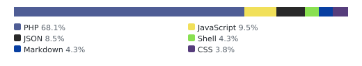
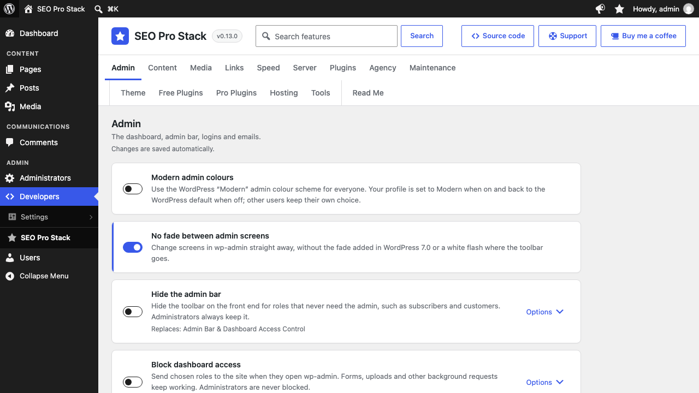
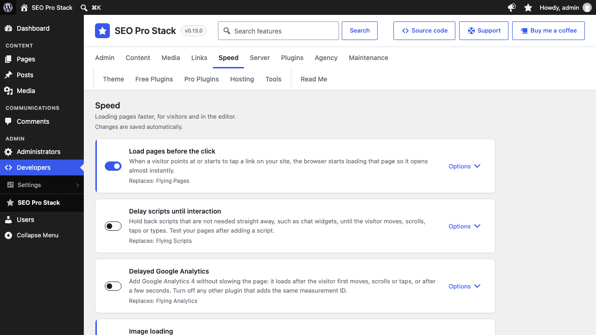
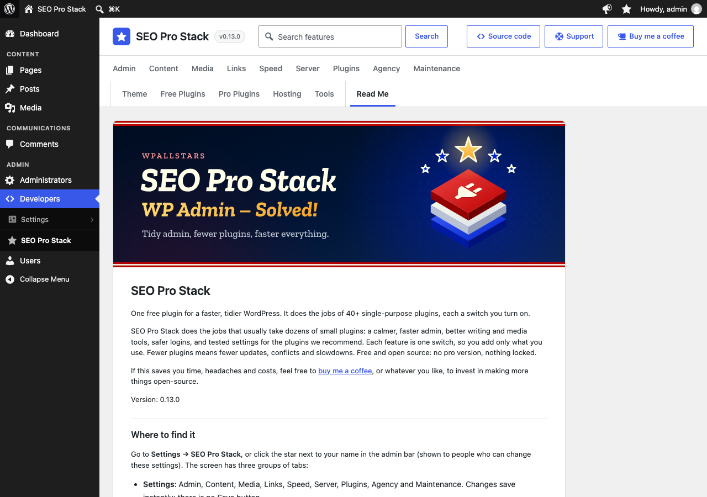

# SEO Pro Stack

<!-- aidevops:badges:start -->
<!-- On GitHub only: the Read Me tab skips this block. scripts/rename-plugin.sh rewrites it. -->

<!-- aidevops:badges:end -->

One free plugin for a faster, tidier WordPress. It does the jobs of 40+ single-purpose plugins, each a switch you turn on.

SEO Pro Stack does the jobs that usually take dozens of small plugins: a calmer, faster admin, better writing and media tools, safer logins, and tested settings for the plugins we recommend. Each feature is one switch, so you add only what you use. Fewer plugins means fewer updates, conflicts and slowdowns. Free and open source: no paid version, nothing locked.

If this saves you time, headaches and costs, feel free to [buy me a coffee](https://buymeacoffee.com/marcusquinn), or whatever you like, to invest in making more things open-source.

Version: 1.0.0

<!-- github-only:start -->
## Screenshots

**Settings → SEO Pro Stack**: the Admin tab, with search and the Source code, Support and Buy me a coffee links.

**The Speed tab**: each feature is one switch, with its options and the plugin it replaces.

**The Read Me tab** shows this file inside WordPress, banner included.

<!-- github-only:end -->

## Where to find it

Go to **Settings → SEO Pro Stack**, or click the star next to your name in the admin bar (shown to people who can change these settings). The screen has three groups of tabs:

- **Settings**: Admin, Content, Media, Links, Speed, Server, Plugins, Agency and Maintenance. Changes save instantly; there is no Save button.
- **Search features** (next to the plugin name) finds settings on every tab by name, description or the plugin they replace. Results can be switched on and changed in place.
- **Discover**: Theme, Free Plugins, Pro Plugins, Hosting and Tools.
- **About**: this Read Me.

At the top right of the screen, **Source code** opens the plugin’s [GitHub repository](https://github.com/wpallstars/seoprostack) in a new tab, and **Support** opens its [GitHub issues](https://github.com/wpallstars/seoprostack/issues) in a new tab. Say what you did, what you expected and what happened, with the versions of WordPress, PHP and SEO Pro Stack. Leave out passwords, licence keys and personal data, since issues are public. For questions, ask [aidevops](https://aidevops.sh) (Built with AI below). **Buy me a coffee**, next to it, opens the maker’s [Buy Me a Coffee](https://buymeacoffee.com/marcusquinn) page in a new tab.

## Features

A new install starts with the features that are safe on every site switched on, so it is faster and tidier straight away, and leaves off those that need choices about the site or change its content, files, people or other plugins’ settings. On by default:

- **Speed:** Load pages before the click, Image loading, Remove WordPress extras, Lighter WooCommerce pages and Faster editor with Kadence Blocks (the last two do nothing without those plugins).
- **Server:** Fewer Heartbeat requests, Clean the database weekly, Load large settings only where they are used and Hosting needs.
- **Plugins:** Load plugins only where needed, with **Also skip them for people who are logged in**, so it takes every chance to skip plugins once it has learned; Clean up deleted plugins, Plugin sizes and Fixes for other plugins.
- **Admin and editor:** Organise the admin menu, More menu in the admin bar, Hide admin bar items (Comments and + New), Hide admin notices, Tidy admin screens, Tidy the dashboard, Tidy WooCommerce admin, Readable list columns, Simpler block editor, Notification emails (plugin and theme auto-update reports, unless an update failed), No fade between admin screens, Quiet Freemius prompts and Quiet Appsero prompts.

Also offered on Server: **Faster page counts on long lists**, off by default, with exact totals counted separately from the page.

Copies installed from GitHub releases also have Updates from GitHub on. Sites that already had SEO Pro Stack keep their own settings: the defaults apply to new installs. Each feature can be switched off on its card. Features that replace a separate plugin say so on their card (“Replaces: …”) and import that plugin’s settings once when SEO Pro Stack is updated. The other plugin’s own settings are never changed or deleted. While that plugin is active, the feature waits and the plugin keeps doing the job, so the two never run side by side; the card says so, with a deactivate link that comes back to the same settings tab. Deactivate the plugin to switch over. The Plugins screen lists installed plugins that SEO Pro Stack can replace, with what to do next for each: deactivate it (its setting is on), switch the setting on, or delete it once inactive (single sites; on multisite another site may use it). Each of those plugins also gets a note under its own row saying which SEO Pro Stack setting makes it redundant and what to do next, including inactive plugins whose setting is still off; the notes are not hidden by **Hide**. When an active plugin does things on the site that SEO Pro Stack does not (such as Disable Bloat’s REST API switches), the line names them instead of saying the plugin can go. **Hide** hides the lines shown for that person until another step is needed. Plugins that web hosts add to every new site (Hostinger AI and Hostinger Easy Onboarding) get a note under their row while active, saying what they are for and recommending deactivating them if that is not used, with a Deactivate link; nothing is deactivated or deleted for you.

SEO Pro Stack replaces **53 plugins**, some of them in part, with free and Pro editions counted separately. The 44 that can be downloaded come to 41.9 MB zipped; SEO Pro Stack is 3.1 MB.

| Feature | Tab | Replaces |
| --- | --- | --- |
| Hide the admin bar, Block dashboard access | Admin | Admin Bar & Dashboard Access Control |
| Turn off unused remote access | Admin | Hostinger Tools and Disable Bloat (PRO), in part |
| Magic login links | Admin | WP Magic Link Login, in part |
| Organise the admin menu | Admin | Admin Menu Editor (Pro) |
| Hide dashboard widgets, Disable sidebar widgets | Admin | Widget Disable |
| Tidy admin screens, Tidy WooCommerce admin, Tidy the login screen, Simpler block editor, Limit post revisions, Remove WordPress extras, Fewer Heartbeat requests, Lighter WooCommerce pages | Admin, Content, Speed | Disable Bloat (PRO), in part |
| Notification emails | Admin | Manage Notification E-mails |
| Hide admin notices | Admin | Hide Admin Notices |
| Avatars without Gravatar | Admin | Avatar Privacy |
| Duplicate posts | Content | Carbon Copy, Yoast Duplicate Post |
| Staged new versions, Shareable preview links | Content | Post Draft Preview, Public Post Preview |
| Pinned posts for any post type | Content | Sticky Posts Switch |
| Select all across pages | Content | Bulk Actions Select All |
| Menu item visibility | Content | Nav Menu Roles |
| Restrict content | Content | Content Control, in part |
| Change post type | Content | Post Type Switcher |
| Order by hand | Content | Simple Custom Post Order |
| Term tools | Content | Term Management Tools |
| Tag clouds and related posts, Term tools | Content | TaxoPress (and Pro) and Tag Groups (and Pro), in part |
| Search custom fields | Content | ACF: Better Search |
| Website screenshots | Content | Browser Shots |
| Link cards | Content | Bookmark Card |
| Wikipedia previews | Content | Wikipedia Preview |
| Word documents in the editor | Content | Mammoth .docx converter |
| Like, save and share | Content | Favorites |
| Brand icons | Content | Popular Brand Icons – Simple Icons |
| Spectra block replacements | Content | Spectra |
| Paste into the Media Library | Media | The Paste |
| SVG uploads | Media | Safe SVG |
| Resize large uploads | Media | Imsanity |
| Replace media files | Media | Enable Media Replace |
| WebP and AVIF images | Media | CompressX |
| Watermark pictures | Media | Easy Watermark |
| Load pages before the click | Speed | Flying Pages |
| Delay scripts until interaction | Speed | Flying Scripts |
| Delayed Google Analytics | Speed | Flying Analytics |
| Image loading | Speed | Flying Images, in part |
| Clean the database weekly | Speed | WP-Optimize and WP-Optimize Premium, in part, where LiteSpeed Cache runs on a LiteSpeed server |
| 410 Gone for removed pages | Links | Ultimate 410 |
| Old post addresses | Links | Slugs Manager: Delete Old Permalinks |
| Short addresses for custom post types | Links | Remove CPT base |
| Short links | Links | Pretty Links |
| External link icons | Links | Link Whisper's icon only |
| Internal linking tools | Links | Selected Link Whisper workflows, after per-site retirement checks |
| Maintenance mode | Maintenance | Hostinger Tools, in part |
| Updates from GitHub (GitHub builds only) | Maintenance | Git Updater |
| Plugins menu in the admin bar | Plugins | Plugin Toggle |
| Clean up deleted plugins | Plugins | Fix ‘Plugin file does not exist’ Notices |

These plugins showed what sites need. [Credits](#credits) thanks their makers and links to each one.

Also available, off by default: **Count terms and comments in the background** on the Server tab, for imports, bulk edits and shops.

### Modern admin colours (Admin)

Uses the WordPress “Modern” admin colour scheme for every user while enabled. Switching it also updates your own profile: on selects Modern, off selects the WordPress default. Other users’ saved choices are not changed and return when the setting is off.

### No fade between admin screens (Admin)

WordPress 7.0 fades from one wp-admin screen to the next, using the browser’s view transitions. The fade can flash, and each screen change waits for it. With this on, screens change straight away, as before 7.0. **On by default**; switch it off to get the fade back.

- Removes core’s `wp-view-transitions-admin` style and adds `@view-transition { navigation: none; }` to admin screens, so fades that other plugins add the same way stop too.
- Also paints the toolbar's strip in the menu's colour before the toolbar is drawn. Core prints the toolbar after the admin menu, so with a long menu the first paint showed a white strip at the top for a moment on every screen change.
- Only page changes are affected. Animations inside a screen, such as in the site editor, stay.
- No effect before WordPress 7.0, which has no fade, or for people whose system asks for reduced motion, who never get it.
- Goes well with Load pages before the click’s **Also in the admin**, which downloads admin screens when you point at their links.

### Turn off unused remote access (Admin)

Off by default, with three independent choices, all unchecked:

- **Turn off XML-RPC**: direct requests to `xmlrpc.php` return HTTP 403, including unauthenticated methods such as pingbacks. Removes the `X-Pingback` response header and RSD discovery link. Jetpack and some mobile apps need XML-RPC; leave this unchecked if you use them.
- **Turn off application passwords**: core stops accepting application passwords and hides their profile section and the Authorize application screen. Existing application passwords are not deleted; they work again when this choice is unchecked, if core allows them. Normal password login and the REST API stay available.
- **Block web access to log and backup files**: requests for `.log`, `.sql`, `.sql.gz` and `.bak` files, `error_log`, `php_errorlog` and copies of `wp-config.php` (such as `wp-config-old.php`; not the real one) return HTTP 403, in every folder. Plugins write debug logs to the uploads folder under random names (AI Engine's `mwai_*.log` holds chatbot conversations), and PHP's `error_log` holds server paths and SQL; random names do not hide them, because `.log` URLs are guessed and crawled. A marked block (`# BEGIN SEO Pro Stack log and backup files`) goes at the top of the site's `.htaccess`, and of the `.htaccess` in wp-content or the uploads folder only when that folder is outside the site's folder (rules cover the folders below them). On Nginx, which does not read `.htaccess` files, the options show a `location` rule to copy; other servers get a note to ask the host. When a file cannot be written, the options show the block to add by hand. The block follows the switch, not the plugins the feature waits for, because they do not block these files. On multisite the main site's choice covers the network, which shares the files. Files are never deleted or moved: they belong to their plugins.

Imports enabled switches from active Hostinger Tools (`hostinger_tools`) and Disable Bloat once, without overwriting choices already saved here or changing their options. The feature waits until those plugins are deactivated. Only these two functions are replaced here, and Hostinger’s maintenance mode by [Maintenance mode](#maintenance-mode-maintenance): the Plugins screen names Hostinger’s HTTPS and www redirects, llms.txt generation and MCP connection when they are on, instead of suggesting removal. Keep Hostinger Tools if you still use those or its hosting tools.

**Log and backup files in Site Health** (always on, advice only, even with the feature off): once a day, the files with those names and something in them in the top level of the site's folder, the WordPress folder, wp-content (`debug.log` included) and the uploads folder are each asked for with one `HEAD` request, largest first, at most 10 a day. Files that answer HTTP 200 are named, with their size, as a recommended improvement under Security in Tools → Site Health, with a link to the choice above; their contents are never read. Copies of `wp-config.php` are blocked but not asked for, because asking for a PHP file runs it. When every request fails, the test says the files could not be checked rather than that none were found. `WP_DEBUG_LOG` handling is left as it is.

The block's place and state are kept in the `seoprostack_hardening_files` site option, and the last check in the `seoprostack_exposed_files` transient. Deactivation removes the block (on multisite, network-wide deactivation or the main site's), and uninstall removes it if a file could not be written then, with the option and transient.

Uses core’s `xmlrpc_enabled`, `wp_headers` and `wp_is_application_passwords_available` filters, removes `rsd_link` from `wp_head`, refuses XML-RPC during `init`, and adds the test through `site_status_tests`.

### Magic login links (Admin)

Adds “Email me a login link” to the login screen, next to “Lost your password?”.

- The link works once and expires after 5–60 minutes (10 by default). Requesting a new link cancels the previous one.
- Opening the link shows a **Log in** button; the login happens when it is pressed. Email security scanners that open links therefore cannot use them up.
- The response is the same whether or not the account exists, and requests are rate limited per IP address and per user.
- Links are stored only as a keyed hash and are removed when used, when they expire, and on uninstall.
- Passwords keep working. Administrators can be required to use their password.
- Uses the core login screen and core `wp_login` / `login_redirect` hooks, so activity logs, redirect rules and two-factor plugins that use `wp_login` still apply. Two-factor plugins that only check the password step are not asked; on those sites exclude administrators or leave the feature off.
- Pages made with WP Magic Link Login keep working after it is deactivated: its `[wpmll_form]` shortcode shows the login link form, with its `heading`, `description`, `login-button-text`, `logout-link-text` and `redirect_to` (an address on this site, or `current-page`) attributes. People already logged in see a log out link. While Magic login links is off, the shortcode shows WordPress’s password login form instead, so the page still lets people log in. While WP Magic Link Login is active, its own shortcode is left in place. Its other settings (allowed email domains, accounts for new email addresses, the landing page, hiding the password form, one IP address per link) are not replaced.

### Admin bar and dashboard access (Admin)

- **Hide the admin bar** on the front end for chosen roles.
- **Block dashboard access** for chosen roles: opening wp-admin sends them to the home page or a page you choose, such as `/my-account/`. AJAX, uploads and other background requests keep working. With WooCommerce active and no page chosen, its My Account page is filled in.
- Both lists start with every role that can neither manage options nor write posts (subscribers, customers and similar roles from plugins). Roles that plugins add later are ticked in both lists unless they can write posts, so staff roles such as Shop manager are never locked out. The roles seen so far are kept in the `seoprostack_access_roles` option.
- People who can manage options are never affected, so roles that can (such as Administrator) are not offered.

### Developer admins (Admin)

Off by default. For sites where you build or look after the site and a client also has an administrator account: choose which administrators are **developers**, and what only developers can do. Everyone else, client administrators included, cannot.

- **Developers**: super admins on multisite. On single sites, tick them in the list of administrators. Switching the feature on ticks you; tick anyone else who builds or looks after the site.
- **You cannot lock yourself out**: the person who switches the feature on or saves the list is always kept on it, people who are not developers cannot change SEO Pro Stack’s settings, and if no ticked person is an administrator any more (accounts deleted or demoted), every administrator counts as a developer. WP-CLI and cron run as nobody and are never limited.
- **SEO Pro Stack is for developers only**: people who are not developers do not see Settings → SEO Pro Stack (opening it gives a 403), its star in the admin bar, or its row on the Plugins screen, and cannot deactivate it.
- **Only developers can** (the first five ticked by default):
  - **Install, delete or edit the code of plugins and themes**: installing, uploading and deleting plugins and themes, and the plugin and theme file editors.
  - **Switch plugins on or off and change the theme**: Activate and Deactivate on the Plugins screen (each link and bulk action), and activating a theme in Appearance → Themes and the Customizer. The Plugins and Themes screens stay open, so updates and Appearance → Menus and Widgets keep working.
  - **Make administrators, and edit or delete developers**: roles that can manage options (such as Administrator) are not offered when adding people or changing roles, nor as the default role for new accounts in Settings → General; administrators’ roles cannot be changed; developers’ accounts cannot be edited or deleted (their own accounts still can).
  - **Change the site’s addresses and administration email**: the WordPress Address and Site Address (a typo takes the whole site down) and the administration email, which gets fatal error and recovery mode emails. Shown read-only in Settings → General, with a note; the rest of the screen still saves.
  - **Change permalinks and search engine visibility**: Settings → Permalinks is read-only and refuses saving (this also covers other plugins’ address bases on that screen), and “Discourage search engines” in Settings → Reading is read-only. Both can wreck a site’s search rankings.
  - **Update WordPress, plugins, themes and translations**: for sites where you test updates first. Update checks and automatic updates are left alone.
  - **Add unfiltered HTML, such as scripts, to content**: everyone else’s content is filtered as for authors, so pasted scripts and some embeds are removed.
- With [Organise the admin menu](#organise-the-admin-menu-admin), people who are not developers also do not see the Developers menu or the developer plugins placed in it, and its **Preview the admin as** › **Client administrator** shows what a client administrator gets.
- Capabilities are taken away with core’s `map_meta_cap` filter and `editable_roles`; core settings are left out of `allowed_options` and kept with `pre_update_option_{option}`, so other paths (such as the REST API) cannot change them either. The `seoprostack_is_developer` filter decides who is a developer.
- Until 0.13.0 the developer list and the code and administrator limits were Organise the admin menu’s **Client safeguards**. Sites where the menu was organised with them on get Developer admins switched on with those two limits and the same developers.

### Organise the admin menu (Admin)

Groups the admin menu under the headings **Content**, **Communications**, **SEO**, **Shop** and **Admin**, the same way on every site, so plugins’ entries are where you expect them. Dashboard stays at the top. Under **Admin** come two menus, **Administrators** and **Developers**, then **Users**.

- Within a section, WordPress’s own entries come first, then plugins’ in A–Z order, with a thin line between them. Settings, Tools and Appearance are sorted the same way.
- Entries under the headings keep their normal flyout submenus. **Administrators** and **Developers** open to the side like any menu, listing their entries with icons; each entry’s own submenu opens one level further to the side. On a page inside them, the menu opens in place with the page’s list shown under its entry.
- In **Developers**, plugin pages moved out of WordPress’s menus (such as Scheduled Actions, WP Crontrol or a debug log viewer) share one **Settings** entry instead of each showing a cog. SEO Pro Stack keeps its own entry, with a star icon.
- **Fold sections** (off by default): click a heading to fold it; folded sections are remembered for each person, and the section of the page you are on always opens. With the sidebar collapsed, headings become lines and every entry shows.
- **Fit the menu to its names** (on by default): the sidebar widens, up to 280 px, so that entry names fit on one line instead of wrapping, including every menu’s entries as they show when their menu is open (third-level lists with their indent). Every menu and folded section counts, so the width does not change when a section opens. Each entry is measured with the spacing it has in its open menu, wherever it is, so it needs the same room on every screen. Some plugins add entries, badges or fonts on some screens only, so the widest width the menu has needed is remembered per person (in WordPress’s `wp-settings` cookie, as `spsmw`) and used on every screen until the active plugins, the language or SEO Pro Stack change. A remembered width more than 24 px wider than a screen needs is a one-off (a badge or notice since gone), so that screen’s width replaces it. It is measured as the page loads, before the page is drawn, and checked again once it has loaded (only ever wider, for styles printed later), and the content, submenus and the open menu’s list move over with it. Other plugins’ own bars and panels that are fixed to the window and laid out for WordPress’s usual 160 px menu (such as Fluent Support’s setup footer, Kadence’s and WP-Optimize’s headers, or Freemius dialogs) move over or narrow by the extra width too. They are found by where they sit, not from a list of plugins, as they appear and whenever they change; dialogs centred on the window and menus that a script places itself are left alone. Entry icons in the Administrators and Developers menus sit beside the name, so a name too long even for 280 px wraps under its first line, not under the icon. Only on screens wider than 960 px with the sidebar expanded; the collapsed sidebar and phones are unchanged, as is the block or site editor in full screen mode, where WordPress hides the menu (the menu is fitted when the editor leaves full screen).
- Plugins that take other plugins’ scripts off their own screens (Fluent Forms, Fluent Booking and Fluent Boards do) also took the menu script, so the menu there was not fitted or folded and had no third level. The menu script is then printed with the menu, and the plugin’s choice stands for every other script. FluentCRM keeps only the scripts on its own list, so the menu script is added to that list (`fluent_crm_asset_listed_slugs`).
- FluentSMTP, moved from Settings to Communications, shows its own logo instead of a cog, drawn in the menu’s colours like the other entries.
- Fluent plugins’ names are spaced like Fluent Forms and Fluent Boards: FluentCRM shows as Fluent CRM, FluentSMTP as Fluent SMTP, FluentCommunity as Fluent Community and FluentCart as Fluent Cart. Only the name in the menu changes.
- **Shop** starts with the shop plugins’ own menus, WooCommerce then FluentCart, followed by the rest A–Z.
- **Preview the admin as** a role: the options panel links to each role, and to **Client administrator** (an administrator who is not a developer). Each opens the admin in a new tab with only that role’s permissions, never more than your own, and a **Stop** link in the corner and the admin bar. The preview is kept in a signed cookie in this browser, so every tab shows it until you stop it or two hours pass. Only developers who can manage options can start one.
- Places come from a list of common menus and plugins (`admin/data/admin-menu.php`), made from real sites. Plugin pages under Settings or Tools that belong elsewhere move too: SEO plugins to SEO; caching, security and developer tools to Developers. Pages inside a plugin’s own menu stay there. Unknown plugins go to Administrators; post types to Content.
- **Left out**: upgrade links (an entry called only Upgrade, Upgrade to Pro or premium, Go Pro, Get Pro, Unlock Pro, Premium Upgrade or Pricing), entries without a name, pages registered without a menu (such as WooCommerce’s Setup Wizard, which WordPress itself never shows), and entries listed as hidden: Freesoul Deactivate Plugins’ holder menu, the Freemius opt-in prompts of WP Sheet Editor add-ons, and AutomatorWP’s advert for ShortLinks Pro. Their pages still open and keep their place for the safeguards. The list of entries marks them “(hidden)”; choosing another place, or a line in Move menu entries, shows one.
- A menu logo that a plugin puts in its title as a picture (Meow Apps) becomes the entry’s icon, so it looks like the others on every screen, including where the plugin’s own styles are not loaded and in the Administrators and Developers menus.
- In the Administrators and Developers menus, plugins’ SVG icons are drawn in the menu’s text colour, as WordPress paints them at the top level, so dark ones (Site Assist, ICS Calendar, Bit Social, FluentCRM) show on the dark menu and follow hover and the current page. Picture icons keep their colours. An icon from a plugin’s own icon font (AutomatorWP) shows a cog on screens where that plugin is skipped. Code Snippets draws its icon with its own styles on its top-level entry only, so its entry shows its logo, kept in SEO Pro Stack.
- In Developers › Settings, pages with the same name get the menu they came from after it, such as Plugin Check (Tools) and Plugin Check (Settings).
- **Choose places**: the options panel lists this site’s entries (every top-level entry, and plugins’ pages in WordPress’s menus) with a **Place** list for each: a section, or for pages, inside any menu. Choosing a place writes its line in **Move menu entries**; choosing the usual place removes it. Reload to see the menu change.
- **Move menu entries**: one per line, a menu address or plugin folder, `=`, then a place: `top`, `content`, `communications`, `seo`, `shop`, `admin-heading` (under the Admin heading, after the two menus), `administrators` (or `admin`), `developers` (or `super-admin`), or another menu’s address to go inside it, for example `elementor = content` or `wpcf7 = administrators`. To move one page out of a menu, write `menu>page = place`.
- Moved pages keep their usual addresses, and WordPress checks access to them as before: the menu is only rearranged while it is printed. Nothing runs on the front end. Which plugin owns each page is worked out once and kept in the `seoprostack_admin_menu` option until plugins change. With Load plugins only where needed, plugins a screen skips still count as active, so the kept owners stay the same on every screen, and a skipped plugin’s menu entries keep their places using the owner learned on screens that load it.
- Some plugins move menu entries with their own scripts, matching them by name (for example moving any entry called “Analytics” above Posts). The menu script puts the printed entries back in order as the page loads; entries such scripts add are left where they put them.
- With [Developer admins](#developer-admins-admin) on, people who are not developers do not see the Developers menu or open its pages, and do not see or switch developer plugins (those placed in Developers) on the Plugins screen. Until 0.13.0 this, the developer list and the other limits were this feature’s **Client safeguards**; they moved to Developer admins, so they also work without the organised menu.
- **Writers see only writing** (off by default, as it changes what people can open): contributors and authors (people who can write posts but not edit other people’s) see Dashboard, the posts and post types they can edit, Media if they can upload, Comments and their profile. Plugins often open their pages to anyone who can log in or write (settings pages that ask only for `read` or `edit_posts`, such as AI Engine’s, Media File Renamer’s, FluentCommunity’s or WooCommerce’s Home); those are hidden from writers and refused with a 403 if opened. Tools is hidden too, as it offers writers nothing of WordPress’s own. So are plugins’ post types without the content editor, such as Lasso Lite’s short links, which use the same permissions as posts but are records, not writing: their list, Add New and edit screens are refused too. Post types with the editor stay. Which plugin post types have no editor is kept in the `seoprostack_writer_types` option, so screens where Load plugins only where needed skips the plugin still know. Pages that ask for a capability a plugin gives the role on purpose (an instructor or support agent capability, for example) stay. Editors, shop managers and administrators are not affected. Subscribers and customers, who only log in to comment, review or buy, never need the admin: use **Block dashboard access**. Filters: `seoprostack_is_writer`, `seoprostack_writer_hides_page` and `seoprostack_writer_hides_post_type`.
- Replaces Admin Menu Editor and Admin Menu Editor Pro. Their settings are not imported: places come from the rules above, so every site gets the same menu. Admin Menu Editor’s own settings are left alone; while it is active, this feature waits.

### Dashboard and sidebar widgets (Admin)

- **Hide dashboard widgets** for everyone, such as WordPress Events and News, the welcome panel or plugin promotions. Widgets added by plugins appear in the list after the Dashboard is next opened.
- **Disable sidebar widgets** you never use (the Meta widget by default); they disappear from the Widgets screen, the Customizer and sidebars.
- While Disable Bloat is active, its Dashboard box switches (WooCommerce Status and Setup, Elementor, Yoast, and PRO’s WordPress boxes) and widget switches (WooCommerce widgets, PRO’s WordPress widgets) are imported once.

### Tidy the dashboard (Admin)

Lays out the Dashboard the same way on every site, from rules made from 12 sites arranged by hand with Admin Menu Editor Pro (`admin/data/dashboard.php`):

- **Columns**: first WordPress’s browser and PHP update warnings when shown, then Quick Draft, Activity and WooCommerce reviews; then Fluent Forms, Fluent Support and FluentSMTP statistics; then visitor statistics (Burst), Rank Math, At a Glance, Site Health and AI Engine Advisor. Widgets that are not listed stay in the column their plugin chose, below the listed ones.
- **Hidden for everyone**: the Welcome panel, WordPress Events and News, WooCommerce Status and WooCommerce Setup (they repeat WooCommerce → Home), Pretty Links quick add, Link Whisper’s link health box and Debug Log Manager (it reads the whole debug log on every Dashboard load; its screen under Tools shows the same entries).
- **Developers only**: Site Health status and AI Engine Advisor. AI Engine Advisor (a daily list of general advice about the site’s plugins) also starts unticked in Screen Options, once per person, including people who saved Screen Options before; ticking it there shows it from then on. Developers are the ones chosen in Organise the admin menu; without it, people who can manage options (super admins on multisite).
- **People who can publish**: At a Glance and the form, support and email statistics, so contributors do not see them. People who cannot edit posts, such as subscribers and customers, see no boxes.
- Everyone gets the same layout and boxes cannot be dragged. **Let people rearrange boxes** (off by default) allows dragging and keeps each person’s own arrangement; until someone rearranges, they get the layout above. Saved arrangements are never deleted, so switching the feature off gives them back.
- Works alongside Hide dashboard widgets: boxes it hides stay hidden.

### Notification emails (Admin)

Stop routine emails one by one: new user notices, password and email change notices, comment notices, and WordPress, plugin and theme auto-update reports. Each is stopped with the core filter that sends it, so nothing else changes. Password reset links are only ever stopped for administrators, and auto-update reports are still sent when a core, plugin or theme update fails.

### Hide admin notices (Admin)

Moves plugin and theme notices behind a megaphone at the right of the admin bar, so pages open at their content. The megaphone opens a panel over the page with the notices, which can still be read and dismissed there. The admin bar is the one place no admin screen draws over, so the megaphone never sits on a plugin’s own header, and the page never moves.

- Kept on the page: messages about what you just did (such as “Settings saved”), inline notices inside the page’s content (inline notices printed above the page are moved), and notices that scripts add after you first click or type, since they answer what you did.
- Optionally keep errors, or warnings and the WordPress update message, on the page. On screens that hide every notice themselves, such as WooCommerce’s and Rank Math’s, kept notices go in the panel so they can still be read.
- Also caught: notices printed inside another plugin’s wrapper, notices that scripts add while the page loads, WooCommerce’s lasting notices (such as connect prompts and database updates, which use the same `#message` id as “Settings saved”), and plain boxes of text, links and pictures printed above the page without notice classes (such as MainWP Child’s connect message). Boxes with headings, tabs, lists, forms or buttons are a plugin’s own header or tools and stay. A notice drawn by React or Vue (such as WooCommerce Analytics’) stays hidden in its place and the panel shows a copy; dismissing the copy dismisses the original.
- The megaphone sits next to the account menu (“Hi, …”), or left of the Plugins menu when that is on. Debug Log Manager’s icon, when it shows, sits just left of the megaphone; other plugins’ admin bar items go further left. A megaphone, not a bell, so it is not mistaken for other plugins’ notification bells.
- The megaphone is on every admin screen. A dot at its top right shows there are notices: red when at least one can be dismissed in the panel (a dismiss button, or a link or button such as “Dismiss”, “Hide” or “No thanks”), and in the admin bar’s text colour (white with the default colours) when they can only be read. With none, the panel says “No notices.” Since the megaphone never appears, disappears or changes width, nothing on the bar moves when the notices are counted. Screen readers hear the count (“Notices (2)”). On phones the megaphone joins WordPress’s icons and the panel fills the width.
- **With Load plugins only where needed**: a screen that skips a plugin also skips its notices. Notices that skipped plugins print on screens that load every plugin are kept for each person (only visible notice boxes; other things printed there, such as buttons above a plugin’s own list, belong to that screen and are not kept) and shown behind the megaphone on screens that skip them, so they can be read and dismissed anywhere. A kept notice goes when its plugin stops printing it on the screen it came from, when it is dismissed (the dismiss button, or a link or button such as “Dismiss”, “Hide” or “No thanks”), or after 12 hours, since links in notices carry security tokens that expire. On screens that load the plugin, the plugin shows its own notice as usual. Kept notices are in the `{prefix}seoprostack_stored_notices` user option, removed on uninstall.
- Like the other admin bar menus, pointing at the megaphone opens the panel and moving the mouse away closes it. It stays open while you type in a field inside it.
- The megaphone works from the keyboard and on touch screens: Enter, Space or a tap opens the panel and keeps it open; Escape, the megaphone again or clicking elsewhere closes it.
- Notices are hidden with CSS until they are moved, so they do not flash or push the page down. Without JavaScript they stay on the page.
- Empty boxes printed on the notice hooks, which a plugin’s script fills later (such as announcements loaded from the plugin maker’s site), stay hidden while empty. Filled with a notice or banner, they go behind the megaphone.
- The block editor has its own notices and is left alone.
- Add the class `sps-keep` to a notice to keep it on the page.
- **Show example notices** (off by default) adds one notice of each kind to every admin screen for administrators, to see where they go: information, success, warning and error behind the megaphone, and one with `sps-keep` on the page. Reload the page after changing it.

### Quiet Freemius prompts (Admin)

Freemius is a sales and licensing kit that some plugins bundle, such as WP Sheet Editor and its add-ons and Git Updater. Each copy asks for attention on its own: an “Opt in to make … better!” notice on every admin screen, Opt In, Upgrade and Add-Ons links on the Plugins screen, trial and affiliate offers, a jump to its opt-in page when the plugin is activated, and a “Quick feedback” survey when it is deactivated. The Plugins screen carries a hidden copy of the survey or opt-in dialog for each of them.

This turns those prompts off. On a test site with six such plugins, the five opt-in notices went from every screen, the Opt In and Upgrade links from the Plugins screen, and the hidden dialogs there from nine to two (Git Updater’s licence dialogs). Deactivating goes straight through, and activating stays on the Plugins screen. **On by default**; switch it off to get the prompts back.

- Freemius itself still loads: the plugins call it to check licences and build their menus, so stopping it would break them. Only its prompts are turned off, through the per-plugin filters Freemius provides.
- Nothing is saved in the other plugins: none is opted in or out, and turning this off brings every prompt back.
- Kept: licence activation and its dialogs, the Account, Contact Us and Support pages, licence, trial-ending and payment notices, Opt Out for plugins you opted in to, and “Complete activation now” for plugins that only work with a licence.
- A plugin that has not been opted in or skipped yet still shows its opt-in page in place of its own first screen. Choose **Skip** there once; the plugin keeps that choice.
- Upgrade links that plugins add themselves, without Freemius, are not touched. Organise the admin menu leaves many of them out of the menu.

### Quiet Appsero prompts (Admin)

Appsero is a usage-tracking and licensing kit that many plugins bundle, such as Easy Video Reviews, each with its own copy. Each copy shows an “Allow … to collect diagnostic data and usage information” notice on every admin screen until it is answered (answering “No thanks” sends Appsero a “tracking skipped” report), prints a “Goodbyes are always hard” survey on the Plugins screen that opens when the plugin is deactivated and sends the answer with the site’s name, address, admin email and server details, and, in themes, sends those details when the theme is switched away from, whether or not you opted in.

This removes the notice, the survey and its submission, and the theme-switch report from every copy. Deactivating goes straight through. **On by default**; switch it off to get the prompts back.

- Copies are found by their class (`Appsero\Insights`, a copy under a plugin’s own namespace, or a subclass), since versions differ between plugins. Appsero has no filter for these, so their hooks are removed after `admin_init`.
- Nothing is saved in the other plugins: none is opted in or out.
- Kept: licence pages and licence notices (`Appsero\License`), and the plugin’s own opt-in and opt-out handling.
- Plugins you already allowed keep sending their weekly report until you opt out in the plugin; check each plugin’s settings for its usage-tracking option.

### More menu in the admin bar (Admin)

When many plugins add items to the admin bar, it wraps onto a second line that covers the top of the page and makes it hard to click. With this on, the items plugins and themes add to the left of the bar go into one **…** menu, last on the left side: after WordPress’s own items (+ New, Edit and the like) and any items you keep on the bar, in wp-admin and on the site. Point at **…** to open it, like the other admin bar menus; it closes when you move away. Moved items keep their own submenus.

- **Keep on the bar**: tick plugins (or a theme or must-use plugin) whose items should stay where they are. Those that have added items are listed first, marked “adds items”. SEO Pro Stack’s own items (such as Duplicate) stay by default.
- Settings save straight away, but the bar on the settings page was drawn before the change, so the saved message asks you to reload the page.
- WordPress’s own items and the right of the bar (the account menu, the notices megaphone, the Plugins menu) are not moved. To remove WordPress items, use Hide admin bar items.
- Items are matched to the plugin that added them. If another plugin replaces WordPress’s admin bar class, WordPress’s own items are recognised by name, every other item goes in the menu, and Keep on the bar does not apply.
- Items that show only an icon or numbers get their plugin’s name added in the menu.
- On phones and tablets, tap **…** to open it. WordPress hides plugins’ items there; the menu shows them, with their submenus open.
- From the keyboard, Enter opens it and Escape closes it. Opening and closing are WordPress’s own, as for every admin bar menu.

### Hide admin bar items (Admin)

Removes WordPress items you do not use from the admin bar, for everyone, in wp-admin and on the site. **On by default**, so the bar starts tidy; switch it off to get every item back.

- **Hide**: Comments and + New are ticked by default. Also offered: the WordPress logo menu, My Sites, Site name, Edit site, Customise, Updates, the command palette, Edit, View and Preview, Shortlink and Search. Their submenus go with them.
- The account menu (with Log Out) and the menu button on phones in wp-admin are never offered, so they always stay.
- Some items appear only on certain screens, such as Edit on the site or View in the editor.
- Reload the page after a change to see it; the saved message says so.
- Works with or without the More menu.
- With Disable Bloat active and its “Remove the WordPress logo” switch on, the logo menu is added to the default items, once, if no items were chosen yet.

### Tidy admin screens (Admin)

Removes WordPress text and tools from wp-admin that most people never need, for everyone. Core hooks and constants only; nothing is stored.

- **Remove**: the “Thank you for creating with WordPress” footer and the “WordPress X is available” notice for people who cannot update WordPress (both ticked by default), and the theme and plugin file editors, for developers too (refused through `map_meta_cap` as `DISALLOW_FILE_EDIT` does, so switching it off brings them back).
- Replaces part of Disable Bloat: its matching switches are imported once while it is active.

### Tidy WooCommerce admin (Admin)

Removes WooCommerce’s promotions and prompts from wp-admin with the filters WooCommerce provides. Orders, products, reports and WooCommerce’s own settings are not changed. Does nothing without WooCommerce.

- **Remove**: marketplace suggestions (`woocommerce_allow_marketplace_suggestions`), the Extensions menu entry (the page still opens at its address), “Connect your store to WooCommerce.com” notices (`woocommerce_helper_suppress_admin_notices`), “Get the WooCommerce app” in new order emails, and the payment plugins WooCommerce suggests under “More payment options” on Settings → Payments (its link to the marketplace stays; payment methods already set up, and the suggestions WooCommerce lists among them, are unchanged), all ticked by default; also offered, Marketing → Overview (recommended marketing extensions and courses), so the Marketing menu opens Coupons. Since WooCommerce 11.1 the Marketing menu always loads, so only its entry is removed; the page still opens at its address and other plugins’ Marketing pages stay.
- Replaces part of Disable Bloat: its matching switches are imported once while it is active.

### Tidy the login screen (Admin)

- **Change**: the logo links to your site instead of WordPress.org and is named after your site (`login_headerurl`, `login_headertext`); the WordPress logo picture is hidden, keeping the name for screen readers; the language menu is hidden (`login_display_language_dropdown`; only shown on sites with more than one language). All but the language menu are ticked by default.
- Replaces part of Disable Bloat: its matching switches are imported once while it is active.

### Readable list columns (Admin)

Keeps the title column of post, page, user, media and plugins’ lists wide enough to read. WordPress gives its list columns fixed widths, and the title gets what is left; every plugin that adds a column with a width of its own (SEO details, privacy scans, page views, post type, sticky) takes from it, until the title is a letter wide and runs down the page.

- When the main column of a list is narrower than a fifth of the table, or another column has been squeezed to nothing (columns without a width of their own get none once the others add up to more than the table), it gives the main column a quarter of the table and narrows the other columns towards the narrowest they can be without breaking words. Narrow columns whose content fits (checkboxes, icons, counts) keep their width. When even that is not enough room, the main column gives up some of its quarter, down to 120 px (or 12% of the table), before other columns break words. Lists with room to spare stay as they are.
- Each list is fitted before it is first shown, so it never flashes up squeezed: the script loads in the page head and fits a list as soon as its rows are in. Until then the list is hidden; if the script never gets to it, the list shows after two seconds as WordPress lays it out. Without JavaScript, nothing is hidden.
- Checked again when columns are switched on or off in Screen Options and when the window changes size. On phones, where WordPress stacks columns under the title, nothing changes.
- **Columns to remove** (all ticked by default): Complianz’s Website Scan, Post Type Switcher’s Type and Burst Statistics’ Pageviews are taken out of every list, and out of Screen Options. Admin Columns still offers them in its column editor, so a layout made there can add them back. To hide other columns for yourself only, untick them in Screen Options.
- **Author and date last** (on by default): on lists of posts, pages, media and other content, Author and Date are moved to the end, after the columns plugins add. A column layout chosen in Admin Columns still wins.
- Rank Math’s **SEO Details** column gets room for its usual longest line (“Schema: Article (BlogPosting)”). The score and link counts stay on one line; a longer keyword or schema wraps between words, indented under its label, so it never pushes the list off the page.
- A small script on list screens; only the two settings above are stored.

### Avatars without Gravatar (Admin)

Serves every avatar from your own site. By default WordPress loads avatars from Gravatar, which tells Gravatar who visits your pages and publishes a hash of each commenter’s email address. With this on, nothing is loaded from or sent to Gravatar.

- **Profile pictures**: people upload a picture on their profile screen (Users → Profile), where WordPress would otherwise point them to Gravatar. It is cropped to a square, stored in four sizes (64 to 512 pixels) and the smallest size that fits is used. Photo details such as location are removed. JPEG, PNG, GIF and WebP are accepted. Replacing or removing a picture, or deleting the user, deletes the files. This part can be turned off.
- **Everyone else** gets the default chosen under Settings → Discussion, drawn on your site: a silhouette, a pattern that differs per person (made from a keyed hash of the email address, so it cannot be traced back), or nothing. Other stored styles, such as Identicon, Retro or Avatar Privacy’s Birds, show the pattern; Mystery Person and the rest show the silhouette.
- Guests are never matched to accounts by email address, so a guest cannot show someone else’s picture.
- Avatars that other plugins set (anything not from Gravatar) are kept. The admin bar, comment and user lists, the REST API (`avatar_urls`) and the block editor all use the same avatars.
- Generated files keep their names, so cached pages keep working. Files are stored in `uploads/seoprostack-avatars/` (on multisite, profile pictures are in the main site’s uploads).
- Switches on if Avatar Privacy is active, and copies its uploaded profile pictures, since deleting Avatar Privacy deletes them. Pictures are also copied when Avatar Privacy is deactivated, and otherwise the first time they are shown. A picture that cannot be processed is tried again the next day, keeping any earlier copy, and a picture uploaded or removed during a copy is never overwritten. Avatar Privacy lets people opt in to Gravatar; this feature never uses Gravatar, so that choice is not imported. While Avatar Privacy is active, it keeps handling avatars.

### TranslatePress switcher colours (Content)

Makes TranslatePress's floating and shortcode language switchers follow the site's colours, including Kadence's light and dark mode switcher. **Off by default**; nothing changes without TranslatePress.

- Text and backgrounds use Kadence's palette on the switcher itself, so changing the palette on the body takes effect straight away. Without Kadence, the browser's canvas colours follow the site's colour scheme. Hover backgrounds use a translucent neutral; menu labels inherit their links' theme colours.
- Covers the current and legacy switchers. Sizes, positions, flags, borders' widths, dropdowns and language links stay as TranslatePress sets them.
- Only a small front-end stylesheet is added. No scripts, outside services or changes to TranslatePress's saved settings. Turning it off restores TranslatePress's own colours on the next page load.

### Duplicate posts (Content)

Adds **Duplicate** to post lists, the editor and the admin bar for the post types you choose. The copy is always a new draft; the original is never changed. Choose what else is copied: excerpt, author, featured image, terms, custom fields (including SEO settings), template, format, menu order, password and date.

### Staged new versions (Content)

**New version** on a published post creates a draft copy that remembers its original. Edit, preview or share it while the live post stays as it is. Publishing the copy, now or scheduled, copies it over the original — title, content, excerpt, terms, custom fields, featured image, template and format — so the address, comments and publish date are kept and WordPress stores a revision. The copy is then deleted.

- The copy never goes live at its own address, so sharing, pings and sitemaps are not triggered for it.
- In the block editor, custom field boxes are saved before the copy is merged. If the tab closes first, a background task finishes the merge within minutes.
- If the original cannot be updated, the copy stays as a draft so no edits are lost.

### Shareable preview links (Content)

Tick **Share a preview link** in the editor of a draft, pending or scheduled post to get an address anyone can open without an account.

- Links expire after 1–90 days (7 by default) and stop working when turned off or when the post is published.
- Preview pages send `noindex`, `no-referrer` and no-cache headers and ask page caches not to store them.

### Pinned posts for any post type (Content)

Adds a narrow pin column to the lists of the post types you choose, and a **Pin to the top** option in the editor for types other than posts. Wherever WordPress says “Sticky” in post lists, Quick Edit, Bulk Edit and the editors, it says “Pinned”, the word most sites and apps use (core still calls them sticky posts, so themes and blocks see no change). Pinned items lead the first page of the blog home, their post type archive and chosen term archives (categories, tags or custom taxonomies). On archives they take places on the pages, so each page keeps its size and nothing shows twice; these lists also end their order with the post ID, so items sharing a date keep one place across pages. It uses core’s sticky list, so existing sticky posts, themes and blocks keep working.

With ACF, ACF Pro or Secure Custom Fields active, **Pin from a true/false field** ties the pin to a true/false field of a pinnable type, such as a “Featured” field: an item is pinned while the field is on, however the field is set (editor, REST API, WP-CLI, imports), and pinning or unpinning it in the pin column or Quick Edit sets the field. When you choose a field, the items of its type are pinned and unpinned to match it, so the field decides. In the editor the field is the pin: **Pin to the top** is not shown for that type, so saving the field’s box cannot undo a pin set elsewhere. Only top-level fields of a field group are listed.

With Kadence Blocks Pro active, **Lift to the top of Kadence query loops** does the same for Query Loop (Adv) blocks: pinned items of the pinnable post types lead the loop in its own order (an A–Z loop lists its pins A–Z, then everything else A–Z), and only those that match the loop’s filters and facets. Pinned items take places on the pages like any other item, so every page keeps the loop’s size however many items are pinned, nothing is repeated or skipped, and the loop’s result count and number of pages include them. **Only in these Kadence query loops** limits it to the loops you tick; leave them all unticked for every loop. It works through Kadence’s `kadence_blocks_pro_query_loop_query_vars` filter, which its filter and pagination requests also use; a site snippet that already fixes pinned items for a loop on that filter should be removed when this is turned on.

### Select all across pages (Content)

Tick the “select all” box in a post list with more than one page and a bar offers **Select all N items**: every item matching the current filters, search and status. Bulk actions (Move to Bin, Restore, Delete Permanently, Edit and plugin actions) then apply to all of them, still checked against each item’s permissions. Unticking any row clears the choice.

### Menu item visibility (Content)

Each item in Appearance › Menus gets a **Who sees this** choice: everyone, logged-in people, logged-out visitors, chosen roles, or everyone except chosen roles. Hidden items, and the items below them, are left out of menus on the site. On multisite, only members of the site (and super admins) count as logged in. Kadence and other classic themes build their header and footer menus from these items; Kadence’s navigation block has its own visibility settings.

- Hides menu links only. It does not protect the pages they lead to: use Restrict content for that.
- Replaces Nav Menu Roles: its rules are read as they are until an item is saved here, and are never changed. The feature switches itself on when a site has Nav Menu Roles rules.

### Restrict content (Content)

Keep posts, pages, products, categories and blocks for the people they are for. The choice is made where the content is edited:

- **Posts, pages, products and public custom post types**: a **Who sees this** box in the editor: everyone, logged-in people, logged-out visitors, only chosen roles, or logged-in people except chosen roles.
- **Categories, tags and other public taxonomies** (product categories too): **Who sees its posts** on each term, for every post in it that has no choice of its own. A post in several restricted terms must pass all of them; the post’s box shows which terms it follows and can set Everyone to override them.
- **Part of a post**: put the members’ part in a **Members only** block. Everyone else gets the message in its place, and logged-out visitors a **Log in to see it** link. It is for logged-in people until another choice is made in its Visibility panel, and its own message can be set in the block.
- **Blocks**: a **Visibility** panel in every block’s settings, with the same choices. Hidden blocks, and the blocks inside them, are left out of the page without a message. Widgets and templates are blocks too.

Someone who may not see a post gets a teaser: what is above its **More** block, or else its hand-written excerpt. Then comes the message set on the card (“This content is for members.” unless changed), and logged-out visitors a **Log in to see it** link that brings them back. The same happens in archives, search results, feeds and the REST API, so the content is never sent. Its comments are hidden and closed, and the page asks search engines not to index it. People who can edit a post always see it, and people who can edit others’ posts see blocks kept for members or roles, so editors can check their work; blocks for logged-out visitors are hidden from everyone logged in.

Memberships, payments and sign-up stay with the plugins that do them well: Fluent Forms (user registration), FluentCRM, FluentCart or WooCommerce give people a role, and the role decides what they see. Logging in stays with WordPress or the plugin that runs the site’s account pages. On a page cache, logged-in people are normally served fresh pages, so the cached copy is the one for logged-out visitors.

Shops, for trade prices or products only members may buy:

- **WooCommerce**: a product the visitor may not see keeps its name, pictures and short description in the shop, without a price (logged-out visitors get **Log in to see prices**), its attributes or reviews; its description shows the message, and it cannot be added to the cart, through the shop, links or the Store API. Its price is not sent in the Store API or structured data either. Set **Who sees this** on each product, or on a product category for all its products.
- **FluentCart**: FluentCart edits products in its own screens, so set **Who sees its posts** on a FluentCart product category. Its products’ descriptions show the message and their structured data is left out, and they cannot go in the cart or through checkout. FluentCart still shows their prices, as it has no way to hide them.

- Replaces Content Control, in part. Its block rules (`contentControls`: login status and roles, and hiding on phones, tablets or desktops at its breakpoints) keep working, and the Visibility panel says so with a button to remove them. Its `[content_control]` shortcode keeps working with the same attributes (`status`, `allowed_roles`, `excluded_roles`, `class`, `inline`, `message`, and the older `logged_out` and `roles`). The first time an administrator opens wp-admin after it is deactivated, its restrictions for chosen posts and pages, chosen terms, or posts in chosen terms become **Who sees this** on those posts and terms, unless they have a choice already. Restrictions for the whole site, all posts of a type, archives or other conditions, and those needing every condition at once, are listed on the settings card to set again by hand. Its own redirects and per-restriction messages are not carried over: visitors get the message instead. The feature switches itself on while Content Control is active and takes its default message. Content Control’s settings and restrictions are never changed.
- Not covered from Content Control Pro: showing blocks only between two dates, Easy Digital Downloads rules and its own login forms.
- Uninstalling SEO Pro Stack removes the rules, so that content shows to everyone again.

### Change post type (Content)

Turns a post into a page, a product or another post type, and back, keeping its ID, content, fields and slug. Choose **Post type** in the block editor’s summary panel (unsaved changes are saved first), the classic editor’s Publish box, Quick Edit or Bulk Edit (No change by default). It offers public post types with an admin screen that the person can edit and publish.

Replaces Post Type Switcher, which has no settings; the feature switches itself on while it is active.

### Order by hand (Content)

Drag rows by their handle, or focus the handle and use the arrow keys, in the lists of the post types and categories or tags you choose. Lists of those types, and queries on the site that set no order of their own, follow the order; searches on the site keep their relevance order.

- Posts keep their place in core’s `menu_order` (the Order field pages already have); terms in term meta, so no core table changes.
- Moving rows only swaps them among the places they already hold, so ordering one page of a long list, or a filtered or searched list, leaves the rest where it was. Searches in the admin list and the Drafts and Pending views show the hand order too, so you can move rows there.
- Sorting the list by a column (Title, Date…) hides the handles. A **Custom order** link next to All, Published and the other views, and the handle column’s header, go back to the hand order with the same filters.
- Only people who can edit others’ posts of that type (or manage the terms) can reorder.
- WooCommerce sorts its own product categories and attributes, so they are not offered.
- Replaces Simple Custom Post Order: its post types and taxonomies are imported, and so is its term order (read from the `term_order` column it adds, which is left alone).

### Term tools (Content)

Bulk actions on category, tag and other term lists:

- **Merge into**: the chosen terms become one (an existing term by name, or a new one). Their posts and child terms move to it.
- **Move to taxonomy**: the terms, and the terms below them, become terms of another taxonomy with their posts, fields and IDs. A term whose slug the other taxonomy already uses stays where it is; merge them first.
- **Set parent** (hierarchical taxonomies). A term cannot go below itself or its own children.
- **Apply slug pattern**: add the taxonomy's prefix and suffix to selected existing terms, keeping their old addresses as redirects.

**Slug patterns**, in Term tools' Options, has one row per public taxonomy. Set a prefix such as `best-` or `how-to-` and a suffix such as `-guide` or `-statistics`: with `best-` and `-guide`, a new Technology term's slug is `best-technology-guide`. Slugs are permanent addresses, so use words that stay true rather than dates. Patterns apply on every term creation or edit, including imports and REST requests, while Term tools is on. Saving a pattern does not change existing terms until they are edited or selected for the bulk action. Empty fields leave slugs unchanged; existing prefixes and suffixes are not added twice. WordPress handles unique slugs.

Old archive addresses of merged, moved and patterned terms redirect with a 301 to the term that took over, when they would otherwise be a 404. Replaces Term Management Tools, which has no settings; the feature switches itself on while it is active.

**All | Unused (N)** above each term list shows only terms with no posts, so they can be checked and removed with the core **Delete** bulk action: the clean-up TaxoPress’ Manage Terms screen offers.

### Tag clouds and related posts (Content)

Shows categories, tags and other terms the way readers browse them, and posts related to the one being read, with WordPress’s own blocks, so a site needs no taxonomy plugin to do it.

- **Related posts** block (Widgets category): posts of the same type that share the most categories, tags or other terms with the post being read. Terms used on few posts count for more than ones used everywhere, so a tag on every post does not make every post related; newer posts come first among equals. A grid of cards with featured images, or a list, with dates and a heading if wanted, and a choice of which taxonomies to compare. It works in Query Loops and templates. Password-protected posts, and posts Restrict content hides from the visitor, are left out. Results are kept in the object cache until posts or terms change.
- **Add related posts after the content of**: post types that get the list after their content, without a block. Posts that already have the block are left alone.
- The **Term list** block gains a **tag cloud** (sizes on a log scale between the smallest and largest text, plain or as boxes), a **comma-separated line**, an **A–Z index** with letter links, **This post’s terms** (in Query Loops too), an order (name, most posts first, random), a most-terms limit (keeping those with the most posts) and a fewest-posts threshold. Terms can be **grouped** by their top-level term, or by Tag Groups’ groups, under headings, in an **accordion** (`
`, no script) or in **tabs** (keyboard arrows, Home and End; without the script they stay under headings). Styles use the theme’s colours and translucent borders, so they suit light and dark palettes, Kadence’s switcher included.
- **After TaxoPress is deactivated**: taxonomies made with it stay registered with their saved choices (labels, archives, address base, REST, admin column), so their terms, archives and post links stay. Its Terms Display, Terms for Current Post and Related Posts blocks, shortcodes (`[taxopress_termsdisplay]`, `[taxopress_postterms]`, `[taxopress_relatedposts]`) and widgets, terms it added after post content, and the `st_tag_cloud()`, `st_the_tags()` and `st_related_posts()` template functions are drawn with the blocks above from its saved displays: taxonomy, format (list, cloud, boxes, comma-separated), order, number, sizes, chosen and excluded terms, titles and empty texts.
- **After Tag Groups (or Pro) is deactivated**: its groups are read in place, so the Term list can group by them. Its tabbed, accordion, alphabetical and list clouds, as blocks or shortcodes (`[tag_groups_cloud]`, `[tag_groups_accordion]`, `[tag_groups_alphabet_tabs]`, `[tag_groups_alphabetical_index]`, `[tag_groups_tag_list]` and the Pro table, combined cloud and shuffle box), are drawn with the Term list from their settings: groups, taxonomy, order, amount, sizes, terms of a post, and unassigned terms.
- Saved TaxoPress and Tag Groups settings are only read, never changed, so turning either plugin back on finds everything as it was.
- Left out, on purpose: automatic term links inside post content, automatic and AI tagging, synonyms and linked terms, and Tag Groups Pro’s front-end post filters and post lists (their shortcodes and blocks show nothing once it is deactivated). They are specialist tools for sites that rely on them, and Pro editions keep them; a core site needs the displays and the clean-up.
- Switches on while TaxoPress or Tag Groups is active and has displays, groups or taxonomies, with the post types TaxoPress adds related posts to (settings version 20).

### Search custom fields (Content)

With Advanced Custom Fields or Secure Custom Fields active, searches on the site and in admin lists also look in the values of text-like fields: text, text area, WYSIWYG, email, URL, number, select, checkbox and radio, including fields inside repeater, group and flexible content fields.

- Fields are found through the reference ACF keeps next to each value (`_{meta key}` → `field_…`), so every repeater row counts and other plugins’ post meta is never searched. Password and other fields are left out.
- As in core, each word must match somewhere in the post (title, excerpt, content or a field), and `-word` leaves out posts that have it anywhere.
- Only the main search of a page or admin list: widgets, blocks, REST requests and the media library keep core’s search, as do queries that choose their own search columns.
- No settings. Replaces ACF: Better Search; the feature switches itself on while it is active.

### Custom fields to content (Content)

Off by default. Copies top-level ACF or SCF text, text area and WYSIWYG fields into WordPress post content so site search, SEO analysis and internal-linking tools can read them.

- Select the post types to sync, then reload the settings screen. Each selected type has its own included field types, skipped field names or keys (one per line), excerpt source and label-and-value or values-only format. Uncheck a type to stop syncing it.
- **Replaces existing post content.** Only enable it for posts built from fields, and skip private fields before saving posts or running a batch. If your template displays both the fields and post content, the copy appears twice: check the template first. Theme and builder templates cannot reliably be detected from settings alone.
- A chosen excerpt field replaces the excerpt with its plain text, including clearing it when the field is empty, excluded or missing. A blank source leaves the existing excerpt alone. Nested groups, repeaters, non-text fields and skipped fields are never copied.
- Runs after ACF saves, sanitises HTML, preserves backslashes and guards against recursive saves. A hash of the generated content and excerpt prevents another content update when nothing changed. WordPress's original save can still change its modification time; this feature makes no additional update or revision on an unchanged sync.
- With the feature enabled, sync existing posts using `wp seoprostack fields sync --post-type=page --user=admin` (replace the type and administrator login). Runs in batches of 100; the same unchanged-content check applies. ACF or SCF must be active.
- Disabling leaves copied content and excerpts in place. Uninstall removes settings and `_seoprostack_field_content_hash` fingerprints, not the copies.

### Simpler block editor (Content)

Turns off parts of the block editor most people never use, for everyone.

- **Welcome guides** (ticked by default): closed whenever an editor opens (post, site, widgets and Customizer widgets editors). They are each person’s editor preferences, which core prints into admin screens from the `{prefix}persisted_preferences` user meta; SEO Pro Stack reads them as off (`get_user_metadata`), so no script runs and nothing is saved. Help → Welcome Guide still opens a guide for that visit.
- **Block directory** (ticked by default): searching for a block no longer offers blocks to install from WordPress.org.
- **WordPress’s own block patterns** and those from the Pattern Directory: the theme’s and plugins’ patterns stay.
- **Template editor** in the post editor, for classic themes only (block themes need it).
- **Fullscreen mode**: the post editor opens with the admin menu, read as off the same way as the welcome guides.
- **Block widget editor**: Appearance → Widgets and the Customizer use the classic widgets screen (`use_widgets_block_editor`, as the Classic Widgets plugin does). Block themes have no widgets screen.
- Replaces part of Disable Bloat: its matching switches are imported once while it is active.
- **Opens faster**, whatever is ticked: every block editor asks the REST API index for a few site details as it opens (`/?_fields=…`), and core describes every route of every plugin before dropping what was not asked for. When `_fields` leaves `routes` out, the route list reads as empty while the index is built (`rest_dispatch_request`, `rest_endpoints`) and is back before other plugins see the index (`rest_index`). The answer is the same; on a test site with 80 plugins and 1,953 routes it took 8 ms instead of 60.

### Limit post revisions (Content)

WordPress keeps every revision of every post. This keeps the newest few (10 by default, 0 to 100) with core’s `wp_revisions_to_keep` filter, or fewer where another filter or `WP_POST_REVISIONS` asks for fewer. Core removes older ones the next time a post is saved; with 0, it stops saving revisions and leaves the saved ones alone. Autosaves still work. Nothing is stored or deleted by SEO Pro Stack.

- Replaces Disable Bloat PRO’s post revisions switch, imported once as 0 while it is active.

### Load pages before the click (Speed)

Uses the browser’s Speculation Rules to download (or fully prepare) a page when a visitor points at or starts to tap a link to it. On WordPress 6.8 and later it tunes core’s built-in speculative loading; earlier versions get the rules added directly. Admin, login, file and query-string links are always skipped; add your own exclusions such as `/cart` or `logout`. Browsers without Speculation Rules ignore it. Logged-in users are not affected.

**Also in the admin** (off by default) downloads admin screens when you point at their links, with the same “When to start” setting. Screens are only downloaded (prefetch), never fully prepared, so their scripts do not run before the click. Skipped: links whose query string contains `action`, `nonce`, `dismiss` or `download`; screens that change something when opened or are slow to build (`post.php`, `post-new.php`, `customize.php`, `site-editor.php`, `update-core.php`, `update.php`, `upgrade.php`, `plugin-install.php`, `theme-install.php`, `admin-ajax.php`, `admin-post.php`, `async-upload.php`); `#` and `download` links, anything in a `.no-prefetch` element, and your own exclusions.

### Delay scripts until interaction (Speed)

Scripts whose tag or code contains a keyword you list (for example a chat widget) are held back until the visitor moves, scrolls, taps or types, or until a time limit passes, then run in their original order. Pages can be excluded by address. Add `data-seoprostack-nodelay` to a script tag to never delay it. Logged-in users, previews and feeds are not affected.

### Delayed Google Analytics (Speed)

Adds Google Analytics 4 (standard gtag.js) with your measurement ID, loaded after the first interaction or after a few seconds so it does not compete with the page. Logged-in users are not tracked. Turn off any other plugin that adds the same ID.

### Image loading (Speed)

WordPress already lazy-loads pictures and iframes with the browser’s own `loading="lazy"`, and loads the first three pictures of a post or page straight away. This tunes that through core’s filters, so pages are never rewritten and nothing is added for the browser to run.

- **Load straight away**: how many pictures at the top of a post or page load without waiting (0–20; 3, WordPress’s default; `wp_omit_loading_attr_threshold`). WordPress counts a featured image shown above the content as the first.
- **Never lazy-load pictures containing**: one line per text to find in a picture’s tag (its address, class or other attributes), such as a logo’s file name or a slider’s class. Pictures and iframes with the `skip-lazy` or `no-lazy` class, or a `data-skip-lazy` or `data-no-lazy` attribute, always load straight away. Applies to content pictures (including `loading="lazy"` saved in blocks, through `wp_content_img_tag`), pictures shown with `wp_get_attachment_image()` such as featured images, and content iframes. Developers can change the list with the `seoprostack_image_loading_exclude` filter.
- Replaces Flying Images’ lazy loading, in part: its exclusions are imported once (settings version 21, leaving out its example `your-logo.png`), and the feature switches on where its lazy loading was on. It waits while Flying Images is active. Not replaced: its free CDN through Statically with compression and WebP on the fly (use [WebP and AVIF images](#webp-and-avif-images-media), or a CDN such as Cloudflare or QUIC.cloud set up by its own plugin), its own `srcset` for pictures outside the Media Library (WordPress adds `srcset` to Media Library pictures), and its JavaScript lazy loading with a placeholder and of background pictures, which rewrites every page.
- Logged-in visitors are treated the same. The settings live in the main settings option and are removed on uninstall.

### Remove WordPress extras (Speed)

Leaves out scripts and tags WordPress adds to every page that most sites never use, with core’s own hooks. Nothing is stored.

- **Ticked by default**: the emoji script and styles (browsers show emoji themselves; feeds and emails no longer swap emoji for pictures from WordPress.org), the WordPress version in the page head and feeds, the RSD and Windows Live Writer links, the shortlink tag and header, and the comment reply script on pages without comments to reply to.
- **Also offered**: Dashicons for visitors who do not see the admin bar (a style that needs it still loads it), jQuery Migrate on the site (old plugin and theme code may need it), links made from web addresses typed in comments, feed links in the page head, feeds themselves (sent to the home page with a 301), embed links in the page head (other sites can no longer show your posts as cards; the oEmbed route stays, since the editor’s previews of other sites use it), and the password strength meter on the site, except on wp-login.php’s password screens, My account and checkout (a script that needs it still loads it).
- Replaces part of Disable Bloat: its matching switches are imported once while it is active.

### Fewer Heartbeat requests (Server)

WordPress’s Heartbeat asks the server for news every minute while an admin screen is open (and on the site, where a plugin uses it); each request loads WordPress and every plugin. The post, site and widgets editors and the Customizer keep it as it is, for post locks, autosave and the “session expired” prompt.

- **Limit** (both ticked by default): on the site, Heartbeat is left out (a script that needs it still loads it, slowed); on other admin screens it runs once an hour (`heartbeat_settings`; before WordPress 6.7, every 2 minutes, its longest). News such as an expired login waits for the next page.
- Replaces Disable Bloat’s Heartbeat switch, which turns it off everywhere, editors included. It is imported once (both choices) while Disable Bloat is active.

### Count terms and comments in the background (Server)

Off by default. Saves, imports and deletions queue the affected categories, tags, product terms and comment post IDs instead of repeating their count queries in each request. A single scheduled task starts about five minutes later; new work does not postpone it.

- Counts in widgets, term lists, hide-empty lists and code reading a count straight after a change can be a few minutes behind, including a post's first approved comment. On quiet sites, or with WordPress cron disabled, counts wait until scheduled tasks run.
- **Recount now** processes up to 500 queued IDs. Any remaining work follows in another scheduled batch. WooCommerce and other taxonomies keep their own counting callbacks.
- Switching it off recounts one batch immediately, stops deferring new changes and finishes any remainder in the background. Queued taxonomies whose plugin is not loaded stay queued until it is available again; do not deactivate a taxonomy's plugin before recounting its terms.
- The non-autoloaded option `seoprostack_deferred_counts_queue` holds term taxonomy IDs per taxonomy and post IDs for comments. Atomic updates preserve simultaneous writers. IDs stay queued until a successful recount acknowledges their processing generation, so interrupted runs and new changes during a recount are retried. Cron and the manual action load all plugins. Uninstall removes the queue and the `seoprostack_deferred_counts` hook.
- Developers can run the scheduled task with `wp cron event run seoprostack_deferred_counts`.

### Faster page counts on long lists (Server)

Off by default. WordPress normally counts every matching post while fetching one page (`SQL_CALC_FOUND_ROWS`). This fetches the page without that keyword and counts the matching rows separately, without sorting or limiting them. Databases can do this faster on long archives, searches, admin lists and REST collections; totals and page numbers stay exact.

- Uses `posts_request` and `found_posts_query`; WordPress still applies its own total filters and caches the results. Grouped and distinct queries count their result rows, not every joined row.
- Only recognisable, paged post queries are changed. Queries without totals, suppressed filters, unusual select fields, SQL comments or unsupported clauses keep WordPress’s query. A later plugin’s replacement request is not used to build a count.
- No database changes or background tasks. Switching it off restores WordPress’s normal counting; its setting lives in the main settings option and is removed on uninstall.

### Clean the database weekly (Server)

WordPress and plugins leave rows behind that nothing reads again, and they slow down queries and backups. Once a week, at 3am site time, in the background, this removes them:

- **Remove** (all but scheduled tasks ticked by default): expired transients (also with an object cache, for rows stored before it came), posts and comments that have been in the bin longer than WordPress keeps them (`EMPTY_TRASH_DAYS`, 30 days by default), spam comments older than that, automatic drafts older than 7 days (as WordPress's own daily cleanup), and post, comment and term meta whose post, comment or term no longer exists (rows for ID 0 were never attached and stay).
- **Scheduled tasks from plugins that are no longer active** (unticked by default, because unlike the others it changes what other code finds): a removed plugin's scheduled tasks stay in the autoloaded `cron` option for good. WordPress runs nothing for a task with no code, then schedules a recurring one again, so the option grows and is rewritten after every cron run (on one Hostinger site, 32 such tasks, and `cron` the most-written option).
  - **Checked as cron runs them.** At the end of a web cron request, which loads every plugin, at most hourly while the switch is on, each task with no code is noted. Tasks hosts add from outside plugins only on web requests (Hostinger's Monarx agent, `mnx_*`, the `monarxprotect` PHP extension) would look orphaned from WP-CLI, so WP-CLI requests never check. Where cron runs from WP-CLI, an admin screen asks for a check in the background when none ran for 12 hours: `wp-cron.php?doing_wp_cron=seoprostack-check`. That lock value matches no lock, so `wp-cron.php` loads WordPress and runs no tasks.
  - **Removed** when nothing ran a task on checks at least 7 days apart, with a check in the last 2 days, and none in the request doing the removal either. Never removed: WordPress's own tasks (`wp_*`, `delete_expired_transients`, `recovery_mode_clean_expired_keys`, `upgrader_scheduled_cleanup`, `importer_scheduled_cleanup`, `publish_future_post`, `do_pings`), `mnx_*`, SEO Pro Stack's own, and tasks of installed plugins, active or not. Those are tasks whose name starts with a plugin's folder, main file or text domain, or with their first part, as LiteSpeed Cache's `litespeed_task_*` do. Also never removed: tasks whose name's first part other code in the request uses (Rank Math's `rank_math/...` tasks while it is active, even with their modules off), and tasks put back.
  - Removed with `wp_unschedule_hook()`. The options panel lists the tasks waiting to go, with the recommended plugin each most likely came from, and when they were last checked. After a cleanup it lists what went, with **Put back**: that restores the tasks exactly as they were stored (their plugin's own schedule may be gone) and keeps them from then on. `--dry-run` lists the tasks too.
- **Optimise tables with free space** (off by default): runs `OPTIMIZE TABLE` on this site's tables with at least 1 MB of free space that is also a tenth of the table's size. A large table can be busy for a moment while it is rebuilt.
- Revisions are left to **Limit post revisions**.
- Posts and comments are removed with `wp_delete_post()` and `wp_delete_comment()`, so their meta, files and counts follow; transients with `delete_expired_transients()`. Work is done in batches for up to 20 seconds; the rest follows a minute later (`seoprostack_database_cleanup_more`).
- The options panel lists what is waiting (counted once an hour), the last cleanup and the next one, with **Clean now**. `wp seoprostack clean-database [--dry-run]` does the same from the command line, with the chosen items, also while the switch is off.
- Replaces WP-Optimize's scheduled cleanup where LiteSpeed Cache runs on a LiteSpeed server, which keeps pages and handles CSS and JS there. Elsewhere WP-Optimize's page cache is still needed, so this runs alongside it and the card does not name it. WP-Optimize's scheduled cleanup choices (transients, bin, spam, auto-drafts, orphaned post and comment meta, optimise) are imported once if its schedule is on; the switch comes on only where it replaces WP-Optimize. Settings version 14.
- Stores the last cleanup in `seoprostack_database_cleanup_last`, the scheduled-task checks in `seoprostack_database_cleanup_cron_seen` and the tasks removed last in `seoprostack_database_cleanup_cron_removed` (none autoloaded). Deactivating SEO Pro Stack stops the schedule, and uninstalling removes them all (removed tasks stay removed).

### Load large settings only where they are used (Server)

On by default, single sites only. Other plugins often save large settings that WordPress loads on every request, even after those plugins have gone. This learns which settings of 10 KB or more logged-out site pages actually read, then stops loading the others until a plugin asks for them. Their values never change or get deleted; `get_option()` and `get_transient()` still return them.

- A small must-use file observes reads before ordinary plugins load. One in 100 requests is considered, with at most three visitor pages and three admin screens an hour. Each new large setting needs at least three days, 30 sampled visitor pages and 10 sampled admin screens. Settings read only in admin, or never read, qualify; admin pays an extra indexed query when it asks for one.
- One survey a day, on a sampled admin screen (never a visitor page), keeps names, sizes and read evidence, never values. It changes at most 30 flags a day, without a new cron job, and returns a setting to its original flag if site pages start reading it. Newly saved autoloaded settings learn again.
- WordPress's own settings, theme and widget settings, timed transients and SEO Pro Stack's settings stay alone. Large transients without a timeout can qualify, including the folder-size cache; none are deleted. Changes pause if active plugin, must-use or theme code reads the whole autoloaded list directly (`wp_load_alloptions()`), or if its safety scan cannot finish. Calls that only refresh the cache (`wp_load_alloptions( true )`, as WooCommerce, Link Whisper and ICS Calendar do) and a plugin's `uninstall.php` do not pause it. Yellow Pencil, Advanced Database Cleaner Pro and All-in-One WP Migration do pause it while active. The scan reads up to 15,000 files a day and keeps each plugin's result until that plugin is updated, so a larger site finishes over a few days. Plugin activation, deactivation and theme switching restore changes and restart learning.
- The Speed tab lists the total, the 15 largest loaded settings, known makers and the settings no longer loaded because they are **not used on site pages**. Hosting needs names the three largest too.
- Turning this off, deactivating or uninstalling SEO Pro Stack restores exact original flags for settings that still have the flag and value fingerprint it recorded. A plugin's later changes are left alone. The must-use file and learning records go too.

**If something is slow or wrong, turn this off: every option goes back to how it was**, unless its plugin has saved a different value or loading choice since. Sites with little traffic may take longer to gather enough samples; multisite does nothing.

### Lighter WooCommerce pages (Speed)

WooCommerce loads its scripts and styles on every page, so that add-to-cart buttons work wherever they appear. On a test site, a plain page loaded `woocommerce.js`, `wc-add-to-cart`, `wc-cart-fragments` and WooCommerce’s styles. With this on, they load only on shop pages (the shop, products, product categories and tags, cart, checkout and My account) and on pages whose content has WooCommerce blocks or shortcodes. Does nothing without WooCommerce.

- **Leave out**: WooCommerce scripts and styles outside shop pages (ticked by default; add-to-cart buttons there reload the page or open the product, and the store notice keeps its script), cart fragments outside shop pages (they ask the server for the cart on every page; a header cart there may show an old count on cached pages), and Stripe’s Apple Pay and Google Pay buttons on product pages (`wc_stripe_hide_payment_request_on_product_page`; they stay in the cart and checkout).
- Only dequeued: a script or style that another one needs still loads. WooCommerce’s order attribution script is left alone, since it records where orders come from from the first page a visitor sees.
- Products shown by a theme’s template parts are not seen; return true from `seoprostack_woo_light_shop_page` for those pages.
- Replaces part of Disable Bloat: its matching switches are imported once while it is active.

### Faster editor with Kadence Blocks (Speed)

Kadence Blocks prints its whole design library, with every pattern’s HTML, into each block editor screen as the `kadence_blocks_params_library` script variable. On a test site with the library cached that was about 15 MB, so a new post screen weighed about 24 MB. This turns the preload off with Kadence’s own `kadence_blocks_preload_design_library` filter (Kadence does the same when Gravity Forms is active). The editor then fetches the library from Kadence’s `kb-design-library/v1/get_library` REST route the first time you open the design library, so only people who use it wait for it. Without Kadence Blocks it does nothing. A filter of your own on `kadence_blocks_preload_design_library` at a priority above 10 still decides.

Kadence already keeps what it downloads in `wp-content/uploads/kadence_blocks_library`, so opening the library again does not reach Kadence’s servers, but each new editor page asked the site for the whole library again, and sent each request twice. The editor now keeps Kadence’s answers in the browser (Cache Storage, `seoprostack-kadence-library-*`) and sends each request once:

- Only Kadence’s own section, page and template libraries are kept: never cloud or custom libraries (Kadence checks their expiry on each request), licence, account or AI data.
- The kept copy belongs to a token from Kadence’s cache files (names, sizes and times), the versions of Kadence Blocks and Kadence Blocks Pro, its licence (in a salted hash), the user and the site. When Kadence’s copy changes, the next editor page drops the old one and fetches again once.
- Kadence’s Sync button always goes to the site and Kadence’s servers, and drops the kept copy.
- Nothing is stored on the server; browsers without Cache Storage (sites not on HTTPS) still send each request once.
- The library lays out all of its patterns at once (833 on the test site, a list about 70,000 px tall). Each pattern gets `content-visibility: auto`, so the browser lays out and draws only the ones on screen and the rest as they are scrolled to. Browsers without it ignore the rule.

On a test site, in one browser, alternating editor pages with and without the browser copy (four of each, opening the library from a new page each time): the library showed after 5.9 seconds without it (median; three library requests taking 2–2.7 seconds) and 3.4 seconds with it (no requests). Skipping off-screen patterns brought the time to the first drawn library from 2.7 to 2.0 seconds. The rest is Kadence building its pattern list. The first opening in each browser still loads the library from the site, and opening it again in the same editor page was already quick, since Kadence keeps it in the page. Sync still fetched new designs.

### Rank Math defaults (Links)

Off by default and only runs while Rank Math is active. Choose public post types and enable **Set an empty focus keyword from the title** to fill missing keywords on save with the lowercase title, without tags. Existing keywords are kept when titles change; autosaves, revisions, auto-drafts and trashed posts are skipped. Turning the keyword setting off keeps the pillar warning available.

On each chosen post type’s list, a warning appears when more than 20% of its published posts have Rank Math’s pillar flag. Pillars should be a few cornerstone pages, not almost every post. Select the posts that should not be pillars and choose **Remove Rank Math pillar status** in Bulk actions. Only selected posts you can edit are changed; keywords are kept. Pillar status is never added or removed automatically.

### 410 Gone for removed pages (Links)

Answers “410 Gone” instead of “404 Not Found” for addresses you list, so search engines drop them sooner. Visitors still see the theme’s not-found page.

- One address per line, as a path (`/old-page/`) or a full address on this site. End with `*` to include everything below it (`/old-shop/*`).
- Only addresses that would otherwise be “not found” are affected, so a live page cannot be taken down by mistake.
- Optionally, published content deleted from the bin is added to the list automatically.

### Old post addresses (Links)

When a post’s slug changes, WordPress keeps the old one (`_wp_old_slug`) so links to the old address still lead to the post. This clears the old addresses that can no longer lead anywhere, and lists the rest under **Tools → Old addresses** with the post and when each last redirected someone, so you can remove the ones nobody needs (one at a time or selected).

- Remove: one with its row's **Remove** link, the ticked ones with **Remove selected**, or every one with **Remove all** (it asks first). Ticking the box above the list ticks the page; when there are more pages, a bar offers **Select all** to take in every page, and Remove selected then removes them all. Removing all works in batches of 1,000 for about 20 seconds; on very large sites the page shows how many are left, and Remove all carries on.
- Cleared automatically when a post’s slug changes and when Tools → Old addresses opens: the post’s current slug, the same old slug stored twice, old slugs of posts that no longer exist, and old slugs that another published post of the same type now uses (its address answers first; only for types whose addresses have no date or category in them).
- A working redirect is never removed automatically. A removed one shows “not found”.
- The last use is recorded at most once a day per address. Old addresses never used since recording started say “Not since” and the date.
- Replaces Slugs Manager: Delete Old Permalinks, closed on WordPress.org on 27 April 2026; the feature switches itself on while it is active.

### Short addresses for custom post types (Links)

Serves items of the post types you choose at `/item-name/` instead of `/type/item-name/`, the way pages are served, for example `/blue-shirt/` instead of `/product/blue-shirt/`.

- Links everywhere (menus, sitemaps, the editor, shop listings) use the short address, because WordPress builds them through `post_type_link`.
- Old addresses keep working and redirect (301) to the short one, including split pages (`/product/item/2/`) and query strings. Rewrite rules do not change, so nothing needs flushing and turning the feature off restores the old addresses.
- Pages, posts and categories keep their addresses. When a published page or post has the same name as an item, the item keeps its old address, and the options panel lists each clashing address with links to edit the page or post and the item, so you can change one's slug. Rename the page or post when the item should own the address (such as a directory entry that is the main page for its topic): the item takes the address over, so links to it reach the item. Rename the item to keep the page or post there: WordPress redirects the item's old address. Items of hierarchical types keep their parents in the address (`/parent/child/`).
- Feeds, embeds and comment pages of an item work at the short address. Archives such as `/product/` keep theirs.
- Only post types with a fixed base are offered; a base with tags such as `%product_cat%` cannot be removed.
- Replaces Remove CPT base and imports its chosen post types.

### Short links (Links)

Short addresses on your site, such as `/go/offer/`, that send visitors to another address. Manage them under **Short links** in the admin menu; anyone who can edit pages can add and change them.

- Each link has a name (only shown in the admin), a short address, where it goes, a 301, 302 or 307 redirect, a note and categories. New links get a random address, starting with the prefix you choose (such as `go/`), and the defaults from the settings panel.
- **Review links**: the first time someone who can add links opens the admin with the feature on, three published 302 links are added: `/googlereview/` (to `https://google.com`), `/facebookreview/` (to `https://facebook.com`) and `/trustpilotreview/` (to `https://trustpilot.com`), in the **Review Requests** category (the site’s own category of that name if it has one). Under **Goes to**, each says where to find the brand’s real review page to put there, and suggests using the short link in email signatures and review requests. An address already used by a short link, a page or post, or a Pretty Links or Lasso Lite link still to import is skipped. They are added once per site, so deleted ones do not come back.
- **Nofollow** sends `X-Robots-Tag: noindex, nofollow` with the redirect, and **sponsored** adds `sponsored`, the same as Pretty Links. Redirects are sent with no-cache headers, so changing where a link goes takes effect straight away.
- **Clicks**: each click, and each visitor’s first click (a one-year cookie per link, holding only `1`), is counted after the visitor has been sent on. Bots, link previews, scripts and HEAD requests are not counted. Only totals are stored. The list can be sorted by clicks and searched by name, address or target.
- Only published links work: save a link as a draft, or move it to the bin, to turn it off. Addresses ignore case and query strings, and WordPress’s own addresses (`wp-admin`, `feed`, `sitemap.xml` and so on) cannot be used. Saving a link with the address of a page or post warns that the link now takes over that address.
- Live links are kept in one small autoloaded option, so requests that are not short links cost an array lookup and no database query. The link is matched before WordPress looks up the page.
- Replaces Pretty Links: imports its defaults for new links (redirect, nofollow, sponsored, click counting and the Pro address prefix), and switches on if Pretty Links is active with links. Its links are imported with their address, target, redirect, options, name, description, date, on or off, click and unique visitor counts and categories when Pretty Links is deactivated, with **Import links** in the settings panel, or with `wp seoprostack short-links import`. Links already imported, deleted in Pretty Links, or whose address a short link already has are left out, so importing again is safe. Pretty Links’ data is only read. Cloaked and other redirect types become 302 redirects. Its click history (individual clicks, referrers, IP addresses) and Pro keyword replacements are not imported.
- Imports Lasso Lite (Simple URLs) links, for sites moving their links. It does not replace Lasso Lite, which does more than links (product displays with its `[lasso]` shortcode, block and Elementor widget, and reports), so the two run side by side: Lasso Lite keeps answering its own addresses until they are imported, and its settings are left alone. Its links (`surl` posts) are imported the same way as Pretty Links’ (on deactivation, **Import links**, or `wp seoprostack short-links import`, which lists each address left out) with their address (`/go/name/`, or the prefix its `simple_urls_slug` filter sets), target, nofollow, sponsored, name, date, on or off (only published links redirect in Lasso Lite), click count and categories (`lasso-lite-cat`). They stay 301 redirects that count every click, as in Lasso Lite; it has no unique visitor counts. Amazon product targets get Lasso Lite’s tracking ID the way Lasso Lite adds it when redirecting, when its code is loaded (the import on deactivation, or while it is active). Lasso Lite redirects from its post meta, so its own tables are not read, and its data is only read. On deactivation, WordPress rebuilds its rewrite rules, since Lasso Lite leaves its own behind and other `/go/…` addresses would show the home page instead of a 404.
- The Short links list shows only WordPress’s own row links (Edit, Quick Edit, Bin, Restore, Delete permanently) and SEO Pro Stack’s. Other plugins add theirs to every post type, such as AI Engine’s Magic Wand and Social Engine’s Create Social Post, which do nothing useful for a redirect.

### External link icons (Links)

Off by default. Adds a small square-and-arrow after external text links in
rendered post content and block or classic text widgets. It uses the link's
colour, including hover, focus and Kadence's live light/dark palette switch.

- No JavaScript, icon font, extra asset request or outside service. A small
  inline stylesheet is printed in the head while enabled; WordPress's HTML
  tokenizer marks links in one pass, flushing small batches of changes to
  keep link-heavy pages fast. Page caches keep the result normally.
- Only absolute HTTP(S) and protocol-relative links to a different hostname
  are marked. Relative links, anchors, email and telephone links stay plain.
  The home hostname, its www variant and trailing DNS dot are treated alike;
  other subdomains are external unless listed in **Do not mark these domains**
  (that list also covers each domain's subdomains).
- Image/SVG links, buttons, downloads, empty links and links containing an
  existing SVG or Link Whisper icon are left undecorated. Add
  `sps-no-external-icon` to a link or a content container to opt out,
  including links styled by your own theme.
- No changes to saved posts, link targets, rel attributes, accessible names,
  feeds, REST responses or auto-generated excerpts. Links in menus and HTML
  inserted later by scripts are outside this feature's content hooks.
- The icon is decorative and scales with the text; older browsers without
  CSS `:has()` keep plain, working links. Allow data images in a custom CSP
  if you want the embedded icon mask to show.
- Only Link Whisper's external-link icon is covered, not its suggestions,
  reports, keyword autolinking or URL rules. The Plugins screen does not
  recommend removing Link Whisper. Its embedded icons take precedence;
  turn its icon off to use this one, and deactivate it only if its other
  tools are not needed. No Link Whisper settings are imported or changed.

### Internal linking tools (Links)

Off by default. Open **Tools → Links** after enabling **Internal linking tools**
in the Links tab. It can run alongside Link Whisper while you compare the two
on staging; it never deactivates another plugin or changes its settings.

- **Pages**: incoming, internal and external link counts, and orphan candidates.
  Uses Rank Math's link-counter report when its public API and tables are
  available; otherwise builds a local stored-content index in small cron batches.
  An orphan candidate is not proof that menus, builders or dynamic content never
  link to that page. Refresh the index after imports or changing providers.
- **Suggestions**: incoming or outgoing opportunities from published page titles
  and Rank Math focus keywords, with a destination search and context preview.
  Local and bounded, with no AI account or outside service. Each insertion needs
  your approval. Automatic edits are limited to screened HTML and simple core
  blocks without shortcodes; builders and dynamic content need manual editing.
  Saves use normal WordPress hooks, require transactional WordPress tables, and
  keep a conflict-checked undo record. Undo refuses to erase later edits.
- **Link health**: separately opt in to cached background checks of linked
  public addresses, never on visitor page loads. Query-bearing, login, API and
  private-network addresses are excluded. Results are cached for seven days;
  404/410 responses are candidates to review, not automatic content changes.
  When Rank Math Link Genius's report is detected, open that report instead of
  running a second crawler; confirm it is accessible and current on this site.
- **Count link clicks**: separately opt in; off by default. Counts approximate
  events on indexed links in public singular content, not unique visitors.
  Stores only daily totals, source post IDs and destination paths (plus public
  page IDs for plain permalinks), with up to 90 days of retained totals. No
  cookies, IP addresses, user IDs, queries or visitor profiles. Logged-in visits,
  Do Not Track and Global Privacy Control are excluded. Public signatures can
  be replayed, so counts are capped at 5,000 events per link per UTC day. Server
  logs and other plugins are separate; review your own consent requirements.
  Turning counting off adds no counting script or event route and leaves
  retained totals available until expiry. Clear page caches after opt-out.
  Retiring Link Whisper does not require keeping its click history or enabling
  this counter: separate analytics plugins or apps can cover those needs.
- **Retire Link Whisper**: read-only, point-in-time checks for stored rules,
  target keywords, related-post dependencies and click history. Unknown schemas
  remain blockers. Back up, recheck each site and validate rendered content on
  staging before deciding to deactivate it. Keyword autolinking, URL replacement,
  AI/cloud workflows, dynamic builder coverage and imported click history are not
  blanket replacements. A clear report is not a safety certificate.

WP-CLI: `wp seoprostack links audit --format=json` is read-only and works with
the toolkit off. `wp seoprostack links index` requests a background scan;
`wp seoprostack links index --batch` processes one bounded batch. WordPress cron
must run. Uninstall removes only this toolkit's tables, metadata and scheduled
jobs; approved links remain in your content and third-party data stays intact.

### Publishing queue (Content)

Publishing a post from the editor without choosing a date schedules it for the next free time slot instead.

- Slots are times of day (for example `09:00, 15:00`) on the days you choose, in the site timezone. Each slot takes one post.
- Dates you choose yourself (future or past), updates to posts that are already published or scheduled, and saves from imports, WP-CLI, cron, XML-RPC or API clients are left alone.
- Queued posts are normal “Scheduled” posts and WordPress publishes them. Turning the feature off leaves them scheduled.
- Choose which content types use the queue.

### iFrame block (Content)

Adds an **iFrame** block to the editor (Embed category).

- Width and height, or an aspect ratio (16:9, 4:3, 1:1, 9:16…).
- Lazy loading, full screen, border.
- Sandbox with per-permission checkboxes (on by default), permissions policy (camera, microphone, autoplay, payment…) and referrer policy.
- Optionally pass the page’s URL parameters (such as UTM tags) to the embedded page.
- Allowed domains: limit which sites can be embedded (subdomains included).
- Who can add iFrames: contributors, authors, editors, or only users who can add any HTML. Checked in the editor and again when the page is shown, using the post author’s role.
- Output is built on the server from validated settings, so stored content cannot inject HTML. Turning the feature off hides existing iFrame blocks.

### Website screenshots (Content)

Adds a **Screenshot** block (Embed category) and Browser Shots’ `[browser-shot]` shortcode. Each page is captured once by a screenshot service, saved to the Media Library and shown from your site, so visitors never contact the service and free allowances are used once per screenshot, not once per page view.

- Services: Thum.io (default, no key), Microlink (free daily allowance, key optional), ApiFlash and Screenshot Machine (your key). Set the key in the settings or as `SEOPROSTACK_SCREENSHOTS_KEY` in `wp-config.php`.
- Pages are captured in a browser window 1920 × 1080 by default. The block’s shape (16:9, 4:3, square…) sets the window’s height. Saved as JPEG (default) or PNG, with the usual smaller sizes and `srcset`.
- Block settings: alt text, caption, shape, width on the page, alignment, margin, and border, rounded corners and shadow (shadow needs WordPress 6.5 or later), which frame the picture and leave the caption outside. Link to the captured page, the post, another address or nothing, with new tab, nofollow, sponsored and user-generated (`ugc`) options.
- The editor takes the screenshot when you enter the address, for users who can upload files. Otherwise it is taken in the background when the post is published or first viewed; until then a box with the site name shows. A toolbar button takes a new one.
- Screenshots are renewed in the background after 30 days (0 keeps them). The new one replaces the old one in the Media Library.
- Pages that cannot be reached (unknown sites, private or local addresses, 404 and 410) are not captured and are tried again after an hour. The last failure shows in the settings panel.
- Browser Shots content keeps working: `[browser-shot url="…" width="600" height="450"]Caption[/browser-shot]` with its `alt`, `link` (or `href`, and `PERMALINK`), `target`, `class`, `image_class`, `rel`, `display_link` and `post_links` attributes, and its block, which the editor offers to convert to a Screenshot block. The width and height set the shape; the browser window keeps the set width.
- Switches on if Browser Shots is active (it has no settings to import). Browser Shots loads mShots images from WordPress.com on every page view; after switching, pictures come from your Media Library.
- Screenshots are never watermarked by Watermark pictures.

### Link cards (Content)

Adds a **Link card** block (Embed category): paste the address of a page and the card shows its title, description, site name and picture. The editor reads the page through WordPress’s own link preview route (`wp-block-editor/v1/url-details`), and the picture is copied to the Media Library and shown from your site, so visitors’ browsers never contact the other site.

- Block settings: address (with **Read the page again**), title, description, site name, picture on the right, on the left, above or none (beside the text once the card is 480 pixels wide), open in a new tab, and nofollow. Alignment (wide), margin and an HTML anchor.
- Pictures are copied by people who can upload files; a picture copied before is reused. Others see a note that someone who can upload files needs to open the card. Copied pictures keep their address in `_seoprostack_source_url`, as Copy linked images does.
- The card is built on the server from the block’s settings. Text takes the theme’s colour and borders are translucent, so cards follow the Kadence light and dark modes.
- Bookmark Card blocks (`mamaduka/bookmark-card`) keep showing, with the same layout in the theme’s colours, while Bookmark Card is inactive. The editor shows a **Convert to Link card** button on each (or use the block switcher); the card keeps its title, description, site, layout, new tab and nofollow, and its picture is copied to the Media Library. Until converted, their pictures still load from the other site.
- Switches on if Bookmark Card is active (it has no settings to import).

### Wikipedia previews (Content)

Links to Wikipedia articles in posts and widgets show a short preview of the article (title, summary and picture) on hover, keyboard focus or tap, with a link to read more. On touch screens the first tap opens the preview.

- The visitor’s browser reads the preview from Wikipedia’s page summary API when it opens, and keeps it for the visit; nothing is fetched before. The small script and style load only on pages with such links, in the footer, without jQuery.
- The language comes from the link (`fr.wikipedia.org` previews the French article; mobile links work too). Links to pages that are not articles (`Special:`, `File:`, `Category:` …) are left alone.
- Wikipedia Preview’s marked words (``) keep working, and posts where its link detection was turned off (post meta `wikipediapreview_detectlinks`) keep plain links.
- Previews follow the Kadence dark mode switcher (the palette on `<body>`); without Kadence, they use the page’s colour scheme.
- Switches on if Wikipedia Preview is active (it has no site settings to import).

### Word documents in the editor (Content)

Drop or paste a Word document (`.docx`) into the block editor, or choose **Word document** in the editor’s Options menu (⋮), and it becomes blocks where it lands. From Google Docs, use File → Download → Microsoft Word (.docx).

- Kept: headings (Heading 1–6 and Title styles, or outline levels), paragraphs, bold, italic, underline, strikethrough, superscript, subscript, links, line breaks, bulleted and numbered lists with nesting, quotes (Quote and Block Text styles), tables (with header rows and merged columns) and pictures, with their alt text and captions.
- Pictures are copied to the Media Library, attached to the post and named after their alt text or the document. Up to 100 per document; the editor says how many could not be added.
- Not kept: fonts, colours, sizes, comments, footnotes, headers and footers. Tracked insertions are kept, deletions left out.
- The server reads the document with PHP’s zip extension (`ZipArchive`) and DOM, through `POST seoprostack/v1/word-document`, for people who can upload files and edit the post. The document itself is not stored. Documents up to 30 MB, or the site’s upload limit if smaller. Without the zip extension, the editor says to ask the host to turn it on.
- Older `.doc` files need saving as `.docx` first.
- Switches on if Mammoth .docx converter is active (it has no settings to import). Unlike Mammoth, there is no meta box and no 600 KB script in the editor.

### Like, save and share (Content)

Like, Save and Share buttons, as on social media, and a list of what each visitor saved.

- **Like, save and share** block: Like (a heart and the total), Save (a bookmark) and Share. Each button can be turned off in the block settings. The same three buttons go after the content of the post types chosen in the setting, on the post's own page, unless the block or `[favorite_button]` is already in it.
- **Saved posts** block: the visitor's saved posts, newest first, as links, with optional excerpts and Remove buttons and your own text for an empty list.
- Share opens the device's share sheet where there is one (most phones), and otherwise copies the link and says so.
- Colours: the buttons take the text colour, or the **Button colour** chosen from the Kadence theme's palette (main colours 1 to 9, or the Notices colours: Success, Info, Alert, Warning, Rating), so they follow Kadence's dark mode. The same setting is under the feature and in Customize → Colors & Fonts → Colors (with the Kadence theme). Other themes use the text colour. The buttons set their own hover, focus and pressed looks, so a theme's button colours and shadows do not show after a click.
- Works with page caching. The page is the same for everyone; a small script (only on pages with the buttons or list) asks `admin-ajax.php` for the totals and, for logged-in people, what they liked and saved, with a fresh nonce for changes. No sessions, no cookies.
- Visitors' likes and saved posts stay in their browser (`localStorage`); the server keeps only like totals (post meta `_seoprostack_likes`), and visitors' like changes are limited to 120 an hour per address (a salted hash, kept for an hour). Logged-in people's likes and saved posts are stored per site in user options `seoprostack_liked` and `seoprostack_saved`, so they follow them between devices, and posts saved before logging in join their list.
- Only published, public posts without a password can be liked or saved.
- Replaces Favorites. While Favorites is active, it switches on with the post types Favorites adds its button to (before or after the content), and Favorites' own buttons stay until it is deactivated. Until SEO Pro Stack stores its own, totals come from Favorites' `simplefavorites_count` and logged-in users' saved and liked posts from their Favorites favourites on this site, so each is counted once. Favorites' data is never changed. Visitors' favourites in Favorites' cookie are not carried over.
- Favorites' shortcodes keep working once it is deactivated: `[favorite_button]` (Like and Save), `[favorite_count]`, `[user_favorites]` (the visitor's own list; `post_types`, `include_excerpts`, `include_buttons` and `no_favorites` are used), `[user_favorite_count]` and `[clear_favorites_button]`. Groups, thumbnails and other people's lists are not.
- Deleting the plugin removes the totals and logged-in people's lists.

### Brand icons (Content)

A **Brand icon** block with about 3,800 brand logos: the current [Simple Icons](https://github.com/simple-icons/simple-icons) set, plus [Font Awesome Free](https://github.com/FortAwesome/Font-Awesome) brand icons for brands Simple Icons does not have, many removed from Simple Icons at their owners' request (LinkedIn, Microsoft, Slack, AWS).

- Search by name in the block (the placeholder, or Icon in the block settings). Then choose the brand's colour or the text colour (pick one under Styles, or it follows the theme and its dark mode), a size, an optional link and a name for screen readers.
- Near-black and near-white logos (GitHub, X, Apple) always take the text colour, so they stay visible in dark mode.
- **Kadence Blocks**: every Kadence icon picker (Icon, Advanced heading, Advanced button, Icon list, Info box, Tabs and the others) gets a **Brand icons** category next to Line Icons and Solid Icons, with search. Icons are stored as `sps_{slug}` and take the block's own icon colour and size settings. In the editor, the icons a page already uses come with it and the rest load in the background from the icon files, which the browser keeps (about 2 MB compressed, once). On the site, Kadence draws them like its own icons: the shapes of the brand icons used in Kadence blocks are kept in the `seoprostack_kadence_brand_icons` option (not autoloaded; up to 300 icons, refreshed after an update) when a post is saved or first shown, so pages never read the icon files. Nothing is added without Kadence Blocks.
- Speed: icon shapes are kept in 64 files in `assets/brand-icons/` (so installs and updates stay quick), and only the one holding an icon is read, on the server, to put the icon into the page as SVG. No icon font, no request to another site, no script or stylesheet on the front end. The editor searches through `GET seoprostack/v1/brand-icons` (for people who can edit posts) and never loads the whole set.
- `[simple_icon name="github" color="" size="" class="" title_tag=""]` and menu items titled `#github#` work as with Popular Brand Icons – Simple Icons, once it is deactivated. Names match with or without spaces, dots and capitals (`Node.js`, `node-dot-js`, `nodedotjs`), and old names follow renames (`twitter` shows X). Brands no longer in either set show nothing.
- Each icon is labelled with the brand's name for screen readers, with a tooltip unless it is a link or `title_tag="false"`.
- Switches on if Popular Brand Icons – Simple Icons is active (it has no settings to import). Settings version 13.
- The set is refreshed with `scripts/update-brand-icons.sh` (Node.js 18 or newer), which downloads the newest Simple Icons and Font Awesome Free from npm and writes `index.json`, the `shapes-*.json` files and `LICENSE.txt`. Run it before a release.
- Icons are trademarks of their owners; follow each brand's own guidelines. Simple Icons is CC0; Font Awesome's icons are CC BY 4.0, credited in `LICENSE.txt` and in each shapes file that holds one.

### Spectra block replacements (Content)

Lets a site stop using Spectra (Ultimate Addons for Gutenberg) without losing content, so the theme and core blocks, or Kadence Blocks, do the work.

- Adds a **Term list** block (Widgets category): the terms of any public taxonomy as a list (with child terms, post counts, list markers, spacing and link colours; palette colours are stored as palette references, so they follow dark mode switchers such as Kadence’s), a grid of boxes with “3 Posts”-style counts, or a drop-down that opens the chosen term. Built on the server, with up to 1,000 terms.
- Spectra’s Taxonomy List saves no HTML, so after deactivating Spectra its blocks would show nothing. They are drawn by the Term list instead, with the same taxonomy, layout, counts, hierarchy, colours and spacing.
- Other Spectra blocks keep their saved text, links and pictures. Until they are converted, pages with Spectra images, buttons or testimonials get a small stylesheet in place of Spectra’s (an option, on by default). Spectra’s per-block colours and sizes are not kept.
- In the editor, Spectra Heading, Image, Buttons, Testimonial and Taxonomy List blocks show one notice, in place of WordPress's "not supported" warning, with a **Convert** button (and **Convert all**) that rebuilds them as core Heading and Paragraph, Image, Buttons, Quote and Term list blocks, keeping text, links (new tab, nofollow), alt text, captions, alignment and text colours. Other Spectra blocks are left as they are. Nothing changes until the post is saved. Before a post with Spectra blocks changes, its current version is stored as a revision, even if it was never edited before (imported posts, for example), so Revisions can bring it back.
- The options panel lists the posts that still contain Spectra blocks, with edit links.
- Switches on if Spectra is active and its blocks are in use (settings version 5). Spectra has no settings to import; its blocks carry their own styles.

### Kadence query filters scroll to results (Content)

When a visitor changes a filter (a checkbox, radio button or drop-down) in a Kadence Blocks Pro query loop, the results reload in place, and on a long list the visitor is left partway down the page. This scrolls back up to the top of the loop.

- Scrolls only when the top of the loop is above the window, less **Space above the results** (0 px by default; set it to the height of a sticky header), the admin bar and any `scroll-padding-top` the theme sets. A filter placed outside its loop scrolls to the page’s only loop, or else to the filter itself.
- With reduced motion set in the visitor’s system, the jump is instant instead of smooth.
- The script is under 1 KB, printed inline in the footer, without jQuery or a file to download, and only on pages where a query loop (`kadence/query`) was drawn: in the content, a Kadence Element, a block template or a widget. Other pages get nothing. Nothing changes without Kadence Blocks Pro.

### Copy linked images to Media Library (Media)

When a post is saved, images linked from other sites are copied into the Media Library, resized, attached to the post, and the content is changed to serve the local copy.

- Works with the block editor, the classic editor and programmatic saves by users who can upload files.
- Images already imported from the same address are reused instead of uploaded again.
- Optional maximum width and height: larger images are scaled down before upload.
- Excluded domains (and their subdomains) are left alone. Your own site is always excluded.
- File name and alt text patterns support tokens such as `%filename%`, `%post_title%` and `%date%`. Existing alt text is kept.
- Up to 10 images are imported per save; the rest are imported on the next save.

### Paste into the Media Library (Media)

Paste screenshots, pictures and files from the clipboard (Cmd/Ctrl+V) and they upload straight away.

- **Media Library, media dialog and Add New Media File**: pasted files go through WordPress’s own uploader, the same way as dropped files, so allowed file types, size limits and permissions are unchanged and progress shows as usual. The media dialog works in the block and classic editors.
- **Classic editor**: pictures are uploaded, attached to the post and inserted as a normal image (large size where there is one). Anything copied with text, such as part of a web page or document, is left to the editor. This part can be turned off.
- Pictures from the clipboard have no name of their own, so they are named from a pattern (`%post_title%`, `%user%`, `%date%`, `%time%`); without a post title, `%post_title%` becomes `pasted-image`. Copied files keep their names.
- Optionally save pasted pictures as JPEG or WebP at a chosen quality. WebP falls back to JPEG when the site does not allow WebP uploads. The original is kept when the converted file is not smaller or the browser cannot write the format. GIFs and copied files are never converted.
- The block editor already uploads pasted images and is left alone.
- Imports The Paste’s image quality, classic editor switch and file name, and switches on if The Paste is active. Its per-user options are not imported. While The Paste is active it keeps handling the classic editor, so images are not uploaded twice.

### SVG uploads (Media)

Lets chosen roles upload SVG files, and cleans every SVG as it is uploaded.

- Only known SVG drawing elements and attributes are kept. Scripts, event handlers, `<foreignObject>` and HTML, `set` and `animate` (which can change links), comments, style sheets that import or load other files, `data-*` attributes and links to other files are removed. Links on `<a>` may go to web and email addresses; `<image>` may only hold embedded PNG, JPEG, GIF or WebP pictures.
- Files are refused when they are not well-formed SVG, use a DOCTYPE with entities, use an encoding other than UTF-8 or Latin-1, are larger than 10 MB, or repeat shapes with `<use>` so often (or in a loop) that browsers would hang.
- Uploads through the Media Library, the editors, REST and sideloads are cleaned before they are stored. Files added without an upload (importers, XML-RPC) are cleaned when WordPress makes their metadata.
- SVGs get a width and height from their `width`/`height` or `viewBox`, so they show and insert like other images; every image size points at the same file.
- Who can upload SVGs: chosen roles (default administrators, editors, authors, contributors and shop managers) who can also upload files. On multisite, network admins always can.
- Imports Safe SVG’s upload roles (or, when it had none, every role that can upload files), and switches on if Safe SVG is active. The Safe SVG block is not replaced; none of the surveyed sites used it.

### Resize large uploads (Media)

Scales pictures larger than a set width or height (default 2560, WordPress’s own limit) down when they are uploaded. WordPress keeps the huge original next to a scaled copy; this saves only the smaller picture, under the uploaded name.

- Works for the Media Library, the editors, REST and sideloads. The same limit is used as WordPress’s “big image” limit, so WordPress 7.1 uploads that the browser processes are scaled to it too.
- JPEG and WebP quality (default 82). A resized picture is only kept when its file is smaller.
- BMP pictures are saved as JPEG (on by default). PNG photos can be saved as JPEG when that is smaller; PNGs with transparency are left alone.
- Animated GIFs and files with “noresize” in their name are left alone. Pictures are turned upright, and camera details, captions and credits are kept.
- Optionally delete the original WordPress keeps for pictures it scales, rotates or converts, after it has made the smaller sizes.
- Existing pictures: **Resize to … px** row and bulk actions in Media → Library (list view), or `wp seoprostack resize-images [--dry-run]`. Files keep their names and addresses; bulk resizing stops after 20 seconds and says how many are left.
- Imports Imsanity’s largest size limit (unless it is Imsanity’s default, 1920, so 2560 is used), quality, BMP and PNG conversion and “delete originals”, and switches on if Imsanity is active. When CompressX is active with its resizing on, switches on with CompressX’s limit, since WebP and AVIF images replaces the rest of CompressX.

### Replace media files (Media)

Adds **Replace file** to Media Library items (row action in list view, and a button in the attachment details). Upload a new file and the item keeps its ID, title, alt text, caption and every place it is used.

- **Keep the file name**: the new file takes the old name and address, so links from other sites keep working. It must be the same type. Browsers may show the old file until their cache clears.
- **Use the new file’s name**: any type; the file is saved in the old file’s folder.
- The old file, its smaller sizes and any edited copies are deleted, and new sizes are made. The upload date can be kept or changed to now.
- Links to the old file and each size are changed to the new file (and the same size, or the full file when the new file has no such size) in post content and excerpts, and in custom fields holding text, JSON (page builders) or serialized arrays. Published, scheduled, draft, pending and private posts are updated; custom fields holding objects are left alone.
- The new file goes through the normal upload checks, so allowed file types, SVG cleaning and Resize large uploads apply.
- Only people who can upload files and edit the item can replace it.
- Imports Enable Media Replace’s last-used choices (file name and date), and switches on if it is active.

### WebP and AVIF images (Media)

Saves a smaller WebP and AVIF copy of every JPEG and PNG picture in the Media Library, and of every size of it, next to the file (`photo.jpg.webp`, `photo.jpg.avif`; WebP pictures get an AVIF copy). Browsers that accept those formats are sent the copy at the same address, so pages, the editors and the Media Library keep the original addresses and nothing else changes. Originals are never changed.

- Pictures are converted in the background with WP-Cron, newest first, 20 seconds at a time: new uploads, edited and replaced pictures, and every existing picture. The settings panel shows progress; the attachment details show each copy’s size. Batches also stop in time for PHP’s time limit, which covers every WP-Cron job run in the same request, and restart it where the host allows; one batch runs at a time.
- A copy is only kept when it is smaller than the original. Animated WebP and PNG pictures are left alone. Pictures are turned upright.
- Quality: WebP 90 and AVIF 70 by default (80 and 60 in 0.10.1 and earlier; saved settings are kept). Each picture records the quality its copies were made with (post meta `_seoprostack_nextgen`), so changing a quality, or **Quality by picture size**, converts the copies of that format again in the background; copies of the other format are passed over. Copies made by 0.10.1 and earlier are made again once, because WordPress’s own default quality (86 for WebP, 82 for AVIF) replaced the setting when the format changed on save; the setting is now applied through `wp_editor_set_quality`. PNG conversion can be turned off.
- **Quality by picture size** (on by default) raises the quality for small sizes, where flaws show, and lowers it for large ones, which are usually shown smaller than they are: +15 below 200 pixels on the longest side, −10 from 800, −20 from 2,000, kept between 10 and 100. With the defaults, WebP thumbnails get 100 and 2,400-pixel originals 70.
- AVIF needs WordPress 6.5 or later and an image library that can write it; the setting says whether this server can. Without it only WebP copies are made.
- **Apache and LiteSpeed**: rules in the uploads folder’s `.htaccess` send the copy when the browser’s `Accept` header allows it, with `Vary: Accept`. **Keep pictures out of shared caches** (on by default) also sends `Cache-Control: private`, so CDNs that ignore `Vary`, such as Cloudflare’s free plan, never give AVIF to a browser that cannot show it. If the file cannot be written, the panel shows the lines to add.
- **Rules check**: the settings panel requests a converted picture from the site, as a browser that accepts AVIF and WebP, and says whether a copy came back. The answer is kept for a week (five minutes when it failed) and checked again when the rules change, so the request is made only while the panel is open. When the original came back, the panel says why it may be: LiteSpeed keeps `.htaccess` rules in memory until it restarts; other servers may not read `.htaccess` in uploads or lack `mod_rewrite` or `mod_headers`. Transient `seoprostack_nextgen_check`.
- **Nginx** does not read `.htaccess`; the panel shows the configuration lines to add.
- **Multisite**: every site’s uploads are below the main site’s uploads folder, so one block of rules serves the whole network. It serves the formats any site uses and is removed when no site uses the feature. Each site converts its own pictures with its own settings.
- Existing pictures: **Make WebP and AVIF copies** bulk action in Media → Library (list view), or `wp seoprostack convert-images [--force] [--dry-run]`.
- Deleting a picture deletes its copies. Deactivating the plugin removes the rules, so browsers get the originals; deleting it also deletes the copies.
- Imports CompressX’s formats, quality level, PNG exclusion and cache setting, and its resize limit into Resize large uploads, and switches on if CompressX is active. Copies CompressX made in `wp-content/compressx-nextgen` are moved next to the pictures instead of being made again, so they keep working after CompressX is deleted.

### Watermark pictures (Media)

Lays your site icon, site logo or a picture you choose faintly over pictures as they are uploaded. By default the site icon goes in the bottom-right corner at 30% opacity, at up to 10% of the picture’s width and height, so it looks the same on every size.

- Position (nine places), size and distance from the edge are shares of each picture, so the mark sits in the same place on the full picture and its sizes. A picture with a transparent background works best; SVG watermarks cannot be used.
- The file, the original WordPress keeps for big pictures and every size at least 400 pixels on its shorter side are marked; thumbnails and small sizes stay clean. Files with `nowatermark` in the name, animated pictures, site icons, logos and headers are left alone. The `seoprostack_watermark_attachment` filter can leave others alone.
- Marked after WordPress has made every size and after Resize large uploads, including WordPress 7.1 uploads that the browser processes.
- **Keep unmarked originals** (on by default) copies the original into a folder with a random name in uploads, so a watermark can be removed, or added again with new settings. Pictures marked while it is off cannot be unmarked.
- Existing pictures: **Add watermark** and **Remove watermark** row and bulk actions in Media → Library (list view), the same link under **Watermark** in a picture’s details in tile view (core’s tile view has no bulk actions for plugins; it is left out of a post editor’s media window, where the link would leave the editor), or `wp seoprostack watermark-images [--remove] [--dry-run]`. Adding to a marked picture marks it again from its original with the current settings. **Mark new uploads** can be turned off to mark only chosen pictures. A bulk action works for 20 seconds, then hands the rest to a background batch, unless one is already running (the notice says how many were left).
- Whole library, from the settings panel: **Mark every picture**, **Mark again with these settings** (after changing the watermark) and **Remove every watermark** start a background batch with WP-Cron, 20 seconds at a time, working through pictures in ID order so new uploads during the batch are included. The panel shows progress every few seconds, with **Stop**; the result stays until the next batch. One batch runs at a time. Job in option `seoprostack_watermark_job`, hook `seoprostack_watermark_batch`.
- Replacing a picture’s file marks the new file; deleting a picture deletes its kept original. WebP and AVIF copies are made again from marked pictures.
- Uses Imagick or GD, whichever WordPress uses.
- Imports Easy Watermark’s image watermark (preferring one added to new uploads): the picture, position, opacity, scale and backup choice, and switches on if Easy Watermark is active with it added to uploads. Text watermarks are not imported. Pictures Easy Watermark already marked are left alone.

### Plugins menu in the admin bar (Plugins)

Adds a plugin icon to the right of the admin bar, in wp-admin and on the site. It opens a one-column list of every plugin, which scrolls when it is taller than the window. Plugins loaded on the page are bold; active plugins that are not loaded there are grey; deactivated plugins are grey and struck through. Choosing one asks “Activate …?” or “Deactivate …?”, then runs WordPress’s own activate or deactivate action and returns you to the page you were on.

- The icon sits next to the account menu, with the notices megaphone (when Hide admin notices is on) and then other plugins’ admin bar items to its left.
- Only shown to people who can activate plugins, and only lists plugins they may switch.
- With Load plugins only where needed on, plugins skipped on the current screen or page are grey but not struck through, since they are still active; hover one to see that it is not loaded there, and choosing one deactivates it. Above the list, a line says how many plugins the screen loaded, with a link to reload it with every plugin.
- If the page you were on belonged to the plugin you switched off, you land on the Plugins screen instead of an error.
- Network-activated plugins are left to the Network Plugins screen.
- Plugin names are cached and refreshed when plugins change or the Plugins screen opens, so page loads do not read plugin files.

### Plugin sizes (Plugins)

Adds a **Size** column to the Plugins screen: each plugin’s total disk use, split into PHP, JavaScript, CSS, media and other files. Click the heading to sort largest or smallest first. Large PHP and JavaScript totals often, but not always, mean more work on every page.

- Two rows below the list total every installed plugin and the active ones (network-activated ones on the Network Plugins screen), whichever view is open. Plugins outside the view are measured after those on screen.
- The screen opens straight away; missing sizes are measured in the background a few seconds at a time.
- Sizes are kept until the plugin’s version changes.
- **OPcache** under each size is the memory the plugin’s compiled PHP takes in OPcache now, read once each time the screen opens and never stored. Every PHP worker shares that memory, and a full OPcache throws out the oldest code first, so this shows which plugins use most of it. Only files PHP has loaded since OPcache last restarted count, so a plugin that is not active shows none; the totals rows add it up. It is left out when OPcache is off or the host keeps its status from sites (`opcache.restrict_api`). Hosting needs uses the same numbers to size OPcache.
- Free Plugins’ **All** list shows the same sizes for installed plugins, whether or not this setting is on.
- **Measure page time**, above the list (single sites), shows what each active plugin costs a page. Click it and SEO Pro Stack loads the home page and the newest post three times each, keeps each page’s fastest run and averages the pages. Each plugin’s Size cell then shows its **Page time** and database queries; hover for the details: time and memory to load its files, time in its hooks and shortcodes, its database queries and their time, and its calls to other sites. The active plugins’ total is below the list, and above it the time and queries a page, split into plugins, must-use plugins, theme and WordPress, with a note when plugins or the theme have changed since.
  - Every active plugin loads for the measurement, including those Load plugins only where needed skips, so the numbers are what each plugin costs when it loads.
  - Time is counted for the plugin whose code runs: a callback’s time leaves out the callbacks of other plugins it sets off, and a database query or call to another site counts for the plugin whose code made it. Callbacks that take parameters by reference, PHP’s own functions and blocks count for the code that runs them (blocks for WordPress).
  - Nothing is measured until someone clicks. While it runs, a must-use file (`000-seoprostack-plugin-cost.php`) does the measuring on pages asked for with a one-time token, and does nothing on other requests; it is deleted when the measurement ends, or the next time the Plugins screen opens if a measurement was left unfinished. Measuring adds a little time of its own, so totals are a little higher than visitors see.
  - If a page cache or server cache answers instead of WordPress, the measurement stops and says so.

### Database key cleanup (Server)

Off by default. Turn it on, then open **Tools → Database keys**. It reads indexes on this site's core tables only, on demand. The list shows table, key, ordered columns (including prefix lengths), who added it, why it is offered or kept, and a size estimate. On multisite only super admins see shared tables; their indexes are read-only because a plugin on another site may use them.

- **Added by**: WordPress for keys in the running version's core schema; Scalability Pro for `wpi_` and `spro_`; Index WP MySQL For Speed for `index_wp_mysql_protect_` and, while it is active, its plain-named keys (`meta_value`, `display_name`, `comment_post_parent_approved`). For `wdbi_`, installed plugins' PHP files are searched for the prefix (5 seconds at most, remembered for a day in the `seoprostack_database_key_owners` transient); if none uses it, the owner is "Unknown: no installed plugin uses this prefix". Stored site and network activation states count even when a plugin is skipped on the screen.
- **Redundant**: another key starts with the same columns, in the same order and direction, with prefix lengths at least as long. Offered for removal.
- **Duplicate**: covered the same way, but kept, with the reason: a core key, a key on a shared network table, or a key whose plugin is active and re-creates it. For the last, the advice is to check what else the plugin does, deactivate it, then remove the key here; it is then listed as redundant. When Scalability Pro and Index WP MySQL For Speed are both active and Scalability Pro's keys repeat others, a notice above the list says they overlap.
- **Leftover**: added by a plugin that is not active (or an unknown `wdbi_` plugin) and not covered by another key, so queries may still use it. Listed, not offered; **Offer leftover keys too** offers them, with a warning on the confirmation screen.
- Never offers PRIMARY or unique keys, core keys, active-plugin keys, `index_wp_mysql_protect_` keys, keys touching foreign-key columns, or unsupported types.
- Sizes come from `mysql.innodb_index_stats`. Where the database user cannot read it (common on shared hosting), the size of all the table's keys but the primary key is shown, from `information_schema.TABLES`.
- **Site Health** (always on, even with the setting off) reports "N duplicate database keys" as recommended, never critical, listing redundant and duplicate keys other than core keys with the reason for each, and links to Tools → Database keys or the setting.
- **Review removal** shows the exact table, key and restore statement; **Remove this key** confirms one key on this site. It checks eligibility and definition again immediately before removal. Removing one duplicate cannot make the last remaining key eligible in a later request.
- Back up first and use a quiet period: removing an index does not delete rows, but may slow queries and briefly block writes. No cleanup is automatic. Save the displayed `CREATE INDEX` line; run it through your database tool to restore the key.
- The non-autoloaded `seoprostack_database_keys_log` option records time, administrator ID, key, result and restore SQL, saved before each removal. A pending entry means the result was not recorded; check the database before restoring. Uninstall removes the log but does not undo changes to keys. Copy the log first.
- The `admin_post_seoprostack_database_keys` handler checks `manage_options`, feature state and a nonce on both steps. A database advisory lock serializes removals and log writes without waiting; if it is unavailable, nothing is removed. Confirmation renders on the normal Tools page, with its own review nonce.

### Code Snippets in Site Health

Always on, advice only, with no setting: while Code Snippets or Code Snippets Pro is active, a **Code Snippets** test in Tools → Site Health names the snippets that slow pages or are not needed, each linking to its edit screen. It reads Code Snippets' table (and the network's on multisite, at most 500 snippets each) and never changes a snippet. A snippet is named when it is:

- **Front-end styles, head scripts or footer scripts, active**: Code Snippets Pro serves these through a separate request to WordPress on every page (such as `/?code-snippets-js-snippets=footer`), which page caches skip. On one client site that request took 0.56–0.89 s for 221 bytes needed on one page. Active admin styles are named too: they add a request on every admin screen.
- **A content snippet nothing uses**: active, but its ID is not in a `[code_snippet]` shortcode or Code Snippets Pro block in any post (drafts included, trash not), in the Text, Custom HTML or block widgets, or in the theme's settings. Page builders that keep their content elsewhere are not searched, so the advice says to check them first.
- **A sample, or old and off**: Code Snippets' own samples, and inactive snippets unchanged for six months.
- **Code an SEO Pro Stack setting does**: Kadence query loop pinning (Pinned posts for any post type), Rank Math focus keywords (Rank Math defaults), term slugs set when a term is created (Term tools), copying ACF fields into content (Custom fields to content) and scrolling to Kadence query loop results (Kadence query filters scroll to results). It links to the setting.
- **Saving the post again from `save_post`**: `wp_update_post()` inside a `save_post` hook without removing the hook first, so every save writes the post twice and runs the hook again.

### Plugin presets (Plugins)

SEO Pro Stack keeps its chosen settings for other plugins, chosen for speed, privacy and quiet admin screens. With this on, each plugin that has a preset says on the Plugins screen whether its settings match (**Preset: settings match**, or **Preset: 3 settings differ**). Its row offers:

- **Apply preset** (or clicking **Preset: 3 settings differ**): opens a dialog with the preset's notes and each setting that differs, with a tickbox, ticked to start. Each is named as on the plugin's own settings screen, with a line on what it does and its value now and the preset's in the same words (**Now: Off (not set) → Preset: On**); the stored name is shown small underneath. **Apply 3 settings** changes the ticked ones (the button counts them); unticked ones and the plugin's other settings stay as they are. **Cancel** or Esc closes it with nothing changed. Without JavaScript, Apply preset applies all of them.
- **Reset to defaults**: set the same settings to the plugin’s own defaults.
- **Undo preset** or **Undo reset**: put back the settings from before the last apply or reset.

Each asks first, naming the plugin. **Apply presets** and **Reset presets to defaults** are also bulk actions; plugins without a preset are skipped. Presets never store or change licence keys, API keys, site keys, passwords, tokens or similar: option names and keys that look like one are left out wherever they appear, and stay as they are when settings change or are undone. Only people who can manage options and activate plugins see this; on multisite it works on each site’s Plugins screen.

Presets so far:

| Plugin | What the preset does |
|---|---|
| Antispam Bee | Time check on with the other spam checks; no Gravatar checks, Dashboard spam chart or count, or email per spam comment. |
| Burst Statistics | No non-critical Burst dashboard notices; statistics kept 24 months, then deleted by Burst's daily job (instead of kept forever; deleted statistics cannot be restored); critical notices, tracking settings and the generated tracking script unchanged. |
| Code Snippets | No upgrade notices or Snippets admin bar menu; editor defaults left alone. Per-site settings only, not unified network settings. |
| EventON Lite | Scripts and styles only on pages with a calendar or event; no Google Fonts. |
| FluentCRM | Contacts' IP addresses anonymised; FluentCRM's own avatar instead of Gravatar and ui-avatars.com. |
| FluentSMTP | Email logs kept 2 years instead of 14 days; connections and credentials unchanged. Shows once a connection is saved. |
| Fluent Forms | No weekly email summary, no IP address stored with entries, no admin bar menu. |
| HTTP Requests Manager | Only logs calls to other servers. Its blocking modes also blocked every request after a page's first 3 seconds or 3 requests, which stopped WordPress's and SEO Pro Stack's update checks; Ask before licence checks holds licence checks instead. |
| Kadence Blocks | Google Fonts served from the site, in the blocks and (with the Kadence theme) the theme. |
| Lasso Lite (Simple URLs) | No affiliate programme bar or Dashboard banner. |
| LiteSpeed Cache | Worked out for each site (see below). No news and promotions fetched from LiteSpeed; CSS and JS Minify off (they slowed every uncached page); the cache purged after updates; on a LiteSpeed server, the page cache and browser cache on; LiteSpeed's copy of each job an SEO Pro Stack feature does turned off. |
| Rank Math SEO | No Frontend Stats Bar below the admin bar; 24 months of Analytics data kept (365 days, which Rank Math doubles to compare periods), or as many as the site's Rank Math plan allows; modules and email schedules unchanged. |
| Really Simple Security | 301 .htaccess redirect on supported single-site Apache/LiteSpeed installations with working HTTPS; saved through the plugin, including Reset and Undo. |
| Simple CAPTCHA with Cloudflare Turnstile | Login, registration, lost password, comment and Fluent Forms protected; widget follows light or dark mode and shows only when needed. |
| Tutor LMS | Student profile pages private; course reviews wait for approval; courses written in the block editor; a quiz is submitted when its time runs out; courses complete when every lesson, quiz and assignment is done, and can be retaken. |
| WooCommerce | No usage data, remote error logs, marketplace suggestions or Order attribution tracking; Deferred emails on so checkout does not wait for the mail server. |
| WP-Optimize and WP-Optimize Premium | On servers other than LiteSpeed, the page cache on (WP-Optimize's own defaults: pages kept 24 hours, not for logged-in people); no caching menu in the admin bar; images, minification and cleanup schedules unchanged (see below). |

WooCommerce's **Deferred emails** sends order emails through Action Scheduler after checkout. It needs WP-Cron or a server cron. If order emails arrive late or not at all, check **WooCommerce → Status → Scheduled Actions**, group `woocommerce-emails`, for pending or failed `woocommerce_send_queued_transactional_email` actions, and turn **Deferred emails** off in **WooCommerce → Settings → Advanced → Features**. Applying the preset is optional; Reset puts this setting back to Off and Undo restores its previous value.

They are JSON files in `presets/`, one per plugin folder. Each names its settings for the dialog under `settings`: setting path => `label` (the plugin's own wording), `description` and `values` (stored value => what it means, with `"null"` for not stored). `docs/presets.md` explains how they are made and checked. A preset can be worked out for each site with `when`: option name => a condition, or a list that must all hold (`single_site`, `feature:{key}` for an SEO Pro Stack feature that is on, `feature:{key}:{item}` for a chosen item of it, `option:{name}` for an option the plugin has stored, `litespeed_server`, and more through the `seoprostack_preset_condition` filter; a leading `!` turns one round, as in `!litespeed_server`); options whose conditions fail are left out on that site. A number the plugin caps on each site (such as by plan) can have `limits`: setting path => `filter` (the plugin's own filter for the most it allows) and `max` (the value it filters); a preset value above the limit is lowered to it, and the dialog says so. Analytics and statistics presets keep 24 months of data. A setting named in a preset whose defaults are all "not stored" is removed again on reset, and an option left empty that way is deleted, so the plugin's own defaults apply as on a fresh install.

#### Really Simple Security redirects

This preset changes only **Redirect method** to **301 .htaccess redirect (read instructions first)**. It does not replace, install or activate Really Simple Security, enable SSL, or change licences, HSTS or other security preferences. It is available only for the verified **9.8.3** API on a single-site Apache/LiteSpeed setup with SSL already enabled and an existing writable root `.htaccess` that the plugin allows itself to edit. Other versions, Nginx, multisite and unknown setups are left alone; use the plugin's own settings there.

Apply, Reset and Undo check HTTPS with certificate validation before and after the native save (`rsssl_update_option()`), and verify the plugin's dedicated redirect block. Checks allow up to three same-origin HTTPS redirects, such as language landing pages, but never a downgrade to HTTP, another host or port, or a loop. No HTTPS probe runs just to show the preset, or when applying an already matching setting. A failed save reports an error and attempts to restore the previous redirect; the previous undo copy stays available. An incomplete rollback explicitly asks the owner to check the plugin and rule file. The native writer keeps unrelated rules, and Undo restores only the redirect preference, keeping other settings changed since Apply. Reset removes that preference as on fresh activation (no redirect); it is not a reset of the security plugin.

WP-CLI: `wp --user=<administrator> seoprostack presets apply really-simple-ssl --only=rsssl_options.redirect`, with the existing `reset` and `undo` commands. CLI requests must have a server type Really Simple Security recognises; its existing `RSSSL_SERVER_OVERRIDE` constant can describe a verified Apache/LiteSpeed server. Do not use it to guess or bypass an unsupported server. After each change, check HTTP redirects to valid HTTPS without a loop and that login/admin remain accessible.

#### LiteSpeed hosting

WP-Optimize Premium installs in `wp-optimize-premium`, rather than `wp-optimize`. Both editions use the same cleanup options and `wpo_cache_config`: Clean the database weekly waits for either active edition on LiteSpeed hosting, and imports the same scheduled cleanup choices. Premium is offered the preset from `presets/wp-optimize.json` through `seoprostack_plugin_presets`, with the same conditions and Apply, Reset and Undo save path; an explicitly supplied Premium preset takes precedence. The preset's tested version comes from the free edition, not a separate Premium test. SEO Pro Stack leaves both editions' cache and minify options alone when checking for overlap. Deactivation of either edition can remove the `WP_CACHE` line LiteSpeed Cache needs; the Plugins row warns to save **LiteSpeed Cache → Cache** settings afterwards (with Enable Cache on), and check for a file permission warning. SEO Pro Stack does not rewrite `wp-config.php` automatically.

On LiteSpeed hosting, LiteSpeed Cache and SEO Pro Stack together do what WP-Optimize does: LiteSpeed Cache keeps pages (in the server's own cache, the fastest one there) and browser caching; SEO Pro Stack does images (WebP and AVIF copies, Resize large uploads), Heartbeat, WordPress extras and script delay. SEO Pro Stack knows the site runs on a LiteSpeed server (OpenLiteSpeed, LiteSpeed Enterprise or LiteSpeed Web ADC) from the server's own variables, as LiteSpeed Cache does, and remembers it in the `seoprostack_litespeed_server` option (not autoloaded) for WP-CLI, which does not see them. There, Free Plugins notes under WP-Optimize that this site does not need it, and Hosting needs names the web server, suggests LiteSpeed Cache, and warns when WP-Optimize's page cache or minify runs alongside it.

On other servers WP-Optimize is the page cache, so Free Plugins notes that under it, and its preset turns the page cache on there (`"when": {"wpo_cache_config": "!litespeed_server"}`) and nothing else that SEO Pro Stack already does (images, database cleanup) or that writes `.htaccess` (Gzip, browser caching). Storing the setting is not enough, so after Apply, Reset or Undo, `SEOProStack_WP_Optimize::save_through_plugin()` (`includes/class-seoprostack-wp-optimize.php`, on `seoprostack_plugin_preset_changed`) saves it again through WP-Optimize's own `WP_Optimize_Cache_Commands::save_cache_settings()`, which writes or removes `advanced-cache.php`, the `WP_CACHE` line in `wp-config.php` and its config file, and purges, as its Cache screen does. That code only acts when its stored switch changes, so the switch is first set from the files (`WP_CACHE` and its own `advanced-cache.php`). WP-Optimize does not tell OPcache that `wp-config.php` changed, so for `opcache.revalidate_freq` seconds requests still saw the old `WP_CACHE` and an Undo straight after a Reset left it out; SEO Pro Stack calls `opcache_invalidate()` on `wp-config.php` afterwards, unless `opcache.restrict_api` does not allow it.

The LiteSpeed Cache preset is worked out for each site, from the `when` conditions in `presets/litespeed-cache.json` (`litespeed_server` comes from `includes/class-seoprostack-litespeed.php`):

- **Every site**: notifications off, CSS Minify and JS Minify off, Purge All On Upgrade on, so pages never point at old CSS and JS.
- **Why Minify is off** (GitHub issue #285): with Combine off, LiteSpeed Cache 7.9 minifies and rewrites every CSS and JS file again on every page that misses the page cache (`LiteSpeed\Optimize::_build_single_hash_url()`, which never reuses the file it saved). On Hostinger test sites that took 0.25–1.2 s per uncached page (posts on one client site: 1.98 s with Minify, 0.99 s without), while compression and HTTP/2 already make the files small and quick to fetch. Combine avoids the repeat work but breaks more pages, so it stays off too. Cached pages are not affected either way. Sites that turn Minify back on keep working; they pay that time on each page the cache does not hold yet (first visits after a purge, search, query strings, crawlers).
- **On a LiteSpeed server**: Enable Cache and Browser Cache on. Elsewhere they are left alone: the page cache needs the server (or QUIC.cloud, which SEO Pro Stack cannot see).
- **Where an SEO Pro Stack feature does the job**, LiteSpeed's copy is turned off, so the two never both do it: Load JS Deferred with Delay scripts until people interact, Next-Gen Image Format with WebP and AVIF copies, Frontend and Backend Heartbeat Control with Fewer Heartbeat requests (on the site and admin screens it limits; LiteSpeed's editor Heartbeat is left alone), and Remove WordPress Emoji with Remove WordPress extras (emoji).
- Nothing that needs QUIC.cloud is turned on (critical and unused CSS, image optimisation, the crawler), and the object cache is left to the host.

Apply, Reset and Undo save LiteSpeed Cache's settings again through its own code (`\LiteSpeed\Conf::update_confs()`, after the `seoprostack_plugin_preset_changed` action), so its `.htaccess` rules, `WP_CACHE` line, cron and purges follow, as when settings are saved on its screen. On multisite only the settings for every site apply, because LiteSpeed Cache keeps most settings for the whole network there.

Presets can also name caches to clear after Apply, Reset or Undo: `"cache": {"groups": ["plugin_group"], "keys": {"plugin_group": ["settings_key"]}}`. Only named groups are flushed, when the object cache supports group flushing; otherwise (or if flushing fails), listed keys are deleted. Include both for caches without group flushing; keys in other groups are always deleted. The whole site's cache is never flushed. Code Snippets' group includes its version, so its active `Code_Snippets\CACHE_GROUP` and `Code_Snippets\Settings\CACHE_KEY` constants override the preset's tested group and key. This matches its settings save handler; no cache version counter needs changing.

WP-CLI works whether or not the setting is on:

- `wp seoprostack presets list`: each preset, the version it was chosen with, the installed version, how many settings differ and what can be undone.
- `wp seoprostack presets diff <plugin> [--defaults]`: the settings that differ from the preset or from the defaults, with their names.
- `wp seoprostack presets apply <plugin>… | --all [--only=<settings>]` (`--only` takes settings as `diff` names them, comma-separated, such as `tutor_option.course_retake_feature`), `reset <plugin>… | --all`, `undo <plugin>…`.
- `wp seoprostack presets export <plugin> [--options=<names>] [--like=<patterns>] [--compare=<file>]`: print settings as a preset, without secrets, warning about values that hold the site’s address or an email address. With `--compare` (an earlier export from a fresh install) only changed settings are kept, with the earlier values as the defaults.

#### Starter data

Some plugins keep the way you organise your data in their own tables rather than in settings. For those, SEO Pro Stack has **starter data**: the lists, tags, fields and boards we start our own sites with, so a new site begins organised and shows by example how to add more. An active plugin with starter data says on the Plugins screen what the site does not have yet (**Starter data: 35 items to add**, which opens to list them and explain the pattern) and offers:

- **Add starter data**: add the missing items. Items already there, matched by slug (lists, tags, fields) or title (boards, forms), stay exactly as they are, and settings already stored are not changed.
- **Remove starter data**: remove what SEO Pro Stack added, while it is unused. Lists and tags with contacts, contact fields with values, boards with tasks, forms with entries or placed on a page, and settings and forms changed since stay, and so do lists and tags a remaining FluentCRM setting or Fluent Forms feed still points at (role-based tagging, WooCommerce or Tutor LMS sync). The message says how many stay.

A plugin's preset and its starter data never set the same setting, so they can be used in either order, or only one of them. `scripts/preflight-release.sh` stops a release if one setting is in both.

Each asks first. Items are added through the plugin's own models, with its own created and deleted actions.

| Plugin | Starter data |
|---|---|
| FluentCRM | Lists named after where a contact came from: Website Contact Form, Booking Form, Newsletter Subscription Form, User Registration Form, Post Comment Form and Data Subject Access Request Form, plus Website Shop Customers with WooCommerce and free and paid course lists with Tutor LMS. Tags for who the contact is to you (Customer / Client, VIP, Supplier, Partner, Distributor, Reseller, Job Applicant, Staff, Employee, Contractor, Quote Requested) and what they are on the website (Website User, Admin, Editor, Author, Contributor, Commenter, Newsletter Subscriber, and Shop Manager, Course Student and Tutor where those plugins are active). Contact fields Company, Role and Website. Role-based tagging (FluentCRM Pro) tags contacts by WordPress role; WooCommerce customers and Tutor LMS students go to their list and tag as pending. Signing up from comments, checkout and registration stays off. |
| Fluent Forms | A **Contact Form**, **Discovery Call Form** (company, role, website, message and preferred times), **Subscription Form** and **Data Subject Access Request Form** (who is asking, what they want, and entries deleted after 10 years). With FluentCRM active, each sends people to the FluentCRM list named after it, and tags them from their answers: the newsletter tick box adds Website Newsletter Subscriber, and the access request's types add Customer / Client, Supplier, Employee, Contractor or Website User. Without Fluent Forms Pro, phone fields and the proof of identity and address uploads are left out. |
| Fluent Boards | A **Website** board for requests and feedback, with To-Do, In Progress, Done (please check) and Closed (closes tasks) and the default colour labels. |
| Fluent Booking | A free, 30-minute **Discovery Call** for the administrator adding it, using their existing host calendar or a new one named after their display name. New calendars share only this event; existing sharing settings stay as they are. With FluentCRM active, confirmed bookings join Website Booking Form. Review the default availability, timezone and meeting location before sharing the booking page. Remove keeps events with bookings and calendars with other events or shared host use. |

They are JSON files in `starters/`, one per plugin folder; `includes/class-seoprostack-starters.php` describes the format. A file not named after a plugin folder, with `"set": true`, is a starter set that spans plugins, such as the Agency example data; sets are added only by name, never by `--all`. Besides lists, tags, contact fields, settings, boards and forms, items can be Fluent Support products, FluentBooking events, FluentCommunity spaces, Tutor LMS courses with topics and lessons, draft pages and SEO Pro Stack's own settings, each made through that plugin's own code. Form fields can be compact (element, name, label and options), completed from Fluent Forms' own field defaults. Items name each other with `{form:Title}`, `{board:Title}`, `{event:Title}`, `{page:Title}` and the like (their ID on this site) and `{url:Page title}` (a page's address); a setting that names an item the site does not have yet is filled in when it is added later. What was added is recorded in the `seoprostack_starters_added` option (not autoloaded); uninstalling SEO Pro Stack removes the record but leaves the lists, tags, fields and boards, which are that plugin's data.

- `wp seoprostack starters list`: each starter, whether its plugin is active, how many items are missing and how many SEO Pro Stack added.
- `wp seoprostack starters diff <plugin>`: the items this site does not have yet.
- `wp seoprostack starters add <plugin>… | --all`: add the missing items. Boards and booking events are created by `--user`, or the first administrator. Booking events are matched by title within that user's host calendar; existing events and calendars are left alone.
- `wp seoprostack starters remove <plugin>…`: remove what was added, while unused.

### Hosting needs (Server)

Checks whether the hosting fits the site, and says what to ask the host for. It uses numbers PHP reports, not rules of thumb:

- **OPcache**, which keeps compiled PHP in memory so it is not compiled again on every request. Its memory, file and shared-string limits are compared with how full it is and with the PHP code that can load: WordPress, the theme, must-use plugins, drop-ins and active plugins (not all of it loads on every request, so this is an upper limit). Compiled code takes more memory than its source: the ratio is measured from OPcache’s own list of scripts when the server allows it, and taken as 2.6 otherwise (measured on a WooCommerce test site). When it is nearly full, has had to start again, or has fewer file slots than the site has PHP files, it suggests `opcache.memory_consumption`, `opcache.max_accelerated_files` or `opcache.interned_strings_buffer` values large enough for all the code that can load, so a full OPcache does not hide how much it needs. The Site Health Info tab also gives the settings for the code of every installed plugin, for sites about to switch more on. Hosts that keep OPcache’s status private (`opcache.restrict_api`) get a check against the code size only.
- **PHP memory**: the most memory a request used in the last 7 days, for pages, the admin (with AJAX) and the REST API with cron, against the limit that request ran under. From 80% of the limit it suggests a higher `memory_limit` (`WP_MAX_MEMORY_LIMIT` for the admin). Each request compares its peak with the day’s highest when it ends and writes only a new highest, so there are a few writes a day, to one small option. WP-CLI is not recorded.
- **Memory per PHP worker**: the highest use plus 32 MB for PHP itself, with OPcache’s memory shared by all workers.
- **Traffic**: 1 in 20 requests that reach PHP records how long it took and the hour it ran in, in a small option that is not autoloaded, kept for 7 days. Requests a page cache serves never reach PHP, so they are not counted, which is what sizing PHP needs. Change the rate with the `seoprostack_hosting_sample_rate` filter (0 stops it).
- **The site**: database size, rows of post data, products and options loaded on every request (from table statistics, read at most hourly), whether a page cache or persistent object cache is in use, and whether shop, membership, course or community plugins are active, where more visitors skip the page cache and pages take longer. It advises a page cache when none is found, an object cache above 500,000 rows of post data or 10,000 products, trimming options loaded on every request above 1 MB, and PHP 8.2 or later. On a LiteSpeed server it names the server, suggests LiteSpeed Cache (whose page cache only counts there), and warns when WP-Optimize's page cache or minify runs alongside it (see Plugin presets → LiteSpeed hosting).
- **CDN**: whether a CDN serves the site, from the headers a CDN adds to the request being served (Cloudflare, Sucuri), a plugin that sets one up (QUIC.cloud or a CDN in LiteSpeed Cache, the Cloudflare plugin signed in, Bunny CDN, CDN Enabler, Jetpack's Site Accelerator), or the headers of the home page, asked for at most hourly from the admin (Cloudflare, QUIC.cloud, Bunny CDN, CDN77, Fastly; each header checked against the provider's own responses). With none found it suggests one: QUIC.cloud through LiteSpeed Cache on a LiteSpeed server (it has a free plan), Cloudflare's free plan elsewhere. When the site cannot reach its own home page, the CDN is unknown and nothing is suggested. SEO Pro Stack does not run a CDN or rewrite pages for one, and never turns one on in another plugin.
- **Settings saved on every page view**: some plugins save an option again on almost every request although only a timestamp in it changes (on one Hostinger site, five premium plugins' licence options). Each save is a database write and, with an object cache, rewrites the cached autoloaded options that every request reads. On 1 in 20 page views (GET requests outside wp-admin, cron and WP-CLI), the options saved are counted with the plugin, must-use plugin or theme that saved them, in the non-autoloaded `seoprostack_hosting_writes` option, kept for 7 days. Once 20 page views are counted, options saved on more than half of them are recommended for a look: "These settings are saved again on almost every page view, which slows pages and clears the object cache", each with its plugin and share of page views (also in Site Health Info). If one is a licence option **Ask before licence checks** knows, it suggests turning that on. Transients and SEO Pro Stack's own options are not counted. Counts start again when a plugin is deactivated or updated, or Ask before licence checks is switched. Plugins often save these while their files load: with **Load plugins only where needed** on, its must-use file starts the count before other plugins load; otherwise it starts when SEO Pro Stack loads, so plugins whose folders sort before `seoprostack` are counted only for saves made later in the request.
- **Object cache health**: at most once a day, from the admin, Site Health cron or WP-CLI, checks LiteSpeed Cache's configured server and looks for unused local Redis or Memcached when its PHP extension is loaded, including configured Unix sockets. A reachable unused cache is recommended even on a small site. A turned-on but unreachable cache is flagged, and the site facts name Redis or Memcached when known. Other drop-ins are named from their header and checked by keeping a test value until the next daily check; the first check starts the test. A cache flush or eviction can also lose that value, so the warning asks the host to check rather than treating it as proof of a broken server. Hostinger sites without Memcached's extension enabled are pointed to hPanel's PHP settings when no usable backend was found. The checks themselves never change another plugin's settings and never open connections on visitors' requests. Daily results and the probe token are kept in the non-autoloaded `seoprostack_hosting_object_cache` option, with a short-lived `_lock` option; both and the test key are removed on uninstall. Each server probe uses short connection and reply timeouts, below half a second. For LiteSpeed Cache's object cache (read from the network's settings when it is active for the network) the warning names the cause:
  - **PHP does not load the extension** its drop-in needs (`memcached` or `redis`): it names the extension and PHP version to turn it on for. On Hostinger, hPanel's Object Cache switch turns `memcached` on only for some PHP versions (in October 2026 it turned it on for PHP 8.3 but not 8.5), so it can go missing after a PHP update. This is checked again as soon as the extension loads, not the next day.
  - **The server answers but WordPress does not use it**: LiteSpeed Cache's `object-cache.php` is missing or replaced; saving its Object settings puts it back.
  - **Nothing answers at the configured host and port.**
  - **A working address, one click away**: in the first and last cases it also looks for a local server that answers (`127.0.0.1`, `::1`, `localhost` and Unix sockets; the configured kind first, then the other where PHP loads its extension; not Redis servers that ask for a password). Hostinger's Memcached listens only on `::1`. When one answers, the warning has a **Use Memcached at [::1]:11211** link for administrators (network administrators when LiteSpeed Cache is active for the network). It checks the server again, saves only the object cache kind, host and port through LiteSpeed Cache's own code (as its settings screen does, which rewrites its drop-in's settings file), empties the cache at the new address as LiteSpeed Cache does when it reconnects (it may hold old settings from when the site last used it; for Memcached this empties it for every site on that server, as LiteSpeed Cache's Purge All does), and checks the cache again. Nothing changes until someone clicks it.

**Hosting to buy.** A table gives PHP workers, RAM, CPU cores, object cache and kind of hosting for low, medium and high traffic (10,000, 100,000 and 1,000,000 visits a month), and for the traffic measured now once 30 requests are sampled, with the OPcache settings and PHP memory limit that suit them all. Only traffic is assumed, and the table says how:

- Visits open 2.5 pages; the busiest hour is 3 times the average hour, with bursts 3 times that; a quarter more requests reach PHP for the REST API, AJAX, cron and bots.
- A page cache serves all but 15% of page views (40% on shop, membership and course sites). With no page cache found, every view reaches PHP.
- Time per request is the time 95% of sampled visitor pages took, once 30 are sampled; until then 0.5 seconds (1 second on shop and similar sites). Admin screens, the REST API and cron are timed and shown in Site Health, but not used: they take far longer and are not what visitor traffic needs.
- PHP workers = requests per second that reach PHP in a burst × time per request, plus one for cron and the admin, with at least 2, 4 and 8 for low, medium and high traffic. RAM = workers × memory per worker + OPcache + the database (its size plus a fifth, 128 MB to 4 GB) + the system (0.5 to 1.5 GB) + an object cache from medium traffic (at any traffic on sites with a lot of data), with a quarter extra for bursts, rounded up to a common plan size. CPU cores allow 0.7 of a core per busy worker, with at least 1, 2 and 4.

These are starting points to compare plans with, not guarantees: hosts count workers, memory and CPU differently. The constants are in `includes/class-seoprostack-hosting-plans.php`.

Shown in three places:

- A **Hosting needs** row below the plugin list (after the Size totals when Plugin sizes is on). It fills in after the screen opens, measuring plugins’ code a few seconds at a time, from the same cache as the Size column.
- Two **Site Health** tests (Tools → Site Health): OPcache size and PHP memory, with the settings to ask for. On WordPress 7.0 and later, core’s own test reports OPcache being off.
- A **Hosting needs** section on the Site Health **Info** tab, included when you copy the site info for your host.

### Clean up deleted plugins (Plugins)

When plugin folders are deleted outside the Plugins screen (by FTP, a file manager or a migration), WordPress keeps their uninstall entries, which load on every request, and their “Recently active” entries. With this on, opening the Plugins screen removes entries for plugins that no longer exist and says which ones. WordPress itself already switches off missing active plugins on that screen.

### Ask before licence checks (Plugins)

Premium plugins and themes check their licence with their maker’s server, often while a page loads, so the page waits for that server (on owner sites, some checked on every admin screen or every visit). With this on, each plugin’s licence check waits for the site owner’s say. The first time a plugin tries, an administrator is asked in a dialog on the next admin screen, per plugin and server:

- **Allow once now**: the plugin’s next check goes through when it next asks (within the hour; checks made of several calls get five minutes), then the owner is asked again.
- **Once a day**: the first check each day goes through, and the plugin gets that same answer for the rest of the day without waiting. A failed check is tried again after an hour.
- **Never**: no check is made.

Until a choice is made the check is held: nothing is sent, and the plugin gets WordPress’s usual “request failed” error (`http_request_failed`, saying SEO Pro Stack held it), as if the server could not be reached. Plugins already handle that, usually by keeping their last known licence state. **Ask me again** tomorrow, in a week, in a month or in a year hides the plugins it shows for that long, for that administrator, each plugin with its own time; the checks stay held meanwhile, and a plugin that starts checking later is still asked about. The Plugins screen has a **Licence checks** link above the list and in each such plugin’s row, to see the choices and choose again. There, **Forget my choice** puts one plugin back to asking at its next check, and **Forget all choices** does so for every plugin and drops the kept answers.

Licence checks are calls whose address or form names a licence (`licence`, `license`, `licensing`, a `license` or `license_key` field, EDD’s check, activate and deactivate actions), plus any request the `seoprostack_licence_call` filter marks. Never held: WordPress’s update checks, update details and downloads (by call stack, and addresses that ask for versions, update data or packages), so updates keep working; WordPress.org; the site itself; and calls made by WordPress or SEO Pro Stack. It runs after other `pre_http_request` filters, so a request another plugin (such as HTTP Requests Manager) already answered or blocked is left alone.

**Licence options saved on every request.** Some premium plugins (as patched by GPL Vault, on one Hostinger site) save their licence state again on almost every request, page views included, with only a new timestamp. With this on, the stored value is kept while the stored licence is valid and only the timestamp would change, so nothing is written. Any other change, a licence that is not valid, or one whose stored expiry is less than a week away, is saved as usual, and the plugin then renews it. Known options (`SEOProStack_Option_Writes::KNOWN` in `includes/class-seoprostack-option-writes.php`, one line each):

| Option | Plugin | What changes |
|--------|--------|--------------|
| `cmplz_transients` → `cmplz_license_status` | Complianz Pro | `expires` (other entries of the option still save) |
| `rsssl_transients` → `rsssl_pro_license_status` | Really Simple Security Pro | `expires` (as above) |
| `_ff_fluentform_pro_license_status_checking` | Fluent Forms Pro | `next_timestamp` |
| `tutor_license_info` | Tutor LMS Pro | `activated_at` (while `activated`) |
| `wp-optimize-premium_updater_options` | WP-Optimize Premium | `wp55_option_migrated`, added then removed |

Fluent Forms Pro saves its option while its file loads, and Complianz and Really Simple Security may too. Those plugins load before SEO Pro Stack, because plugins load in folder order. With **Load plugins only where needed** on, its must-use file loads this check before any plugin; otherwise only saves made after SEO Pro Stack loads are kept. **Hosting needs** names options still saved on most page views.

Stored: the choices and times in `seoprostack_licence_calls` (not autoloaded, written when something changes, “last seen” at most once a minute), one day’s answers in `seoprostack_lc_*` transients and “Ask me again” in the `seoprostack_licence_later` user meta, all removed on uninstall. Request forms, which can hold licence keys, are never stored; a hash tells answers apart. Tested on WordPress 6.2 and 7.1 with PHP 7.4, with a stand-in licence server and with Kadence Blocks 3.7.12, Kadence Blocks Pro 2.8.19.1 and Kadence Pro 1.2.5. Kadence makes three licence checks (Kadence Pro on its settings screen and in the block editor, Kadence Blocks’ StellarWP account check in the block editor), each when its own cache runs out; all three are caught, Once a day answers repeats from the kept answer, and Never sends nothing, with no PHP messages. Kadence does not cache a failed check, so while one is held it tries again on the next block editor load (held at once, no wait), and with `WP_DEBUG` on Kadence Blocks writes each failure to the debug log, licence key included, as it does whenever its server cannot be reached.

### Fixes for other plugins (Plugins)

On by default. Works around bugs in other plugins that slow the site down or leave it broken, through those plugins’ own hooks. No other plugin’s settings are changed, so turning this off brings each bug back as it was (a file already deleted stays deleted). The one fix that writes a file is the LiteSpeed block in `.htaccess`, which is removed when this is turned off or SEO Pro Stack is deactivated. Turn it off if a fix causes a problem.

- **Lasso Lite (Simple URLs)**: version 159 saves lasso.link’s whole reply, `{"site_id": "…"}`, as its site ID instead of the ID inside it, then rejects what it saved. So on every admin request by an administrator, admin-ajax included, it asks lasso.link again (about 200–400 ms each on a test site), sending the site address, versions and support email. Its `lasso_lite_estimate_earning_site_id` filter now gets the ID from the saved reply. Lasso Lite then sends its install report once and stops asking; its other reports (each setup step once, and a weekly earnings estimate in the background) work as its makers intended.
- **Tutor LMS Pro**: version 4.1.0’s updater reads the version, download address and tested WordPress version from any update reply with status 200, even one with empty details, as the “no update” reply of copies sold by GPL resellers is. Each update check then adds PHP warnings and deprecation notices to the debug log and WP-CLI output (ten when its plugin details are opened too). Such a reply, from the server or from a `pre_http_request` filter, is completed with the installed version and no download address, so Tutor LMS Pro sees no update, as the reply meant. Status stays 200 for its licence check before updating, and replies that offer an update are left alone.
- **Freesoul Deactivate Plugins and Freesoul Deactivate Plugins PRO** (2.6.9 and 1.3.0.0): deactivating one left the other active (PRO needs the free plugin), and Freesoul’s must-use file, `wp-content/mu-plugins/eos-deactivate-plugins.php`, was left behind on networks, and on single sites whenever Freesoul’s own code did not run during the deactivation (PRO’s own deactivation hook never runs). A file left behind keeps skipping plugins by Freesoul’s saved rules on single sites and shows an error on every admin screen. Deactivating either one, from the Plugins screen, the admin bar’s Plugins menu or WP-CLI, now deactivates both in the same place (this site, or the whole network). Once neither is active on any site, the file is deleted, if it says it is Freesoul’s; opening the Plugins screen also deletes one left from before. Activating Freesoul puts the file back.
- **Readabler** (2.0.18, and other Merkulove plugins built on the same code): it asked its server for product information on every load of the Plugins screen, waiting up to 60 seconds, even with the answer cached for a day. When that request failed (a timeout, its server down, or HTTP Requests Manager blocking it), it added an admin notice that throws an exception, and the Plugins screen stopped with “There has been a critical error on this website”. The request now waits until the cached answer runs out, and the throwing notice is removed before it runs; Readabler still logs the failure.
- **Tutor LMS** (4.1.0): it names its foreign keys the same on every site (`fk_tutor_order_item_order_id` and eight more), but MySQL and MariaDB allow each name once per database. On a network, or sites sharing a database, only the first site got its order, cart and coupon tables; on the others its installer failed quietly, and its 3.8.0 upgrade then failed on every admin screen with “Foreign key constraint is incorrectly formed”. Its cart and coupon tables also pointed at `{prefix}users`, which subsites do not have. When Tutor creates a table, a foreign key name another table already has now gets the site’s table prefix, and the users table is the network’s, so the first site keeps Tutor’s own names. On an admin screen of a site where Tutor is installed but `tutor_order_items` is missing, Tutor’s own installer runs once (if it still fails, the next try waits a day).
- **Tutor LMS Pro** (4.0.9): its updater deleted WordPress’s saved update data and checked for updates again on every load of the Plugins screen, so that screen waited for every plugin’s update and licence servers each time (several seconds with many premium plugins; **Ask before licence checks** leaves checks inside WordPress’s update process alone). That step is removed; WordPress still checks from the Plugins screen, at most once an hour.
- **Comment Goblin** (1.2.0): it asks its server for update details on every read of WordPress’s update data, which happens many times on each admin screen, and keeps the answer only when the request succeeds. While its server failed (commentgoblin.com served a certificate for another name), each read waited about 0.3 seconds: 25 times, about 7.5 seconds, on one Plugins screen. After a failure, its update check now gets the same “request failed” error at once for 12 hours, for every site of a network.
- **MainWP Child** (6.2.1): the MainWP Branding extension’s **Global footer** text is printed on every front-end page, after the theme’s footer and outside any element, so it shows unstyled below the site’s footer (such as “Email support@… for assistance.”, under Readabler’s button). It is no longer printed on the front end. Text set as **Dashboard footer** still shows in the admin footer, and MainWP’s settings are not changed.
- **Action Scheduler and WordPress cron on LiteSpeed servers**: Action Scheduler (part of WooCommerce, Rank Math, FluentCRM and others) runs queued actions in a request it starts and does not wait for, and WordPress starts cron (`wp-cron.php`) the same way. A LiteSpeed server stops PHP as soon as the caller hangs up, unless the request has already sent output, so PHP’s `ignore_user_abort()` cannot keep it running. Runs stopped partway: Action Scheduler marked their actions failed after 300 seconds (89 in 30 days on one WooCommerce site), and a query stopped in the middle left “Commands out of sync” database errors for every query at shutdown. On LiteSpeed servers, a block at the top of the site’s `.htaccess` (`# BEGIN SEO Pro Stack background requests`) sets LiteSpeed’s `noabort` variable for those two requests, as LiteSpeed Cache does for its own background request. It goes before WordPress’s rules, which on a network end rule processing for files that exist. On a network the main site’s switch decides, because the sites share the file.
- **Kadence Pro** (1.2.5): it moved its libraries (PSR interfaces, StellarWP, DI52, LiquidWeb Harbor) into `vendor-prefixed/` under new names, but its Composer class map still lists them under the old names: 348 of its 354 entries point at files it does not ship. Its autoloader goes first, so when another plugin that ships one of those libraries itself asks for a class (AI Engine Pro, Kadence Conversions, WP Mailster and others ship `psr/container`), PHP writes “Failed opening …/kadence-pro/vendor/composer/../psr/container/src/ContainerInterface.php” warnings before the right copy loads. As SEO Pro Stack loads, or as Kadence Pro does if it loads later, the entries whose folder is missing are dropped from Kadence Pro’s class map (under a millisecond), so the lookup goes straight on to the plugin that has the class. Kadence Pro’s own classes are kept, and its files are not changed.
- **WP Crontrol** (1.21.2): with `DISABLE_WP_CRON` set, as hosts do when a cron job on the server runs WordPress cron, its Cron Events screen showed “The DISABLE_WP_CRON constant is set to true. WP-Cron spawning is disabled.”, which cannot be dismissed and does not say whether that cron job runs. The notice now says so, by Site Health’s measure for that setting: a success notice while no scheduled event is more than 15 minutes late, a warning naming the latest event once one is, and an error once one is more than an hour late, which means the server’s cron job is missing or failing. Not changed when a cron runner plugin (Cavalcade, Cron Control) runs cron, which WP Crontrol names itself.
- **Hostinger’s Monarx agent and server cron jobs**: Hostinger’s Monarx security agent (the `monarxprotect` PHP extension, not a plugin) schedules `mnx_versions_cron_event` every 10 minutes on its own `mnx_ten_minutes` schedule, but registers that schedule only on web requests. Where a cron job on the server runs `wp-cron.php` or WP-CLI from the command line, as hPanel’s do with `DISABLE_WP_CRON`, each due run failed to reschedule the task: “Cron reschedule event error for hook: mnx_versions_cron_event, Error code: invalid_schedule” (over 5,000 lines in a day in one account’s `error_log`). WordPress then dropped the task, and the next visit scheduled it again. On cron and WP-CLI requests, a missing schedule of a host’s task (`mnx_*`) is now registered with the interval WordPress stored with the task, so it stays scheduled. The task’s code is not there from the command line, so nothing runs, as before. Other tasks whose schedule is missing (those of removed plugins) are still dropped.

### Load plugins only where needed (Plugins)

Makes wp-admin faster on sites with many plugins. On by default, with **Also skip them for people who are logged in** on too, so it learns from the first screens and pages and then takes every chance it has. Sites installed before that became the default get it switched on when they update to the next version after 0.14.0; switch it off again to give logged-in people every plugin on the site. It chooses every active plugin automatically, except login and permission plugins, network-activated plugins and plugins in **Always load these plugins**. That bypass list starts empty. Add a plugin if a box, field or menu entry is missing or something breaks; the admin bar reload links fix one-off cases. Sites that ticked plugins in the old **Plugins to load only where needed** list keep the plugins they left unticked in the bypass list; sites that ticked none start with it empty.

Plugins load where they are needed:

- on their own screens: the admin pages they add, and the lists and editors of the post types and taxonomies they register;
- on post, term and list screens where they add boxes, fields, blocks, editor features or Quick Edit fields, for that post type or taxonomy only;
- on post, media, term and user lists where they add a column that shows, a filter, a view, a row link or a bulk action (such as Rank Math’s SEO columns and filters). A plugin whose columns are all removed, by Readable list columns or anything else, does not count for its columns;
- on the Profile, Add user and Edit user screens where they show or save profile fields, or change roles and permissions;
- on Tools and Media › Add New where they add tools or change the upload form;
- on the Dashboard where they show a box, after Hide dashboard widgets and Tidy the dashboard have removed the ones nobody sees (so hiding a box there also stops its plugin loading on the Dashboard);
- on Appearance › Menus where they add fields, columns or boxes, change menus or their items, or save item fields, and where their post types or taxonomies can be added to menus or already are in one; if a skipped plugin adds a menu location, Menus loads every plugin from then on, because saving a menu would otherwise take it out of a location that was not shown;
- on Appearance › Editor where they register blocks, add editor features, templates or styles, and, with a block theme, where their post types or taxonomies can have templates (learned again after switching themes);
- on the Customizer where they add controls, preview features, blocks, widgets, widget areas or menus; missing widgets, areas or menu locations, or a changed widget editor, reload with every plugin before the form opens and keep the screen fully loaded until an explicit check. Theme previews and existing changesets always load every plugin;
- on Import where they register an importer, and on Export where they change the form or own post types and taxonomies it offers;
- on SEO Pro Stack’s own settings where they register post types, taxonomies or widgets that the settings offer as choices, change permissions, or add to the settings through `seoprostack_*` hooks;
- wherever a plugin that needs them loads.

Other screens, such as the About screens, skip them. On a test site with 191 active plugins, all ticked, the Dashboard (without plugin boxes) went from about 5.2 to 0.15 seconds, the Posts list from 3.9 to 0.7 seconds, and a plugin’s own page to about 0.25 seconds. The post editor gains least, because most of those plugins add something to it.

- **Learned, not configured.** The first time an administrator opens a screen, it loads every plugin and SEO Pro Stack notes what the screen needs. Plugin activation, deactivation and updates invalidate the decisions, but keep the 30 most-used safe screen URLs in `seoprostack_plugin_screens` (removed on uninstall). On the next admin page opened by someone who can activate plugins, their browser revisits those screens one at a time while idle, with their own session and a pause between requests. A short-lived shared browser lock keeps one tab learning at a time; leaving or hiding the page stops it. No server loopback, login cookies forwarded by the server, or cron acting as a user.
- **Safe background visits only.** The retained URLs cover the Dashboard, post, media, term, comment and user lists, Themes and Tools, with only view arguments (`post_type`, `taxonomy`, `paged`, `orderby`, `order`, `s`, `mode`). Actions, nonces and other arguments are never replayed. Plugin pages, new-post editors that create auto-drafts, other forms and screens that always load every plugin are not replayed; they learn on an ordinary visit. Visitors' pages are unchanged.
- **Always every plugin**: saving (form posts, links with an action or nonce, admin-ajax, REST), cron, WP-CLI, the site itself (unless you choose plugins to skip there, below), and the Plugins, updates, settings, widgets and Site Health screens. Site Health diagnoses active plugins and live PHP state, such as sessions; skipping plugins would make its tests and support report inaccurate even if they add no health callbacks. Customizer preview pages, theme previews and existing changesets, importer execution and export downloads also load every plugin. Opening Widgets saves the widget areas without widgets and areas that are not registered, so a skipped plugin's widgets would be lost. SEO Pro Stack’s own settings save through admin-ajax, so they are checked with every plugin loaded, and on a screen with fewer plugins a list of choices also shows saved choices it cannot offer there, so saving never drops them. Saving a profile loads every plugin too, so a plugin that saves profile fields always loads on the profile screens and its fields are never left out of the form.
- **The menu stays the same.** Skipped plugins’ entries are put back as links; opening one loads what that page needs. Each person only gets back entries they could open. Administrators also see entries for capabilities that a skipped plugin grants itself; the page checks access when it opens. A logo that a skipped plugin puts in its menu title as a picture becomes the entry’s icon, since the plugin’s styles for it are not loaded.
- **Shared code.** Plugins that bundle Freemius share one copy, loaded from whichever plugin has the newest, and Freemius takes over their welcome and opt-in pages. Those pages load the plugin Freemius works for, not the plugin that holds the shared copy. Plugin families that each bundle one framework and use the first copy that loads (such as WP Sheet Editor’s spreadsheets for posts, users, products and terms) are the other way round: the framework registers every spreadsheet’s page, so its pages load every plugin in the family that bundles it.
- **Dependencies follow.** Plugins load wherever another loading plugin needs them (`Requires Plugins`, `WC requires at least`, `Elementor tested up to`, named as a WooCommerce, Elementor or Contact Form 7 add-on, or a Pro or Premium add-on of another active plugin). Always-load bypasses also keep their dependencies loaded. A Pro add-on counts when its folder is the base plugin’s with “pro” or “premium” after it (`fluent-booking-pro`, `fluentformpro`) or its name is the base plugin’s with Pro, Premium or Add-On added (FluentCRM Pro, Fluent Forms Pro Add On Pack), so a base plugin and its Pro add-on load together or not at all, and the add-on’s “requires the base plugin” notice no longer shows on screens that skip the base.
- **Safe fallback.** If a screen hits a fatal error or a plugin tries to deactivate itself there, that screen loads every plugin from then on; the error message says to reload. This includes errors shown by another error handler, such as Query Monitor’s, which ends the page with a 500 status instead of WordPress’s message. A page WordPress would refuse reloads at once with every plugin; for administrators it also loads every plugin from then on, while other people, who may simply not be allowed there, change nothing. Nothing is ever deactivated.
- Skipped plugins’ notices do not show on those screens, unless Hide admin notices is on: then the notices they printed where they loaded are kept behind the megaphone on every screen until dismissed.
- **Health Check troubleshooting.** While Health Check & Troubleshooting's troubleshooting cookie is present, SEO Pro Stack skips no plugins and learns nothing, in wp-admin or on the site. Health Check still chooses which plugins load for that person; its reduced set does not change the saved learning maps.
- On screens that load fewer, the top of the Plugins menu in the admin bar says how many loaded, with **Reload with every plugin and check this screen again**: it loads every plugin once and learns again what that screen needs, for when a box, field or block is missing. **Reload with every plugin and check every screen again** forgets what every screen needs (including screens set to load every plugin after an error), then reloads the screen; safe retained screens relearn in the background, and others learn when an administrator next opens them. Both ask first and explain what will happen. With the Plugins menu off, the admin bar shows “N of M plugins” with the same links. `?seoprostack-load-all=1` does the same, and the `SEOPROSTACK_LOAD_ALL_PLUGINS` constant switches filtering off.
- On screens that load every plugin, the top of the Plugins menu says why: the screen always does, SEO Pro Stack is checking it, it needs every plugin, or a plugin failed there with fewer loaded (with the link to check every screen again).
- Plugins that change logins, the list of active plugins or user permissions always load, without needing a bypass.
- **On the site.** After learning, **Plugins to skip on the site** automatically skips plugins with nothing seen on the site on plain page views and, for visitors (who have no admin bar), plugins that only add to the admin bar. The list says which it skips. Tick other plugins only if you want them skipped too.
  - **What each plugin adds.** The first page view after the feature is switched on, or after plugins change, loads every plugin (one request at a time) and notes what each one adds: shortcodes, blocks, widgets or public content types; hooks that change pages, addresses or what they show (`wp_head`, `wp_footer`, `template_redirect`, `the_content`, `render_block`, `pre_get_posts` and others); login checks; email; the admin bar. The list shows this next to each plugin, or “nothing seen on the site”, and says when Freesoul Deactivate Plugins already skips a plugin on the whole site (its own lists are only read). Plugins that extend one that adds to pages, such as WooCommerce extensions, are marked too.
  - **Always loads.** Plugins that change who is logged in or where logins go (`determine_current_user`, auth cookie and login, logout or lost password address hooks), filter the plugin list, or replace a WordPress function in `pluggable.php` (such as `wp_mail`) always load, even when ticked. So does a plugin that a loading plugin needs. **Always load these plugins on the site** bypasses automatic, ticked and per-page skips: add a plugin here if something it shows on the site is missing. This list is available without page learning.
  - **Existing choices.** On the first successful learn after this update, plugins that would be skipped automatically but were not in a saved ticked list are added to the bypass, once. Existing bypasses stay. Sites that ticked no plugins start with no added bypasses. The `seoprostack_plugin_front_migrated` option records this and is removed on uninstall. The site learns again for the new map version.
  - **Only plain page views.** Skipping applies to GET requests for pages of the site through `index.php`, with no query arguments other than search, page numbers and campaign tags (`s`, `paged`, `page`, `p`, `page_id`, `utm_*`, `gclid`, `fbclid` and the like). Logins, `wp-login.php`, form posts, links with other arguments (unsubscribe, download, add to cart), REST, admin-ajax, cron, XML-RPC and WP-CLI load every plugin. People who are logged in skip them too while **Also skip them for people who are logged in** is on (the default; off, they get every plugin); the Plugins menu in the admin bar says how many loaded on the page, with a reload that loads every plugin and checks the site again.
  - **Safe fallback.** If a page fails with a fatal error, or a plugin tries to deactivate itself, while plugins are skipped, the whole site loads every plugin from then on and the settings say which page, when and in which plugin. Saving the list tries again. A separate `seoprostack_plugin_front_failed` option holds that failure so a concurrent page learning request cannot erase it; it is removed on uninstall. While plugins are skipped, the stored rewrite rules are kept, so skipped plugins’ addresses are never lost.
  - What was learned is kept in the `seoprostack_plugin_front` option (with `seoprostack_plugin_front_lock` while learning), forgotten with the rest when plugins change, and removed on uninstall. The settings list the last five changes that made the site’s pages learn again: when, the hook and the option, custom field, post type or taxonomy, and the kind of request (cron, admin, REST and so on), so a change that keeps resetting them can be found. The last 20 are kept in the `seoprostack_plugin_front_forgets` option (not autoloaded), removed on uninstall.
  - **Learn which plugins each page needs** is on by default (it does nothing until Load plugins only where needed is on); switch it off to skip only site-wide. It learns once per page kind: singles by post type, the front page, blog home, post type and taxonomy archives, author and date archives, and search. Every later address of a learned kind can skip content-only plugins on its first visit. Before plugins load, saved rewrite rules and one post lookup identify the page and match its own blocks and shortcodes to their learned owners. Global templates, widgets, menus, secondary loops and remaining assets keep their owners. Lists and search keep all registered block and shortcode owners, since another result can use them. Unknown global page hooks, security and permission hooks, and dependencies keep loading. **Always load these plugins on the site** opts a plugin out.
  - **WooCommerce PHP.** With Lighter WooCommerce pages on and both its scripts and cart fragments chosen, page learning can skip WooCommerce itself on plain pages. Shop, product, category, cart, checkout and account pages, WooCommerce shortcodes and blocks, mini carts and cart values printed by a theme keep it. Store notices and configured WooCommerce widgets keep it everywhere. Remaining WooCommerce assets (including tracking scripts) keep it on the pages using them. An extension that keeps loading also keeps WooCommerce; extensions chosen in the site-wide list follow the content owner on pages using it. New or unknown WooCommerce security callbacks keep it everywhere.
  - **Public pages only.** Kind learning applies to cookie-free public GET requests without authentication, including search, pagination and harmless campaign tags. Cookies and authentication still use the site-wide choices. Unknown routes, kinds, blocks or shortcodes load every plugin; custom post templates, patterns and template parts from files also take that safe path. Synced patterns in a post are looked up (one query each, up to 20, three levels deep) and their blocks and shortcodes count as the post’s; a missing or unpublished one is unknown. Blocks registered by a network-activated or must-use plugin, or by the theme, need no plugin, since that code loads on every page. Block settings saved in a block's comment (such as `["","",""]`) are not shortcodes. A block that only the editor registers, such as an accordion's panes, belongs to the plugins whose other blocks share its name's prefix (`kadence/`); a prefix with no registered block is unknown. Widgets are read by their own text. Decisions have no expiry and no per-address list or writes: only a kind's first successful learn saves it. Content, metadata, term, theme, plugin and stored-setting changes invalidate decisions; `seoprostack_plugin_front_revision` rejects stale in-flight learning. Settings change in wp-admin, through AJAX, the REST API or WP-CLI, or when a form is sent, so options and custom fields saved on page views (GET requests) and by cron are records, not settings, and leave decisions alone (saving or publishing a post still counts). So do SEO Pro Stack's own records, the licence options **Ask before licence checks** knows, and options **Hosting needs** found saved on most page views: plugins that save those on every request kept restarting the learning. The existing options are removed on uninstall. No visitor identity or session is stored, and page-cache plugins themselves are not automatically skipped. Clear your page cache after changing choices. Themes or custom code with unreported plugin dependencies should use the opt-out list.
- Works from a small must-use file, `wp-content/mu-plugins/seoprostack-plugin-loading.php`, written when the feature is switched on and removed when it is switched off or SEO Pro Stack is deactivated or deleted. If that folder is not writable, the settings say so. On multisite the file serves every site and filters only where the feature is on; network-activated plugins always load.
- **Network-activated plugins (multisite).** While the feature is on for the main site, the Network Plugins screen says how many network-activated plugins could be left out where they are not used if they were activated on each site instead, with a button to move them all, a row action and a bulk action (**Activate on each site instead**) for one or several, and **Hide**, until the list changes. Every site still runs them: each plugin is added to every site's active plugins first, then taken off the network's, without running activation or deactivation code, so nothing is set up twice or torn down. New sites get the moved plugins activated on them, as network activation did. **Undo** network-activates them again and takes them off the sites they were added to; plugins someone activated on a site themselves stay. Kept for the network, and named in the notice with why: SEO Pro Stack, plugins that can only be network-activated (`Network: true`), plugins that send email, server, cache, database and security plugins, network and site management tools, and plugins those need (`Requires Plugins`). Developers can change that list with the `seoprostack_network_plugins_keep` filter (plugin file => reason). A moved plugin no longer loads in the network admin, so a network settings screen of its own goes until Undo. Networks with more than 500 sites are left to WP-CLI. What moved is kept in the `seoprostack_network_moved` network option, removed on uninstall (the plugins stay activated on each site).

### Updates from GitHub (Maintenance)

Only in builds from GitHub releases (see [Updates and releases](#updates-and-releases)). **On by default**, because copies installed from GitHub would otherwise never hear of a new version. Replaces [Git Updater](https://git-updater.com/) for plugins on GitHub: one plugin less, and it works on PHP 7.4 (Git Updater needs PHP 8.0).

New releases of SEO Pro Stack, and of any other installed plugin that names its GitHub repository, show on the Updates and Plugins screens like updates from WordPress.org. SEO Pro Stack only tells WordPress that a release exists and where its zip is; WordPress does the rest itself: **View details**, **Update now**, bulk updates, auto-updates (the Plugins screen offers **Enable auto-updates** for these plugins too), WP-CLI (`wp plugin update`), and putting the old version back if an update fails.

- **Which plugins.** Any plugin in its own folder whose main file has a `GitHub Plugin URI: owner/repo` header (the header Git Updater reads, so a plugin works with both). Add `Release Asset: true` to install only zips attached to releases; without it, a release without a matching zip installs GitHub’s source zip of the tag and is put in the plugin’s own folder. Developers can add or remove plugins with the `wpallstars_github_plugins` filter (`seoprostack_github_plugins` still works).
- **One updater for several plugins.** The updater is shared (`includes/github-updater/`): other plugins made from the same starter carry a copy too. Each copy registers its version, only the newest one on the site runs, and it serves every plugin with the header, so they are checked together, once. Switching **Updates from GitHub** off turns it off for all of them.
- **Which release.** The repository’s latest release (GitHub leaves out drafts and pre-releases) whose tag is a plain version number (`1.2.3` or `v1.2.3`). The zip is the release asset whose name starts with the plugin’s folder name (`seoprostack-1.2.3.zip`); the WordPress.org build (`wordpress-org-…`) is never picked. `Requires at least` and `Requires PHP` are read from the released main file, so WordPress does not offer a version the site cannot run.
- **How often.** GitHub is asked when WordPress checks for updates, at most once every 12 hours per repository (an hour after a failure, keeping the last answer), and again when **Check again** is pressed on the Updates screen. Answers are kept in the `wpallstars_github_releases` site transient, removed on uninstall. Unauthenticated GitHub API requests are limited to 60 an hour per server; one plugin costs one or two requests per check.
- **Private repositories** need a GitHub token with read access to the repository’s contents: `define( 'WPALLSTARS_GITHUB_TOKEN', '…' );` in `wp-config.php` (one token for every plugin using the shared updater; `SEOPROSTACK_GITHUB_TOKEN` still works), or the `wpallstars_github_token` filter (token, owner/repo) for a token per repository. The token goes only to api.github.com: downloads ask the API for the file and fetch it from the short-lived address GitHub gives, without the token. It is never stored or shown.
- **Plugins also on WordPress.org** keep their WordPress.org updates. **Early updates from GitHub** (off by default) takes them from GitHub instead, as soon as they are released.
- **With Git Updater active**, this waits and Git Updater keeps updating (Early updates from GitHub is passed on through its `gu_override_dot_org` filter). The Plugins screen suggests deactivating and deleting it. GitLab, Bitbucket, Gitea and themes are not covered; keep Git Updater if you need those.

### Order flow (Agency)

For businesses that sell services and apps, with the plugins SEO Pro Stack recommends: Fluent Forms takes the order and the payment (its payment fields with Stripe, or offline payments with Fluent Forms Pro), and the rest happens on its own. Each step runs only where its plugin is active, and is logged on the form entry in Fluent Forms.

- **Order forms.** When one is paid (forms without payment: when sent; offline payments: when you mark them paid), the client's FluentCRM contact is linked or added as transactional (buying is not a newsletter sign-up), a task goes on the chosen Fluent Boards board in its first stage with the order's answers, a link to the entry and the board label named in the form's title (“SEO” for “SEO Audit Order Form”), and a Fluent Support conversation opens under the product named in the title, so Fluent Support emails the client a link. New clients get a WordPress account (core's set-password email) when it has something to open: the Client dashboard is on, or a course or space is chosen. Clients with a login are enrolled in the chosen Tutor LMS course and added to the chosen FluentCommunity space. A payment notification that comes twice starts the order once.
- **Updates.** When you move the task to another stage, the client gets a reply in its conversation: “Your order “SEO Audit” has moved to: In progress.”, so name your stages the way clients should read them (other words: the `seoprostack_agency_update_message` filter). Fluent Support sends it by email. The person moving the task replies; an administrator becomes a Fluent Support agent, as when they first open Fluent Support.
- **Nothing to choose.** The tab has only the two switches. Which forms, boards, course, space, pages and report field are used is wiring that [Agency example data](#agency-example-data-agency) fills in (hidden settings `agency_orders_*` and `agency_dashboard_*`, changeable in code with `seoprostack_settings_schema`). Order forms are those it added plus any form named “… Order Form”, so a copied order form for a new service works with nothing to set; a board label or support product with the service's name is used when there is one.
- **Project brief forms.** A brief sent later with the email address of an order is added to the client's latest order: a comment on its task and the client's reply in its conversation.
- **Lead forms** (quote requests, referral partners): each goes on the sales board in its first stage, with its label and FluentCRM contact. No conversation, login or course.
- **Support request forms**: each opens a conversation under the product named in the form's title or chosen in its answers (a “Which service?” dropdown whose choices are your product names).
- **Button layouts.** In the Fluent Forms editor, a radio, checkbox, payment item or subscription field's Advanced → Layout also offers **Buttons: one row** (side by side in equal widths, joined) and **Buttons: 1 column** to **4 columns** (separate buttons; fewer columns on tablets, one on phones). Fluent Forms' own layouts stay as they are. The buttons' text wraps instead of being cut off, a plan shows its name and price inside its button, and colours and borders stay with Fluent Forms and its styler. In a field that is not required, clicking the chosen button again clears it, and a subscription field with one plan shows as one button that can be switched off. Fluent Forms takes one subscription per order, so choosing a plan clears another subscription field's plan on the form unless that one is required. The example plan fields use one row and are required.

Links between entries, tasks and conversations are kept in the entry's meta (`_seoprostack_order`) and the task's meta (`seoprostack_order`, `seoprostack_client`), which the client dashboard reads. After an order starts, the `seoprostack_agency_order_started` action runs.

### Client dashboard (Agency)

A **Client dashboard** block and `[seoprostack_client_dashboard]` shortcode show a logged-in client, on one page: their orders, each with its stage (“In progress”, step 3 of 5), when it was ordered and a link to its messages in Fluent Support's customer portal; a link to their latest report; their upcoming FluentBooking calls with a **Book a call** link; their Fluent Forms payments; their Tutor LMS courses with progress; and their FluentCommunity spaces. Visitors who are not logged in get a link to log in. Clients see only their own orders, payments and calls, found by their email address, and nothing is cached across people.

- **Report**: the example data adds a Report link contact field to FluentCRM. Put the address of a client's report (a shared document or dashboard) there; the dashboard links to it.
- **Order something new** and **Book a call** link to the example Services and Book a Review Call pages. The block's settings can choose other pages, and choose which parts to show.
- Shortcode attributes: `order_page`, `call_page` (a page ID or address) and `show` (any of `orders,report,calls,payments,courses,spaces`).
- Messages links need Fluent Support's customer portal page, which its setup adds.

### Agency example data (Agency)

The Agency tab shows example data for a digital marketing agency, to rename and reprice: what it adds, **Add example data** and **Remove example data** (also `wp seoprostack starters add agency` and `remove agency`). Items already on the site are left alone, and Remove takes back only what is unused, as with [Starter data](#starter-data). Order forms and their pages wait until Fluent Forms can take payments (Global Settings, Payments, with a method such as Stripe); add again afterwards.

- **Forms**: order forms that take payment once (SEO audit with add-ons, link building, local SEO, PR campaign with a number of articles, campaign design, app build) or every month (local business website, SEO retainer, featured directory listing and paid ads management, each with a setup fee; social media marketing, app care plan, retainer), plus Quote Request, Support Request, Referral Partner and Project Brief forms. Featured Directory Listing is for agencies that run a local directory; delete it if you do not. Choices show their price in Fluent Forms' currency (it shows only single items' prices itself).
- **Checkout layout**: every order form is a checkout in two columns. Two thirds: the choices of what to buy first, then what the service includes, the questions (email first) and payment. One third: **Your order**, with the running total (Payment Summary), the discount code where there is one and the button, kept in view while the page scrolls. On phones the order box follows the form. First and last name stay level when a "required" message shows under one, and choices and buttons do not select their text when clicked quickly. The layout is in the form itself (a two-column container and the form's Custom CSS, in neutral colours that suit light and dark modes), so a copied form keeps it and its page needs only the form.
- **Checkout examples**: **Link Building** works with free Fluent Forms: link packs with a quantity and where the links should point. **Local SEO** (Google Business Profile packages), added only with Fluent Forms Pro, adds a phone field, a number of locations, add-ons, a required access confirmation, logo and photo uploads, a discount code and bank transfer next to card. Codes and bank transfer appear once you turn on coupons and offline payments in Fluent Forms → Payments; a bank transfer order starts when you mark it paid.
- **FluentCRM**: a list each for the quote, support and referral forms, the Quote Requested and Partner tags they add, and a Report link contact field.
- **Fluent Boards**: Client Orders (New order, Brief, In progress, Client review, Done) with a label per service, and Sales Pipeline (New lead, Contacted, Call booked, Proposal sent, Won).
- **Fluent Support**: a product per service.
- Labels go on a new Client Orders board only: if the board is already there, add labels for new services (such as Website and Directory) in Fluent Boards yourself.
- **FluentBooking**: Discovery Call (30 minutes; with FluentCRM, people who book join Website Booking Form, the same list as the Fluent Booking starter) and Monthly Review Call (45 minutes), on your own calendar (made if you have none), with FluentBooking's default hours. Set your hours and where you meet in FluentBooking.
- **FluentCommunity**: a private Clients space. **Tutor LMS**: a Client Onboarding course.
- **Pages** (drafts): one per order form, with the checkout and a link to Support (Local SEO only with Fluent Forms Pro), Services (linking to them), Book a Call, Book a Review Call, Work With Us (quote request), Partners, Support, Project Brief and Client Dashboard.
- **Settings**: Order flow and Client dashboard filled in to use all of the above, and switched on. They act only on the example forms, whose pages are drafts until you publish them. Remove example data switches them off again while you have not changed them.

### Discover

- **Theme**: install, activate or customise the Kadence theme.
- **Free Plugins**: recommended plugins from WordPress.org by category. Install, Activate, Deactivate and Uninstall all work in place, so you can set up many in a row without leaving the page: an installed plugin shows Activate and Uninstall, an active one shows Deactivate. **All** lists every recommended plugin grouped by category, with the disk space each installed one takes (as in Plugin sizes, measured in the background), a checkbox per plugin and per group and bulk actions (Install and activate, Install, Activate, Deactivate, Uninstall) that run one plugin at a time with progress, and can be stopped. Bulk Uninstall deactivates active plugins first. Plugins that need a newer WordPress or PHP, or that WordPress.org has closed, cannot be selected. Activate and Deactivate accept only WordPress.org plugins on the recommended list; install and uninstall use WordPress’s own requests, so FTP details are asked for where needed. Shown only to users who can install plugins (on multisite, super admins); plugins active for the whole network are left alone.
- **Pro Plugins, Hosting, Tools**: filterable directories with links to each product. Pro plugins show a badge when their free version is already on the site.

Free Plugins includes WPManageNinja's Fluent products, including FluentAuth, FluentSnippets and Fluent Query Logger, plus Paymattic, Ninja Tables, Ninja Charts, Ninja Job Board and Custom Feed for TikTok. Pro Plugins also lists FluentAffiliate Pro, FluentPlayer Pro, Paymattic Pro and AzonPress. FluentAuth, FluentSnippets and Fluent Query Logger are free only; AzonPress has no listed WordPress.org free version. Choose only what your site needs. Nothing is installed or activated just by opening a directory.

Fluent Query Logger is under **Debug**, with a reminder to deactivate or delete it when not troubleshooting. Its WordPress.org release was last updated in July 2022; Ninja Job Board was last updated in December 2023, so check their compatibility before using them.

FlyingPress and Link Whisper are not recommended. Neither are Fluent Connect (ThriveCart), Fluent Forms Connector for MailPoet or Mautic Integration For Fluent Forms: these connectors are not used in the recommended stack. Legacy WPManageNinja plugins NinjaDB, WP Faq Builder and Testimonials Builder are also left out: their last updates were in 2017, 2018 and 2019 respectively.

In GitHub builds, some directory links are the developer's affiliate or referral links, which may earn a commission or account credit and sometimes give you a discount. They do not change what we recommend, and nothing is added to your public site. The WordPress.org build has plain links instead (`.wporg-links`). Kadence, Fluent/WPManageNinja and AutomatorWP product, pricing and add-on links carry the developer's referral ID, including the matching **Go Pro** links in Free Plugins. WordPress.org install/details links and GitHub source links stay direct. Other product, pricing and documentation links stay direct when no matching referral link is available; the Bit Apps store, Fiverr Pro and the Speedy Index Telegram bot have separate referral links.

## Requirements

- WordPress 6.2 or later
- PHP 7.4 or later

## Updates and releases

There are two builds of each version:

- **GitHub release** (`seoprostack-X.Y.Z.zip` on the repository’s Releases page): everything, including Updates from GitHub (the shared updater in `includes/github-updater/` and its setting in `includes/features/class-seoprostack-github-updates.php`), so sites get each release as a normal update.
- **WordPress.org** (once listed): the same files without those two (listed in `.distignore-wporg`) and without the `GitHub Plugin URI`, `Primary Branch` and `Release Asset` header lines, because plugins hosted there may not install or update code from elsewhere. SEO Pro Stack loads them only when they are present. It has no affiliate links either: those listed in `.wporg-links` are replaced by plain ones when it is built.

GitHub releases are the stable beta channel: each version comes out there first, as soon as it is ready. WordPress.org gets a version 30 days after its GitHub release, once it has been used on real sites, except security releases, which go to WordPress.org at once.

Releasing on GitHub:

1. Merge the version change (`Version:` and `SEOPROSTACK_VERSION` in `seoprostack.php`, `Stable tag:` in `readme.txt`) to `main`.
2. Straight away, tag that commit `vX.Y.Z` and publish a GitHub release with `seoprostack-X.Y.Z.zip` attached. `scripts/build-release.sh --ref vX.Y.Z` builds it (and the WordPress.org zip) from the tag with `.distignore` applied, everything inside a `seoprostack/` folder; `scripts/preflight-release.sh` and `scripts/plugin-check.sh` check them first. Sites pick the latest release whose tag is a plain version number and the asset whose name starts with `seoprostack`, so never attach the WordPress.org zip. Full steps: `RELEASING.md`; SEO Pro Stack's WordPress.org checklist: `LAUNCH.md`.
3. Sites offer the update when they next check (within 12 hours, or at once with **Check again** on the Updates screen).

Mark test builds as pre-releases on GitHub (or tag them with letters, such as `v1.2.0-rc1`): sites never offer those. Do not add an `Update URI` header: WordPress.org rejects it, and Plugin Check reports it as an updater. Sites that still use Git Updater compare the `Version:` header on `main` instead, so keep pre-release versions out of `main` too, and publish the release in the same sitting as the version merge.

### Maintenance mode (Maintenance)

Off by default. Visitors see the site name and a plain-text message, with a 503 response, a one-hour Retry-After and noindex. Administrators see the normal site and a **Maintenance mode is on** admin-bar link to the setting. Login, admin screens, AJAX, cron, WP-CLI, robots.txt, sitemaps and logged-in REST requests keep working. Public REST requests receive a 503 unless they have a bypass cookie.

Switch it on and reload to show the **Bypass link** in its options. Share it only with people who should see the site: it sets a 24-hour HttpOnly cookie (Secure on HTTPS, SameSite=Lax), holding a keyed hash rather than the link's token, and redirects to remove the token from the address. **New link** invalidates the old link and all its cookies. **Allow the bypass link** can stop bypass access without changing the link. This is visitor access, not a login or permission to edit anything.

Clear your host's, CDN's and plugin's page caches when switching on or off; pages served before WordPress runs cannot be held by this feature. Maintenance and bypass responses ask caches not to store them. The small page has no styles or outside resources, so it uses the browser's default colours.

Imports `hostinger_tools[maintenance_mode]` once (settings version 7), without overwriting an existing choice. Hostinger Tools keeps handling maintenance while active. Its XML-RPC and application-password switches are covered by [Turn off unused remote access](#turn-off-unused-remote-access-admin); its HTTPS, www, llms.txt and MCP switches are not replaced, and the Plugins screen names them when they are on before suggesting it can go. Hostinger's bypass code is never reused. The new `seoprostack_maintenance_token` option is removed on uninstall; the switch and message live in the main settings option.

## Extending

Developers can add settings, tabs and directory entries with filters:

- `seoprostack_features`: register a feature class that extends `SEOProStack_Feature` (declare settings in `settings()`, add hooks in `boot()`, and optionally import another plugin’s settings in `migrate()`).
- `seoprostack_settings_schema`: add or change settings. Each entry sets `type` (bool, int, text, url, lines, domains, select, multi, times or media, a picture from the Media Library stored as its attachment ID), `default`, `label`, `description` and either `tab` or `parent`; select and multi also take `options` (an array or a callable), and multi takes `open` to keep saved values that are not currently registered. A child setting can take `hidden` (true): it is not shown or searched, for wiring that starter data or code sets. `reload` (true) makes the saved message ask to reload the page, for changes that show only after a page load. `replaces` (slug => name) shows which plugin a feature replaces. Settings render and save automatically. Tabs are `admin`, `content`, `media`, `links`, `speed`, `plugins`, `agency` and `maintenance`; the pre-0.4 slugs `general`, `workflow` and `advanced` still work and map to `admin`, `content` and `links`.
- `seoprostack_admin_tabs`: add or reorder admin tabs. Each tab sets `label`, `group` (settings, discover or about), a `render` callback and an optional `capability`; tabs the current user lacks the capability for are hidden.
- `seoprostack_admin_script_deps` and `seoprostack_admin_script_data`: the settings screen script's dependencies and the data it reads as `seoprostackAdmin` (both with the active tab).
- `seoprostack_stored_active_plugins`: the active plugin files as stored, for code that skips plugins on some requests; `seoprostack_plugins_skipped`: whether some are skipped on this request (both set by Load plugins only where needed).
- `seoprostack_pro_items`, `seoprostack_hosting_items`, `seoprostack_tools_items`: change directory entries.
- `seoprostack_free_plugins`: change the Free Plugins list (category => slugs).
- `seoprostack_free_plugin_note`: a plain-text note under a plugin in Free Plugins (`$note`, `$slug`), worked out for the site on each view. `$note` starts with SEO Pro Stack's own note, if any (tools for fixing problems that are best left off day to day); return `''` to remove it.
- `seoprostack_external_plugins`: card data for listed plugins that are not on WordPress.org (slug => `name`, `description`, `author`, `url`, `file` when installed, `network`, `install_url`, `requires_php`, `source`). Their cards are built from this data instead of the WordPress.org API, with an Install Now link to `install_url`.
- `seoprostack_auto_upload_process_post`: skip image copying for specific posts.
- `seoprostack_auto_upload_limit`: change the per-save import limit.
- `seoprostack_magic_login_allowed`: allow or refuse login links for a user.
- `seoprostack_maintenance_capability`: capability needed to view the site during maintenance without a bypass link (default `manage_options`). Changing the bypass link still requires permission to change SEO Pro Stack's settings.
- `seoprostack_magic_login_email`: change the login link email.
- `seoprostack_magic_login_ip_limit`: requests allowed per IP address per 15 minutes (default 5).
- `seoprostack_post_scheduler_applies`: skip the publishing queue for specific posts.
- `seoprostack_duplicate_post_data`: change the data of a duplicated post before it is created.
- `seoprostack_duplicate_skip_meta`: custom field keys that are never copied (by Duplicate posts and Staged new versions).
- `seoprostack_watermark_attachment`: return false to leave a picture unmarked (attachment ID).
- `seoprostack_short_link_target`: change where a short link sends a visitor (target address, link post ID); return `''` to leave the address to WordPress.
- `seoprostack_short_link_count_click`: return false to not count a click (link post ID).
- `seoprostack_link_health_provider`: detected health-report provider (`rank_math` or `native`); return `native` if this site's Link Genius report is unavailable. This does not enable background checks.
- `seoprostack_screenshot_request`: change the request sent to the screenshot service (`url`, `headers`, `json`; page URL, browser width, height, service), for example to use another service. The response must be a JPEG, PNG or WebP picture, or JSON with `data.screenshot.url` when `json` is true.
- `seoprostack_term_list_args`: change the `get_terms()` arguments of a Term list (arguments, block attributes), for example to order by count or exclude terms.
- `seoprostack_admin_bar_more_items`: change which top-level admin bar items go in the More menu (item IDs in bar order, `WP_Admin_Bar`).
- `seoprostack_admin_menu_catalog`: change where Organise the admin menu puts entries: `menus` (address => place), `plugins` (plugin folder => place) and `hidden` (addresses, or `menu>address`, left out of the menu); a place is a section key or another menu’s address.
- `seoprostack_is_developer`: whether a user is a developer for Developer admins, the Developers menu and developer-only dashboard widgets (bool, user ID). Previews of other roles return false.
- `seoprostack_is_writer`: whether the current person sees only writing screens with Organise the admin menu’s **Writers see only writing** (bool, user ID).
- `seoprostack_writer_hides_page`: whether writers do not get a menu page (bool, menu address, capability it asks for). Return false to give writers a plugin page, such as an AI writing tool.
- `seoprostack_writer_hides_post_type`: whether writers do not get a post type’s list, Add New and edit screens (bool, post type). By default, plugins’ post types without the content editor.
- `seoprostack_dashboard_layout`: change how Tidy the dashboard lays out widgets: `columns` (column => widget IDs), `hidden`, `developers`, `reports` and `start_hidden` (widget IDs).
- `seoprostack_can_change_settings`: return false to stop the current user changing SEO Pro Stack’s settings (on top of `manage_options`).
- `seoprostack_admin_bar_star`: return false to hide the admin bar star that opens SEO Pro Stack’s settings.
- `seoprostack_licence_call`: whether an outgoing request is a licence check that Ask before licence checks holds (bool, address, request arguments). Update checks are never held, whatever it returns.
- `seoprostack_hosting_sample_rate`: Hosting needs records the time of 1 in this many requests (default 20; 0 stops recording traffic).
- `seoprostack_plugin_presets`: add or change plugin presets (plugin folder => `name`, `tested`, `updated`, `notes`, `options`, `defaults`, optional `settings` and `cache`, as in `presets/*.json`). Secret-looking names are removed after the filter runs.
- `seoprostack_preset_condition`: whether a preset's `when` condition holds on this site (`$holds`, `$condition`); false for conditions SEO Pro Stack does not know.
- `seoprostack_preset_write_check`: preflight an explicit Apply, Reset or Undo (`$error`, `$slug`); return `WP_Error` to stop before changes. Really Simple Security uses it for actionable unsupported-site errors.
- `seoprostack_preset_store`: native option writer (`$handled`, `$slug`, `$name`, `$value`); null uses the usual storage, true means the adapter saved and verified it, `WP_Error` stops without replacing/removing the undo snapshot. Adapters must restore their own failed writes. This is a per-option hook, not a multi-option transaction.
- `seoprostack_plugin_preset_changed` (action): a preset was applied, reset or undone, with the plugin folder and the option names written. For plugins whose own save code does more than store settings (LiteSpeed Cache).
- `wpallstars_github_plugins` (GitHub builds, shared updater): change which plugins update from GitHub releases (plugin file => `repo` as owner/repo, `asset_only`, `version`, `name`). `seoprostack_github_plugins` still works.
- `wpallstars_github_token` (GitHub builds, shared updater): GitHub token for a repository (token, owner/repo), for private repositories; defaults to the `WPALLSTARS_GITHUB_TOKEN` constant, then `SEOPROSTACK_GITHUB_TOKEN`. `seoprostack_github_token` still works.
- `wpallstars_github_updater_enabled` and `wpallstars_github_updater_early` (GitHub builds, shared updater): whether it runs (false while Git Updater is active, or when Updates from GitHub is off) and whether plugins also on WordPress.org take GitHub releases first (Early updates from GitHub).
- `seoprostack_starters`: add or change starter data (plugin folder => `name`, `tested`, `updated`, `notes` and `items`, as in `starters/*.json`).
- `seoprostack_woo_light_shop_page`: whether a page keeps WooCommerce’s scripts with Lighter WooCommerce pages on (bool), for products the content check does not see.
- `seoprostack_replaced_plugin_extras`: what a replaced plugin does on this site that SEO Pro Stack does not (plain names, plugin folder). The Plugins screen names them instead of saying the plugin can go.
- `seoprostack_host_plugins`: plugins web hosts add to new sites, which the Plugins screen recommends deactivating while active (plugin folder => `host` name and `use`, plain text completing “It is not needed to run your site, only for …”).
- `seoprostack_menu_item_visible`: whether the current visitor sees a menu item (bool, menu item, its rule: `show` and `roles`), for membership plugins with their own levels.
- `seoprostack_can_see_content`: whether the current visitor may see a post’s content (bool, post ID, the rules it follows: `show`, `roles`, and `term` when the rule is a term’s; empty when everyone may). Return true to let members of your own levels in.
- `seoprostack_block_visible`: whether the current visitor sees a block (bool, parsed block, its rule: `show` and `roles`).
- `seoprostack_switchable_post_types`: post types Change post type offers (name => label).

Actions:

- `seoprostack_admin_enqueue`: the settings screen's stylesheet and script are enqueued (active tab); enqueue your own after them, depending on `seoprostack-admin`. Scripts can use `seoprostackAdmin.api` (`post`, `speak`, `errorMessage`).
- `seoprostack_setting_saved`: a setting was saved from the admin screen.
- `seoprostack_setting_panel`: print status at the top of a setting’s options panel (setting key, schema entry); wrap it in `
`.
- `seoprostack_magic_login_link_sent`: a login link was emailed.
- `seoprostack_post_queued`: a post was scheduled by the publishing queue.
- `seoprostack_post_duplicated`: a post was duplicated.
- `seoprostack_version_published`: a staged new version was copied over its original.
- `seoprostack_image_imported`: an external image was imported.
- `seoprostack_image_upload_error`: an image could not be imported.
- `seoprostack_media_replaced`: a Media Library item’s file was replaced (attachment ID, old path, new path, IDs of posts whose links changed). Use it to purge caches.
- `seoprostack_screenshot_saved`: a screenshot was saved to the Media Library (attachment ID, page URL, post ID or 0).
- `seoprostack_screenshot_failed`: a screenshot could not be taken (page URL, `WP_Error`).
- `seoprostack_agency_order_started`: the order flow started an order (Fluent Forms entry ID, Fluent Boards task ID, Fluent Support ticket ID and client's user ID; 0 where none).
- `seoprostack_agency_update_message`: the plain-text reply that tells a client their order moved stage (message, Fluent Boards task, new stage, order details: `service`, `entry`, `form`, `ticket`, `user`, `email`, `name`).
- `seoprostack_post_type_switched`: a post’s type changed (post ID, new type, old type).
- `seoprostack_hand_ordered`: items were reordered by hand (`post` or `term`, post type or taxonomy, IDs whose place changed). Use it to purge caches.
- `seoprostack_term_merged`: a term was merged into another (`WP_Term` that took over, the deleted `WP_Term`).
- `seoprostack_terms_moved`: terms moved to another taxonomy (term IDs, new taxonomy, old taxonomy).

Read a setting with `SEOProStack_Settings::get( 'key' )`.

## Uninstall

Deleting the plugin removes its settings and cached data, the profile pictures and generated avatars in `uploads/seoprostack-avatars/`, the WebP and AVIF copies of pictures, including copies left by pictures deleted while the plugin was inactive, and short links with their categories and click counts (Pretty Links’ and Lasso Lite’s own links are left alone), and the must-use files of Load plugins only where needed and of an unfinished Measure page time, the cached GitHub releases, and who hid lines of the Plugins screen notice about replaced plugins (and, from older versions, who dismissed the Git Updater notice), menu item visibility rules (Nav Menu Roles’ own rules stay), Restrict content’s rules on posts and terms (that content shows to everyone again; block rules stay in posts but do nothing), the hand order of terms and the old term addresses kept for redirects, when old post addresses were last used (the old addresses themselves are WordPress’s and keep redirecting), and the order flow's links on Fluent Forms entries and Fluent Boards tasks (the entries, tasks, conversations, contacts and example data stay: they are those plugins' data). Posts keep their hand order in core’s Order field. Imported media, Link card pictures and screenshots stay in the Media Library because your posts use them. Watermarked pictures stay marked, and their unmarked originals stay in the `uploads/seoprostack-originals-…` folder so they are not lost; delete that folder if you do not need them.

Deactivating the plugin removes the WebP and AVIF rules from the uploads folder’s `.htaccess` (for every site when network-deactivated), the LiteSpeed background request rules from the site’s `.htaccess` (on multisite, when network-deactivated or deactivated on the main site) and the must-use file of Load plugins only where needed (on multisite, when network-deactivated).

## Changelog

### Unreleased

- New: **Plugin sizes** has **Measure page time** above the Plugins list. It loads the home page and the newest post three times each, with every active plugin loaded, and shows each plugin’s page time and database queries in its Size column (details on hover: loading time and memory, hooks and shortcodes, query time, calls to other sites), the active plugins’ total below the list, and a summary above it: time and queries a page, split into plugins, theme and WordPress. Nothing is measured until someone clicks; a must-use file does the measuring and is removed when it ends. Single sites only (GitHub issue #447).
- Fix: **Load plugins only where needed** with page learning loaded every plugin on pages using a block from a network-activated plugin, a must-use plugin or the theme, as the block had no owner among the plugins it can skip. Those blocks now need no plugin (GitHub issue #449).
- Fix: pages with synced patterns loaded every plugin. Their patterns are now looked up and their blocks and shortcodes count as the page’s; a missing one still loads every plugin (GitHub issue #450).
- Fix: custom fields that plugins save on page views or in scheduled tasks (view counters, caches, syncs) no longer make the site’s pages learn again; on some sites that happened every few minutes. The settings now list the last changes that did, with the hook, the option, field, post type or taxonomy, and the kind of request (GitHub issue #451).

### 1.0.0

- First stable release: SEO Pro Stack is now 1.0.0. Nothing changes on sites coming from 0.15.0.
- Developers: core files from WP Plugin Starter 1.0.20. `STANDARDS.md` → Performance forbids an index that duplicates one a table already has (other plugins or the host may have added it), instead of any index on WordPress's own tables; an index on a table the plugin does not own is opt-in (GitHub issue #445).

### 0.15.0

- New, off by default: **Count terms and comments in the background** (Server) batches recounts after saves, imports and deletions, with a five-minute scheduled task and **Recount now**. Preserves taxonomy callbacks, including WooCommerce's; counts can lag, including the first approved comment. Switching off flushes a batch and finishes any remainder in the background (GitHub issue #429).
- New: **Faster page counts on long lists** (Server, off by default) counts matching rows separately from paged post queries, keeping exact totals and page numbers (GitHub issue #430).
- Change: the licence is now GPL-3.0-or-later (was GPL-2.0-or-later), with additional terms under GPL-3.0 section 7(b) that keep the copyright notices and credits: `SEOPROSTACK-ATTRIBUTION.txt` for SEO Pro Stack's own code, and WP Plugin Starter's `ATTRIBUTION.txt` for the parts from the starter. Every source file has SPDX licence lines, and both release zips ship `LICENSE` and both terms files. Core files synced from WP Plugin Starter 1.0.19. Nothing changes for users (GitHub issue #422).
- Fix: **Fixes for other plugins**: on Hostinger, a server cron job no longer fills `error_log` with “Cron reschedule event error for hook: mnx_versions_cron_event, Error code: invalid_schedule”. The Monarx security agent registers its 10-minute schedule only on web requests; on cron and WP-CLI requests that schedule is now registered from the task’s stored interval (GitHub issue #437).

### 0.14.2

- Fix: **Load plugins only where needed** with page learning no longer reads code in a page's scripts and styles, such as `items[0]` in a Custom HTML block, as unknown shortcodes, or `[1]` footnote marks as shortcodes. Such pages loaded every plugin (GitHub issue #425).
- Fix: a page whose content is unknown no longer makes every page of its kind (all posts, say) load every plugin. That page still loads every plugin; the kind is learned from a page with known content (GitHub issue #425).
- Change: the plugin description says "no paid version" instead of "no pro version".
- Change: WordPress.org gets each version 30 days after its GitHub release instead of 90 (from WP Plugin Starter 1.0.18); security releases still go there at once.

### 0.14.1

- Change: **Load plugins only where needed** skips plugins for people who are logged in on every site. **Also skip them for people who are logged in** has been on by default since 0.14.0, but only for new installs, so administrators of older sites still got every plugin on the site; updating switches it on there too. Switch it off again to give logged-in people every plugin (GitHub issue #426).
- Change: the **Plugins menu in the admin bar** shows what is loaded: plugins loaded on the page are bold, active plugins skipped there are grey, and deactivated plugins are grey and struck through. Skipped plugins used to look loaded (GitHub issue #426).
- Change: AutomatorWP Pro's links in Pro Plugins, and its **Go Pro** link in Free Plugins, carry the developer's referral ID (GitHub issue #431).
- Change: two release channels (see [Updates and releases](#updates-and-releases)). GitHub releases are the stable beta channel; WordPress.org gets each version 90 days after its GitHub release, except security releases, which go to WordPress.org at once.
- Change: the WordPress.org build has no affiliate or referral links. `.wporg-links` lists each one with its plain address, and `scripts/build-release.sh` swaps them in that build only; `scripts/preflight-release.sh` errors when one is left and warns about other addresses with referral parameters. GitHub builds keep them, as disclosed under Discover (GitHub issue #77).
- Change: the Namecheap **Home Page** button on the Hosting tab links straight to Namecheap's promotions page instead of through a redirect.

### 0.14.0

- New: on multisite, the Network Plugins screen offers to [activate network-activated plugins on each site instead](#load-plugins-only-where-needed-plugins), so Load plugins only where needed can leave them out where they are not used. Every site keeps running them, new sites get them, and **Undo** network-activates them again. Plugins that must run everywhere (email, cache, security, network tools, those that can only be network-activated) stay network-activated and the notice says why. Nothing moves until a super admin asks (GitHub issue #419).
- Change: in the Licence checks dialog, **Once a day** is the highlighted button instead of **Allow once now**, as it is the choice most sites want: pages do not wait and the owner is not asked again (GitHub issue #410).
- Fix: **Load plugins only where needed** skipped nothing on the pages of most sites built with Kadence Blocks. Block settings such as `["","",""]` were read as unknown shortcodes, block widgets were read with their slashes escaped, and inner blocks only the editor registers (accordion panes, countdown timers) counted as unknown, so pages and synced patterns using them loaded every plugin and their page kinds were learned as needing every plugin. On one site the content of 266 of 300 posts is now recognised, up from 208, and its synced patterns and widgets need 5 plugins instead of all 52. Unknown blocks and shortcodes still load every plugin (GitHub issue #417).
- New: **Plugin sizes** shows the OPcache memory each plugin’s compiled PHP takes now, under its size and in the totals rows, so the plugins that use most of the shared OPcache stand out. Read once each time the Plugins screen opens, never stored; left out when OPcache is off or its status is kept from sites (GitHub issue #412).
- Change: the settings screen's header buttons are **Source code** (the GitHub repository) and **Support** (GitHub issues, was Report a problem), with **Buy me a coffee**, on one row.
- New: screenshots of the settings screen and the Read Me tab, for WordPress.org (`.wordpress-org/screenshot-N.png`, captioned in `readme.txt`) and at the top of this README on GitHub, and WordPress.org icons: the banner’s picture on its own, without words (`.wordpress-org/icon.svg`, exported as `icon-256x256.png` and `icon-128x128.png` by `scripts/build-banner.sh`) (GitHub issue #409).
- Developers: core files synced with the starter plugin 1.0.13 and its `main`: `{Prefix}_Setup::header_links()` takes a `source` link; the Read Me tab leaves out anything between `<!-- github-only:start -->` and `<!-- github-only:end -->`, such as this README's Screenshots section; `README.md`'s `Version:` line holds the version itself, and `scripts/preflight-release.sh` checks it; `scripts/rename-plugin.sh` leaves out the CodeFactor badge until CodeFactor has the repository (GitHub issue #409).
- Developers: SonarCloud findings checked (GitHub issues #271 and #414). Website screenshots writes a failed service's message on one `debug.log` line (newlines removed); Load plugins only where needed drops a regular expression alternative that another one already covers; four regular expressions group their alternatives explicitly (same matches); the Go Pro icon's font has a generic fallback. md5 is used only to notice changes and for cache and lock keys, never for security, and the lines say so for SonarCloud; stored fingerprints stay md5 so existing records still match. Nothing else changes for sites.
- Change: a new install starts with the features that are safe on every site switched on: Load pages before the click, Image loading, Remove WordPress extras, Lighter WooCommerce pages, Faster editor with Kadence Blocks, Fewer Heartbeat requests, Clean the database weekly, Load large settings only where they are used, Hosting needs, Load plugins only where needed (also for people who are logged in), Clean up deleted plugins, Plugin sizes, Organise the admin menu, More menu in the admin bar, Hide admin notices, Tidy admin screens, Tidy the dashboard, Tidy WooCommerce admin, Readable list columns, Simpler block editor and Notification emails. Features that need choices about the site, or change its content, files, people or other plugins’ settings, stay off, including Writers see only writing within Organise the admin menu. Sites that already have SEO Pro Stack keep their settings (GitHub issue #404).
- Fix: Notification emails no longer stops plugin and theme auto-update reports when an update failed; only reports where every update worked are stopped, as for WordPress’s own updates.
- Change: a new **Server** tab, after Speed, holds Fewer Heartbeat requests, Clean the database weekly, Load large settings only where they are used, Hosting needs and Database key cleanup, so Speed is about loading pages (GitHub issue #404).
- Developers: PHPStan runs at level 7 (`phpstan.neon.dist`, synced with the starter plugin 1.0.12), without the `missingType.*` checks, and finds nothing: 281 findings fixed, none moved to the baseline. The fixes guard against functions that can return `false` or a `WP_Error`, cached data and stored settings of an unexpected shape, query arguments that arrive as arrays, missing optional object properties and other plugins' APIs that may be absent. Pages behave as before when everything works, and fail softly instead of with a PHP warning or error when it does not (GitHub issue #395).
- Developers: core files synced with the starter plugin 1.0.12: Updates from GitHub reads the last `Location` header when GitHub sends several; admin styles and script are versioned by their file times as text; text that a regular expression can't split counts as empty. New core workflows `.github/workflows/release.yml` (pushing a `vX.Y.Z` tag on `main` runs the preflight, builds the zips and publishes the GitHub release with signed build provenance; `RELEASING.md` step 3) and `.github/workflows/scorecard.yml` (OpenSSF Scorecard), and `CODE_OF_CONDUCT.md`. `scripts/update-test.sh` verifies the provenance bundle (GitHub issue #395).
- Developers: the README's GitHub badges no longer include CodeFactor's, which showed as a broken image because the repository is not added on codefactor.io (GitHub issue #407). Nothing changes for sites.
- Fix: Remove CPT base no longer sends a post type's archive (and any other item) to the home page with a 301 when the plugin that registers the chosen post types is not loaded on that request, for example while Load plugins only where needed skips it or during an outage. `is_singular()` with an empty list matches any item, the front page included; browsers keep 301s, so visitors were sent home long after the site recovered. The redirect now needs a chosen type registered and the item to be of that type (GitHub issue #390).
- Developers: `scripts/update-brand-icons.js` escapes every slash in an npm package name (CodeQL `js/incomplete-sanitization`). Nothing changes for sites.
- Developers: core files synced with the starter plugin 1.0.9: `STANDARDS.md` → Performance, WordPress VIP's performance sniffs in the lint (`automattic/vipwpcs`), and a smoke test that seeds 10,000 posts, lists each request's queries and runs EXPLAIN on the plugin's own; `scripts/preflight-release.sh` checks the SEO Pro Stack recommendation in other plugins. Every finding in SEO Pro Stack's code is fixed or carries its reason (GitHub issue #391).
- Change: **Internal link suggestions** leave the page out of its own suggestions in PHP instead of with `post__not_in`, and the **Next-gen images** rule check waits at most 3 seconds (was 5) for the test picture (GitHub issue #391).
- Change: **Load plugins only where needed** forgets what it learned for site pages once per request, and once more at its end if more changed, instead of at every change (`forget_front()` in `includes/features/class-seoprostack-plugin-loading.php`). Saving one post fires `save_post` and several post meta hooks, and a bulk edit or import many more; each wrote a new revision and deleted two settings (four queries). The first admin screen after switching every feature on runs 210 of SEO Pro Stack's queries instead of 314 (GitHub issue #392).
- Change: admin screens read ten small SEO Pro Stack settings that are not autoloaded (most say a switched-off feature has nothing left to tidy up) in one query with `wp_prime_option_caches()` instead of one each, on WordPress 6.4 and newer (`SEOProStack_Setup::prime_admin_options()`): 1 query instead of 5 with the default settings, 8 instead of 15 with every feature on (GitHub issue #392).
- Developers: SEO Pro Stack's own docs follow the starter's standards (1.0.1 to 1.0.9). `AGENTS.md` is a shorter map: the replaced-plugin steps moved to `docs/replaced-plugins.md`, the LiteSpeed Cache preset decision to `docs/presets.md` and live-site timing to `TESTING.md`. `TESTING.md` keeps only checks the scripts cannot do. `STABILITY.md` and `ROADMAP.md`, last accurate at 0.3.0, are removed: `changelog.txt` and GitHub issues replace them. The unused `scripts/count_files_by_extension.zsh` is removed. Nothing changes for sites (GitHub issue #392).

### 0.13.0

- New: [**Developer admins**](#developer-admins-admin) (off by default): choose which administrators are developers; everyone else, client administrators included, cannot install, delete or edit plugin and theme code, switch plugins on or off or change the theme, make administrators or edit developers, change the site addresses and administration email, or change permalinks or search engine visibility (all ticked by default), and optionally cannot run updates or add unfiltered HTML. SEO Pro Stack's settings and Plugins row are for developers only. No lockout: switching it on ticks only the person switching it on, the person saving stays on the list, and when no ticked person is still an administrator every administrator is a developer. Organise the admin menu's **Client safeguards** and developer list moved here (settings version 22 imports them with the same limits and developers), so they work without the organised menu.
- Added: Load large settings only where they are used, off by default on single sites. Learns reads before plugins load, stops autoloading unused large settings after enough samples, and restores its changes when switched off or uninstalled. Hosting needs names the three largest settings.
- New: Hosting needs says why LiteSpeed Cache's object cache is not working: PHP not loading the `memcached` or `redis` extension (on Hostinger, hPanel's Object Cache switch turns it on only for some PHP versions), its drop-in missing, or no server at the host and port. When a local server answers elsewhere (Hostinger's Memcached listens only on `::1`), a **Use Memcached at [::1]:11211** link saves that address through LiteSpeed Cache's own code, empties the cache there as LiteSpeed Cache does when it reconnects, and checks again. Settings are read from the network when LiteSpeed Cache is active for the network (GitHub issue #387).
- Changed: for questions, ask [aidevops](https://aidevops.sh), which reads the plugin's docs and code to answer (Built with AI, and the Report a problem paragraph above). The plugin also credits WP Plugin Starter, the starter it is made from.
- Developers: core files synced with the starter plugin 1.0.8: `STANDARDS.md` keeps both credits in every plugin and `scripts/preflight-release.sh` warns when one is missing; `scripts/update-test.sh` accepts the release asset's API address that the GitHub updater offers with `WPALLSTARS_GITHUB_TOKEN`, so the test no longer fails for a private repository. Nothing changes for sites.
- Fix: **Fit the menu to its names** kept the menu as wide as the widest it had ever needed, so one wider measurement (a badge or notice since gone) held it at 275 px on a site whose names need 224 px, until the active plugins changed. A remembered width more than 24 px above what a screen needs is now replaced by that screen’s (`remember()` in `admin/js/seoprostack-admin-menu.js`); smaller differences between screens keep the menu still as before (GitHub issue #382).
- Change: **Fixes for other plugins** turns WP Crontrol’s “The DISABLE_WP_CRON constant is set to true” notice, which cannot be dismissed, into whether the server’s cron job runs: fine while no event is more than 15 minutes late, a warning naming a late event, an error past an hour (GitHub issue #382).

### 0.12.8

- New: **Clean the database weekly** can remove scheduled tasks of plugins that are no longer active (unticked by default): tasks nothing ran on web cron checks at least 7 days apart, never WordPress's own, hosts' agents' (`mnx_*`) or installed plugins'. The options list what will go and what went, with **Put back** (GitHub issue #278).
- New: **Hosting needs** counts the options saved on 1 in 20 page views and names those saved on most of them, with the plugin that saves them (`seoprostack_hosting_writes`); each save is a database write and clears the object cache's copy of the autoloaded options (GitHub issue #279).
- New: **Ask before licence checks** keeps the stored licence state of Complianz Pro, Really Simple Security Pro, Fluent Forms Pro, Tutor LMS Pro and WP-Optimize Premium when they save it again on every request with only a new timestamp (seen with GPL Vault's patches), while the licence is valid for more than a week (`SEOProStack_Option_Writes::KNOWN`). With **Load plugins only where needed** on, its must-use file loads this first, so saves made while those plugins load are covered too (GitHub issue #279).
- Fix: **Load plugins only where needed** no longer forgets what it learned for site pages whenever an option is saved on a page view or by cron, by SEO Pro Stack's own records, or by plugins that save an option on every request: those are records, not settings, and restarted the learning on every page view (GitHub issue #279).
- New: Really Simple Security 9.8.3 preset selects its 301 .htaccess redirect on supported single sites with working HTTPS. Apply, Reset and Undo use its own save code and verify rules; failed saves report rollback status and keep the previous undo copy. Nothing changes automatically (GitHub issue #295).
- New: a **Code Snippets** test in Site Health, while Code Snippets is active, names snippets that add an uncached request to every page (front-end styles and scripts), content snippets nothing uses, samples and old inactive snippets, code an SEO Pro Stack setting does (with a link to it) and `save_post` code that saves the post twice. Snippets are never changed (`SEOProStack_Snippets_Audit`, GitHub issue #293).
- New: **Database key cleanup** names the plugin that added each key and the key that covers a duplicate, even while the plugin is active and the key is kept, with what to do first (deactivate the plugin that re-creates it). It separates redundant keys (offered) from leftovers nothing covers (listed, offered only on request), names the plugin that uses `wdbi_` keys by searching installed plugins, warns when Scalability Pro and Index WP MySQL For Speed overlap, and shows a size fallback where InnoDB statistics are not readable. A new Site Health test, always on, counts duplicate keys (GitHub issue #297).
- Change: **Short addresses for custom post types** lists each address a page or post already has with links to edit both the page or post and the item, the item's current address, and what changing each slug does (renaming the page or post hands its address to the item). It listed only the addresses and said to rename one of each pair, without saying which items or how.
- Fix: a site on the GitHub build can no longer be offered an unrelated WordPress.org plugin with the same folder name: `scripts/build-release.sh` adds an `Update URI` header on github.com to the GitHub zip's main file (the WordPress.org zip has none), and the shared GitHub updater (1.1.0) never takes WordPress.org's answer for it. With a token it takes only `seoprostack-{version}.zip`; it tries again within the hour when a release's requirements cannot be read, and downloads only from https addresses on a GitHub host (GitHub issue #371).
- Fix: two settings saved at the same moment (two tabs, or two admins) no longer undo each other: a save holds a short lock (`seoprostack_options_lock`, removed on uninstall) while it reads and writes (GitHub issue #371).
- Developers: core files synced with the starter plugin 1.0.7: settings renderers and sanitizers from a map, the Read Me tab leaves out the badges block and HTML comments, scripts report failures instead of success. New core files: `.codacy.yml`, `sonar-project.properties`, and the SonarCloud, Repository metrics and Starter sync workflows. README.md shows badges on GitHub; `LICENSE` added (GitHub issue #371).
- Fix: in the editor, a Spectra block that can be converted shows one notice, naming the block and what **Convert** makes of it, instead of SEO Pro Stack's notice above WordPress's "Your site doesn't include support for this block" warning (GitHub issue #375).

### 0.12.7

- New: **Hosting needs** finds the CDN in front of the site (Cloudflare, QUIC.cloud, Bunny CDN, CDN77, Fastly, Sucuri, or one set up in LiteSpeed Cache, CDN Enabler or Jetpack) and suggests one when there is none: QUIC.cloud through LiteSpeed Cache on a LiteSpeed server, Cloudflare's free plan elsewhere. Site Health Info gains a CDN line. When the site cannot reach its own home page, the CDN is shown as unknown and nothing is suggested (GitHub issue #345).
- New: **Turn off unused remote access** can block web access to log and backup files (`.log`, `.sql`, `.sql.gz`, `.bak`, `error_log`, `php_errorlog`, copies of `wp-config.php`) through a marked block at the top of `.htaccess`, with a rule to copy on Nginx. A Site Health test, always on, names such files in the site's main folders that anyone can download, checked once a day (GitHub issue #277).
- Fix: lists that Pinned posts for any post type handles (blog home, post type and term archives, Kadence query loops) end their `ORDER BY` with the post ID (`posts_orderby`). WordPress sorts by date or title alone, so items sharing a date, common after an import, came back in a different order on each page and showed twice or not at all. Random, `post__in` and ID orders are left alone (GitHub issue #366).

### 0.12.6

- Fix: on post type archives and chosen term archives, pinned items take places on the pages, as in Kadence query loops (`post_limits` starts the rest after the pinned items before the page). Page 1 keeps its size and no item shows twice; pinned items were added on top of page 1 and listed again later. The blog home keeps WordPress's own sticky behaviour (GitHub issue #363).

### 0.12.5

- New, on by default: **Quiet Appsero prompts** (Admin tab) removes the “Allow … to collect diagnostic data” notice, the deactivation survey and its submission, and the report a theme sends when it is switched away from, from plugins and themes that bundle Appsero, such as Easy Video Reviews. Licences stay, nothing is opted in or out, and plugins already opted in keep sending their weekly report (GitHub issue #317).
- New: a FluentSMTP preset keeps email logs for 2 years instead of 14 days, so you can still check whether an email went out a year or two later. Connections and credentials are not touched. It shows once FluentSMTP has a saved connection, because FluentSMTP expects all its settings once it stores any (new `option:{name}` preset condition).
- Change: the Burst Statistics preset keeps 24 months of statistics, then Burst's own daily job deletes older ones (Burst keeps them forever by default). The dialog warns that deleted statistics cannot be restored; Undo puts back the settings only.
- Change: the Rank Math SEO preset keeps 24 months of Analytics data (Analytics Database 365 days, which Rank Math doubles to compare periods), or as many days as the site's Rank Math plan allows, and the dialog says when that is fewer. Presets gain `limits` for numbers a plugin caps on each site.
- Fix: in Admin Columns Pro layouts that give the pin column (Pinned posts for any post type) no width, the column was 0 px wide and its pin buttons sat on top of the titles: Admin Columns Pro sets every layout column's width from its own CSS variables with `!important`. The pin column now gives that variable a default of 32 px; a width set in the layout still applies (GitHub issue #359).

### 0.12.4

- New, off by default: **Pin from a true/false field** (Pinned posts for any post type) pins items while an ACF or Secure Custom Fields true/false field of their type is on, such as “Featured”, and pinning or unpinning an item sets the field (`post_stuck` / `post_unstuck`). Choosing a field pins and unpins the items of its type to match it. In the editor, the field takes the place of **Pin to the top** (GitHub issue #355).
- Changed: in Kadence query loops, pinned items take places on the pages instead of being added on top of page 1, so a loop with many pinned items keeps its page size, and its result count and number of pages include them (they were short by the number of pinned items).
- Changed: the LiteSpeed Cache preset turns CSS Minify and JS Minify off (it turned them on). Without Combine, LiteSpeed Cache minified every file again on each page missing the page cache, adding 0.25–1.2 s to those pages on test sites (GitHub issue #285). Apply the preset again to take the change; LiteSpeed hosting explains the choice.

### 0.12.3

- New, off by default: **Pinned posts for any post type** can lift pinned items to the top of Kadence Blocks Pro query loops (Query Loop (Adv)), in every loop or only the ones you tick (`sticky_posts_kadence`, `sticky_posts_kadence_loops`). Kadence pages its loops with an offset, so WordPress’s own sticky handling either ignored the pins or showed them again on every page; now page 1 starts with the pins that match the loop’s filters, in the loop’s order, and later pages leave them out without skipping items. The settings show while Kadence Blocks Pro is active.
- Fix: Kadence Pro 1.2.5 caused “Failed opening …/kadence-pro/vendor/composer/../psr/container/…” PHP warnings when another plugin loaded a shared library, because its class map lists 348 files it does not ship. **Fixes for other plugins** drops those entries as SEO Pro Stack loads, so the class loads from the plugin that has it.

### 0.12.2

- Change: **Magic login links** replaces pixolette’s WP Magic Link Login (`wp-magic-link-login`, CodeCanyon), in part. Where it is installed, the Plugins screen says so, and the feature waits while it is active (`replaces` in its settings). Pages using its `[wpmll_form]` shortcode keep a login form after it is deactivated: the login link form, or WordPress’s password form while Magic login links is off.
- New, off by default: **Image loading** (Speed tab) chooses how many pictures at the top of a post or page load straight away and which pictures and iframes are never lazy-loaded, through WordPress’s own lazy loading (`SEOProStack_Image_Loading`). Replaces Flying Images’ lazy loading, in part, importing its exclusions (settings version 21).
- New, off by default: **Kadence query filters scroll to results** (Content tab). Changing a filter in a Kadence Blocks Pro query loop scrolls back up to the loop, less an offset for sticky headers (**Space above the results**), instantly with reduced motion. A small inline script, printed only on pages with a query loop, so sites need no custom snippet for it.
- Changed: Tidy the dashboard shows AI Engine Advisor (`mwai_advisor_widget`) to developers only, in the third column, and unticks it in Screen Options once per person (a `start_hidden` rule; people who saved Screen Options before get it added to their list once), so it starts hidden; ticking it shows it from then on. New `seoprostack_dashboard_start_hidden` user meta, removed on uninstall.
- Fix: MainWP Child printed the Branding extension’s **Global footer** text, unstyled, below the footer of every front-end page. **Fixes for other plugins** (on by default) leaves it out of the front end; the admin footer text stays.

### 0.12.1

- New: **Term tools** Options has a slug prefix and suffix per public taxonomy, such as `best-` or `how-to-` and `-guide` or `-statistics`, applied on creation and editing, plus **Apply slug pattern** for selected existing terms with 301 redirects from their old archives.
- New: the Plugins screen recommends deactivating plugins web hosts add to new sites while they are active: Hostinger AI and Hostinger Easy Onboarding. A note under each row says what it is for, with a Deactivate link; nothing is deactivated for you. Add others with the `seoprostack_host_plugins` filter.
- Fix: on a network where Fluent Forms, Fluent Boards or FluentCommunity is active but a site has no tables for it, settings upgrades no longer log “Table doesn’t exist” database errors for that site: the agency order lists look for the table first.
- Fix: **Short addresses for custom post types** no longer gives “page not found” at the short address of post types registered without a query variable (`query_var` false, as some custom post type tools register them); their links already dropped the base, so the items could not be reached.

### 0.12.0

- New, off by default: **Tag clouds and related posts** (Content tab). A **Related posts** block, also added after the content of chosen post types, weighs shared rare terms above common ones and respects Restrict content. The **Term list** block gains tag clouds, comma-separated lines, A–Z indexes, the current post’s terms, order and number limits, and groups (by top-level term or Tag Groups’ groups) under headings, in an accordion or in tabs, styled for light and dark palettes such as Kadence’s.
- New: after TaxoPress or Tag Groups is deactivated, their taxonomies, blocks, shortcodes, widgets and template functions keep working from their saved settings, which are only read. Automatic term links, auto-tagging and Tag Groups Pro’s post filters are left out. The feature switches itself on while either is active and in use (settings version 20).
- New: **Term tools** adds **All | Unused (N)** above term lists, to find terms with no posts and delete them in bulk.
- Changed: Discover no longer recommends TaxoPress Pro.
- Change: **Pro Plugins** no longer recommends Comment Goblin: its server, commentgoblin.com, answered with a certificate for another name, so its site and update checks failed. Sites that have it keep its fix in **Fixes for other plugins**.
- Fix: on LiteSpeed servers, Action Scheduler runs (WooCommerce, Rank Math, FluentCRM and others) and WordPress cron were stopped partway when their caller hung up: actions failed after 300 seconds, and “Commands out of sync” database errors filled the PHP error log. **Fixes for other plugins** sets LiteSpeed’s `noabort` for those requests in a block at the top of `.htaccess`.

### 0.11.11

- Developers: `AGENTS.md`, which AI agents read in every session, is now a short map (155 → 89 lines). The preset and starter data procedure moved to `docs/presets.md` and the plugin directory choices to `docs/plugin-directory.md`; `AGENTS.md` says when to read each (`STANDARDS.md` → Agent docs, from the starter). Core files synced from the starter: the release preflight checks `AGENTS.md` and `docs/`, `docs/` never ships, a failing settings options list no longer stops a page, and `scripts/sync-core.sh` can update itself. Nothing changes for users.

### 0.11.10

- New, off by default: Internal linking tools, with local owner-approved suggestions and conflict-checked undo, incoming/outgoing counts and orphan candidates, optional cached link-health checks, and read-only Link Whisper retirement checks. Reuses Rank Math where available, without a required dependency.
- New, separately opt-in and off by default: daily aggregate link click events, without cookies or visitor identifiers, with privacy-signal exclusions and 90-day retention. No production migration or Link Whisper deactivation is automatic.
- Changed: Discover no longer recommends FlyingPress, Link Whisper, Fluent Connect (ThriveCart), Fluent Forms Connector for MailPoet or Mautic Integration For Fluent Forms. Other Fluent/WPManageNinja recommendations and referral links stay.
- New: Fluent Query Logger under Debug, with a troubleshooting-only reminder and a warning to check compatibility because its WordPress.org release was last updated in July 2022.
- New, off by default: **Custom fields to content** copies selected ACF/SCF text into content and excerpts, with per-post-type choices, skipped fields, unchanged-output checks and WP-CLI batch sync.
- Fix: **Clean the database weekly** recognises WP-Optimize Premium (`wp-optimize-premium`), waits while it is active and offers its replacement on LiteSpeed hosting. Premium shares the WP-Optimize preset and save handler. Both editions have a Plugins screen warning to save LiteSpeed Cache’s settings after deactivation, which can remove its `WP_CACHE` line.
- Fix: **Readable list columns** kept every line of Rank Math’s SEO Details on one line, so a long focus keyword (“Keyword: Sustainability and ESG Brilliance Awards”) ran out of the column and pushed the list off the page. The keyword and schema lines now wrap between words, indented under their label; the score and link counts still stay on one line.
- Fix: on networks, and sites sharing a database, Tutor LMS made its order, cart and coupon tables only on the first site, because its foreign key names must be unique in the database; on the others its upgrade then failed on every admin screen. **Fixes for other plugins** gives a name already taken the site’s table prefix, points its cart and coupon tables at the network’s users table, and runs Tutor’s own installer once on a site that is missing them.
- Fix: Tutor LMS Pro made every load of the Plugins screen check every plugin’s update and licence servers; **Fixes for other plugins** leaves that to WordPress’s own check, at most once an hour. Comment Goblin asked its update server again on every read of the update data, many times per admin screen, while that server failed; a failure is now kept for 12 hours. On one network, together they made admin screens take 12–17 s.

### 0.11.9

- New: plugin preset for HTTP Requests Manager: Only log HTTP requests. Its Smart block and Block external modes also block every request once a page has taken 3 seconds or made 3 requests (WP-CLI included), so they blocked WordPress's own update checks (api.wordpress.org and Hostinger's wpapi.hostinger.io), SEO Pro Stack's GitHub update checks and LiteSpeed Cache's calls to the site. **Ask before licence checks** holds the licence checks those modes were used to stop.
- Changed: all Kadence and Fluent/WPManageNinja vendor links use the supplied referral IDs, keeping product paths and pricing anchors. Kadence bundles now link directly to Liquid Web; Scalability Pro links to its current Super Speedy Plugins product and pricing section.
- New: 11 missing WPManageNinja free plugins and add-ons, plus FluentAffiliate Pro, FluentPlayer Pro, Paymattic Pro and AzonPress in Pro Plugins. Matching free cards and All rows use the referral links for Go Pro; no invented FluentAuth Pro or AzonPress free version.

### 0.11.8

- Fix: **Load plugins only where needed** loads a base plugin and its Pro or Premium add-on together on every screen, or skips both (FluentBooking, Fluent Boards, Fluent Support, Fluent Forms, FluentCRM). Before, a screen could skip the base while its Pro add-on loaded, so the add-on showed its “requires the base plugin” notice there, or load the base without the add-on, leaving out the add-on’s features. Add-ons are also matched by name (FluentCRM Pro, Fluent Forms Pro Add On Pack). Screens are learned again once.

### 0.11.7

- New: **Tidy WooCommerce admin** can remove the payment plugins WooCommerce suggests under “More payment options” on Settings → Payments, ticked by default for sites that have not chosen items yet. It replaces Disable Bloat’s “Hide payment providers”, which is imported with its other switches. Disable Bloat’s “Remove resource hints” needs nothing in its place: it removed the DNS prefetch for s.w.org, which WordPress 7.1 no longer adds, so the Plugins screen no longer names it.
- Fix: **Fixes for other plugins** stops Tutor LMS Pro 4.1.0 adding PHP warnings to the debug log on every update check when its update reply has no details (as with copies from GPL resellers).
- Fix: **Load plugins only where needed** loads paid add-ons named after an active plugin, such as `fluent-booking-pro`, wherever that plugin loads.

### 0.11.6

- New, off by default: Rank Math defaults (Links tab) fills empty focus keywords from titles for chosen post types, warns about pillar overuse and offers selected-post pillar removal.
- New: Tools → Old addresses has **Remove all** (it asks first), and ticking the whole page offers **Select all** to take in every page, as Select all across pages does in post lists. Before, only the 50 old addresses on screen could be removed at once, so a site with a thousand needed twenty-one rounds. The box above the list also ticks the page where another plugin's script stops WordPress's own from doing it.
- Fixed: deactivating Freesoul Deactivate Plugins or its PRO add-on left the other one active and, on networks or when Freesoul’s own code did not run, its must-use file behind, still skipping plugins on single sites. Fixes for other plugins now deactivates both together and deletes the file once neither is active anywhere, also when the Plugins screen finds one left from before.
- Fixed: Readabler stopped the Plugins screen with a critical error whenever its product information request failed (a timeout, or HTTP Requests Manager blocking it), and made that request on every load of the screen. Fixes for other plugins skips the request while Readabler’s cached answer is there and removes the notice that throws.

### 0.11.5

- New: Hosting needs warns about configured but unreachable object caches, recommends unused local Redis or Memcached even on small sites, and names the cache in site facts. Checks run at most daily, never on visitor requests, without changing cache settings.
- New, off by default: External link icons (Links tab), following link colours and Kadence light/dark switching with no scripts or extra asset requests. Related-domain and per-link bypasses; image links and buttons stay plain. Covers only Link Whisper's icon, not its linking tools.
- Fixed: Updates from GitHub could not update from private repositories on sites where HTTP Requests Manager blocks requests (its "smart" or other blocking modes): it makes every request follow redirects, so GitHub's download address was lost. Its requests to GitHub now never follow redirects, so the token also stays with GitHub. On such sites, install this version once by hand; later updates arrive by themselves.
- Fixed: Load plugins only where needed did nothing on sites updated to 0.11.3 or 0.11.4: every plugin went into **Always load these plugins**, and the site's first learn put every plugin it skips automatically into **Always load these plugins on the site**. Sites stored their old lists empty, which was taken as a choice. Both lists are cleared where that happened; lists with real choices are kept.
- Fixed: the Theme tab showed a broken Kadence screenshot on sites that block images from other sites (a host or security plugin's Content Security Policy, or a browser blocker). An installed Kadence now shows its own screenshot from the site; when it cannot load, the panel stays plain instead of showing a broken image.
- Fixed: on sites with Freesoul Deactivate Plugins, a replaced plugin's Deactivate link (such as **Deactivate Disable Bloat PRO** under **Remove WordPress extras**) reloaded the page but left the plugin active, and Activate and Deactivate on the Plugins tab said they worked but did not. Freesoul saves its own copy of the active plugins list over any change not made from the Plugins screen. SEO Pro Stack now checks the change was saved and, if not, saves just that change (`SEOProStack_Replaced_Plugins::save_plugin_state()`).
- Changed: Load plugins only where needed now skips, for visitors (who have no admin bar), plugins that only add to the admin bar, and **Learn which plugins each page needs** is on by default (also on sites where the feature is still off), so switching the feature on gives the full speed-up straight away.

### 0.11.4

- Fixed: on a network, a site where Fluent Forms, Fluent Boards or FluentCommunity is network-active but never set up (its tables missing) showed a critical error on every page after updating to 0.11.3, while SEO Pro Stack upgraded its settings. The Agency lists now skip a plugin whose tables are missing.

### 0.11.3

- Changed: page learning now decides by persistent page kind and each post's own blocks and shortcodes before plugins load, including never-visited posts. Unknowns load every plugin; no per-address records or hourly expiry remain.
- Changed: Plugins to skip on the site automatically skips plugins with nothing seen on the site after learning. Always load these plugins on the site bypasses automatic, ticked and per-page skips without requiring page learning. Saved site-wide choices are preserved once on upgrade; the feature stays off by default.
- Changed: Load plugins only where needed now chooses admin plugins automatically, with an empty-by-default Always load bypass list. Existing saved selections become bypasses for previously unticked plugins. Login, permission and network-activated plugins always load. The 30 most-used safe core-screen URLs survive map invalidation and relearn sequentially in the administrator's idle browser, with a tab lock and no server loopback or cron impersonation. Plugin pages, actions, nonces and auto-draft editors are not replayed. Admin history writes do not invalidate public-page learning; all site choices stay unchanged.
- Fixed: Widget Disable's Network Admin dashboard choices are imported on multisite too, so those boxes stay hidden after switching plugins. Existing sites import them on upgrade; other sites' choices and an explicitly saved off switch stay unchanged.
- Fixed: page learning no longer switches off Plugins to skip on the site for requests with cookies, authentication or query arguments, including logged-in people when chosen. Health Check troubleshooting skips no plugins and learns nothing, so its reduced plugin set cannot change the saved maps.
- Changed: relevant Theme, Pro Plugins, Hosting and Tools links use the developer's existing affiliate or referral links. Product-specific and pricing links stay available; separate links cover Kadence bundles, the Bit Apps store, Fiverr Pro and the Speedy Index Telegram bot. No links are fetched from the developer's site at runtime.
- Fixed: Updates from GitHub could not download updates from private repositories on sites where another plugin's updater resets WordPress's `upgrader_pre_download` filter for every package (GPLVault Updater does): WordPress then fetched the download without the token, and GitHub answered "Not Found". The shared updater now swaps in GitHub's signed download address on `upgrader_package_options`, before that filter runs, and WordPress downloads it itself. On such sites, install this version once by hand; later updates arrive by themselves.

### 0.11.2

- Fixed: Load plugins only where needed, with **Learn which plugins each page needs** on, could miss some of a page's scripts and styles, and so skip a plugin that page still used. It also wrote "Undefined array key" warnings to the debug log. `SEOProStack_Plugin_Loading::page_needs()` now numbers the handles again after removing duplicates. Each page is learned again within the hour.

### 0.11.1

- Developers: the core files (listed in `scripts/core-files.txt`) now come from the starter plugin, `wpallstars/wp-plugin-starter-template-for-ai-coding`, with SEO Pro Stack's names: `scripts/sync-core.sh` copies them and `scripts/sync-core.sh --check` lists any that differ. SEO Pro Stack's own admin styles and script moved to `admin/css/seoprostack-tabs.css` and `admin/js/seoprostack-tabs.js`, loaded from `SEOProStack_Setup` on the new `seoprostack_admin_enqueue` action, and use the shared helpers in `seoprostackAdmin.api`. The presets and starter data release check moved to `scripts/preflight-plugin.sh`. With no settings at all, the settings screen shows its first tab with "No settings yet." Nothing changes for users.
- Developers: the docs are split so the shared part can be copied between plugins as it is. `STANDARDS.md` (new) holds the rules every plugin made from the starter shares: structure and core files, code rules, Updates from GitHub, releases, dark mode and testing. `DEVELOPMENT.md` and `RELEASING.md` are the same in every plugin, with names as placeholders. `AGENTS.md` keeps only SEO Pro Stack's own rules (features on by default, replaced plugins, presets, starter data), and `LAUNCH.md` (new) its WordPress.org checklist, guideline review and public launch state. The checklist's Defaults line now lists Fixes for other plugins, which is on by default too.

### 0.11.0
- Changed: Free Plugins notes under **Advanced Database Cleaner**, **Anti-Malware Security and Brute-Force Firewall** (`gotmls`), **Debug Log Manager**, **Query Monitor**, **User Switching** and **WP Crontrol** that they are not needed day to day: deactivate or delete them so the site runs at full speed, and turn them on only to look into a problem or for admin work. Built into `SEOProStack_Plugin_Manager::note()`, before the `seoprostack_free_plugin_note` filter, which can change or remove them.
- Changed (GitHub builds): **Updates from GitHub** runs on a shared updater (`includes/github-updater/`, class `WPAllStars_GitHub_Updater`) that every plugin made from the starter carries. Each copy registers its version when its plugin loads; on `plugins_loaded` only the newest loads, and it serves every plugin with a `GitHub Plugin URI` header, so one update check covers all of them. The setting drives it through filters only (`wpallstars_github_updater_enabled`, `wpallstars_github_updater_early`), because another plugin's copy may be the one that runs. New shared `WPALLSTARS_GITHUB_TOKEN` constant and `wpallstars_github_token` and `wpallstars_github_plugins` filters; `SEOPROSTACK_GITHUB_TOKEN`, `seoprostack_github_token` and `seoprostack_github_plugins` still work. Release cache renamed to `wpallstars_github_releases` (both removed on uninstall). The WordPress.org build leaves the folder out.
- Developers: the parts only SEO Pro Stack has (feature list, settings tabs and version history, header links, helpers and Discover tabs) moved to `SEOProStack_Setup` (`includes/class-seoprostack-setup.php`), so the registry, settings store, base feature and admin screen are the same as in the starter plugin apart from names. New filters `seoprostack_admin_script_deps`, `seoprostack_admin_script_data`, `seoprostack_stored_active_plugins` and `seoprostack_plugins_skipped`. Nothing changes for users. The Read Me tab's fallback (when `README.md` is missing) shows the version number instead of `{SEOPROSTACK_VERSION}`.
- Changed: Free Plugins lists **WP-Optimize** on every site again, with a note (new `seoprostack_free_plugin_note` filter): on a LiteSpeed server that this site does not need it, elsewhere that it is there for its page cache. Its preset turns the page cache on where the site is not on a LiteSpeed server (preset conditions can now start with `!`), saving through WP-Optimize's own cache code so `advanced-cache.php` and `WP_CACHE` follow on Apply, Reset and Undo, and clearing `wp-config.php` from OPcache afterwards.
- Changed: the WooCommerce preset turns on **Deferred emails**, so checkout does not wait for the mail server. WooCommerce sends order emails through Action Scheduler instead; WP-Cron or a server cron must run. Check pending or failed `woocommerce_send_queued_transactional_email` actions in the `woocommerce-emails` group if emails arrive late, and turn Deferred emails off in WooCommerce's Features screen if needed. Reset returns it to Off; Undo restores the previous value.
- Fixed: **WebP and AVIF images** quality settings had no effect: `WP_Image_Editor::get_output_format()` calls `set_quality()` with no value when the format changes on save, which put back WordPress’s default (86 for WebP, 82 for AVIF). The quality is now applied through `wp_editor_set_quality` for that save. Copies record the quality they were made with (`_seoprostack_nextgen` meta), and a changed quality converts that format again in the background; copies from 0.10.1 and earlier are made again once. New, on by default: **Quality by picture size** (`nextgen_smart`): +15 below 200 px, −10 from 800, −20 from 2,000 on the longest side. New rules check in the settings panel: a test request as a browser accepting AVIF and WebP, cached in transient `seoprostack_nextgen_check` (a week, five minutes after a failure), with advice for LiteSpeed’s cached `.htaccess` rules (LiteSpeed Enterprise, OpenLiteSpeed and Web ADC, detected by `SEOProStack_Litespeed`) or missing Apache modules. Temporary files have unique names and one background batch runs at a time (transient `seoprostack_nextgen_lock`).
- New: **Watermark pictures** works on the whole Media Library from its settings panel: Mark every picture, Mark again with these settings and Remove every watermark run as background batches (option `seoprostack_watermark_job`, hook `seoprostack_watermark_batch`, removed on uninstall) with live progress and Stop. Bulk actions hand what does not fit in 20 seconds to a background batch. Tile view gets Add or Remove watermark in each picture’s details (`attachment_fields_to_edit`, Media → Library only).
- Fixed: background batches of WebP and AVIF images and Watermark pictures could pass PHP’s `max_execution_time` when WP-Cron ran both in one request (a fatal error in `WP_Image_Editor_Imagick` on a test site with a 30-second limit). New `SEOProStack_Feature::more_time()` restarts the limit with `set_time_limit()` where allowed, and otherwise stops a batch with time to spare, counting CPU time, which image libraries using several threads run ahead of the clock. Only CPU time from this request counts: under PHP-FPM `getrusage()` covers every request the worker served (4,848 s on the shared test site, where `set_time_limit()` returns false), which had made batches and bulk actions stop before their first picture.
- Changed: **WebP and AVIF images** default quality is WebP 90 and AVIF 70 (was 80 and 60), for sharper pictures. Saved settings are kept.
- New, off by default: **Restrict content** (Content tab; replaces Content Control, in part, closed on WordPress.org since 12 August 2026): **Who sees this** on posts, pages and public custom post types (meta box, post meta `_seoprostack_restrict`), on categories, tags and other public terms for the posts in them (term meta of the same name; the IDs of terms with a rule are kept in the autoloaded option `seoprostack_restricted_terms` so other posts cost no lookups), and a **Visibility** panel on every block (attribute `spsVisibility`, added to every block type with `register_block_type_args` and `blocks.registerBlockType`). A **Members only** block (`seoprostack/members-only`, `blocks/members-only/`, plain JavaScript with no build) holds a members' part of a public post and shows a message in its place (logged-in people unless its Visibility says otherwise). Restricted posts show what is above their More block, or else their hand-written excerpt, and a message, with a login link for logged-out visitors, in place of the content (`the_content` at priority 0, so restricted shortcodes never run, and `get_the_excerpt`), in feeds and the REST API too; comments are hidden and closed, and `wp_robots` adds noindex. Hidden blocks are skipped in `pre_render_block` and `render_block`; the editor's block previews (`/wp/v2/block-renderer`) still show them. WooCommerce products the visitor may not see have no price (getters, `woocommerce_get_price_html`, and variable products' ranges through `woocommerce_variation_prices_*` with their own `woocommerce_get_variation_prices_hash` entry), description, attributes or review tab, and are not purchasable (`woocommerce_is_purchasable`, also in the Store API), so there is no add-to-cart form (for variable products, the output of `woocommerce_variable_add_to_cart` at priority 30 is dropped instead of saying "out of stock"). FluentCart products in a restricted category cannot be added to the cart (`fluent_cart/cart/can_purchase`) or checked out (`fluent_cart/checkout/validate_before_process`, which also covers instant checkout), and lose their structured data (`fluent_cart/review/json_ld`). Content Control's block attribute `contentControls` (user and device rules) and `[content_control]` shortcode keep working once it is deactivated; its restrictions for chosen posts, chosen terms and posts with chosen terms are converted once to post and term rules (`seoprostack_restrict_imported` records the result, and the settings card lists restrictions to set again). Switches itself on while Content Control is active and imports its default message. Free Plugins drops the Members category and Content Control; Pro Plugins drops Content Control. New filters `seoprostack_can_see_content` and `seoprostack_block_visible`. Settings version 16.

### 0.10.1

- Change: **Short links** no longer lists Lasso Lite (Simple URLs) in `replaces`, since Lasso Lite also has product displays and reports. The Plugins screen no longer suggests removing it, its `lasso_extras` note is gone, and Free Plugins lists it again (Affiliates). Importing its links stays. Settings version 14 does nothing from now on; sites that ran it in 0.10.0 keep the unset keys it filled (Short links on, nofollow and sponsored defaults), which are harmless with both plugins active.
- Change: the Short links list shows only WordPress's and SEO Pro Stack's row links (`row_actions()` on `post_row_actions`), not other plugins' such as AI Engine's Magic Wand.
- New: **LiteSpeed hosting** (GitHub issue #211). SEO Pro Stack knows when the site runs on a LiteSpeed server (`seoprostack_litespeed_server` option, not autoloaded, for WP-CLI; removed on uninstall). The LiteSpeed Cache preset is worked out per site, through a new `when` key for presets (conditions, with the `seoprostack_preset_condition` filter): CSS and JS minify and Purge All On Upgrade everywhere, the page cache and browser cache on LiteSpeed servers, and LiteSpeed's JS defer, Next-Gen Image Format, Heartbeat control and emoji removal off where SEO Pro Stack's feature does the job. Apply, Reset and Undo save through `\LiteSpeed\Conf::update_confs()`, after a new `seoprostack_plugin_preset_changed` action, so `.htaccess`, `WP_CACHE`, cron and purges follow. On LiteSpeed servers Free Plugins no longer lists WP-Optimize, and Hosting needs names the web server, counts LiteSpeed Cache as a page cache only there, suggests it, and warns when WP-Optimize's page cache or minify runs alongside it.
- Fixed: a white flash where the toolbar goes, on each wp-admin screen change. Core prints the toolbar after the admin menu, so with a long menu (about 100 KB of HTML on a test site) the browser's first paint showed the menu with the light page background above the content, then the toolbar. **No fade between admin screens** now also prints `html.wp-toolbar #adminmenuback::after`, a fixed strip the height of the toolbar (32 px, 46 px on small screens) that inherits the menu's background, which every colour scheme also gives the toolbar; the toolbar covers it once drawn.

### 0.10.0

- Plugin header: the Description on the Plugins screen matches the readme's opening line.
- New, off by default: **Clean the database weekly** (Speed tab; replaces WP-Optimize's scheduled cleanup where LiteSpeed Cache runs on a LiteSpeed server): a weekly background cleanup (`seoprostack_database_cleanup`, 3am site time) of expired transients, posts and comments in the bin past `EMPTY_TRASH_DAYS`, older spam, automatic drafts older than 7 days and orphaned post, comment and term meta, and optionally `OPTIMIZE TABLE` for tables with a lot of free space. Batches of up to 20 seconds, continued a minute later. Panel with what is waiting and **Clean now**; `wp seoprostack clean-database [--dry-run]`. Imports WP-Optimize's scheduled cleanup choices. Settings version 15.
- Development: ready for public launch. PHPStan baseline emptied (48 findings: 22 fixed in the code, such as strict `array_filter()` callbacks, `false` instead of `''` for inline-only script handles, checks for methods WordPress 6.2 always has, and guards for unexpected values; none changes what users see; 26 explained in `phpstan.neon.dist` as stub or analyser limits). Git history scanned with gitleaks (no secrets; Fluent Forms field keys allowed in `.gitleaks.toml`). New `SECURITY.md`, `CONTRIBUTING.md`, issue forms and pull request template, all left out of release zips. Plugin URI is now the GitHub repository instead of the author's site.
- Fixed: **Fit the menu to its names** gave the menu different widths on different screens (203 to 219 px on a test site). Submenu entries were measured with the padding they had where they were (14/16 px in a menu that opens to the side, 12/12 px in the open menu); they now use their in-place padding everywhere (`room()` in `admin/js/seoprostack-admin-menu.js`). Plugins that add entries, badges or fonts on some screens only (AutomatorWP's "New" badge, Tutor LMS) are covered by remembering the widest width per person in the `spsmw` user setting, keyed to the stored active plugins, the user's language and the SEO Pro Stack version (`width_key()`).
- New: **Short links** imports Lasso Lite (Simple URLs) links (`surl` posts) with their `/go/…` address, target, nofollow, sponsored, name, date, on or off, click count and categories, as 301 redirects like Lasso Lite’s, on deactivation, with **Import links** or with `wp seoprostack short-links import` (which now lists each address left out, for Pretty Links too). It does not replace Lasso Lite, which also has product displays and reports: the two run side by side, and Lasso Lite stays in Free Plugins. Deactivating Lasso Lite also makes WordPress rebuild its rewrite rules, which Lasso Lite leaves behind. Its data is only read. Settings version 14 does nothing.
- Changed: the Short links list shows only WordPress’s and SEO Pro Stack’s row links, not other plugins’ (`row_actions()`), such as AI Engine’s Magic Wand and Social Engine’s Create Social Post.
- Read Me and `readme.txt`: a clearer opening about what SEO Pro Stack is for, `readme.txt` features grouped by what they help with and trimmed to about 9.9 KB (WordPress.org allows 10 KB), and a **Built with AI** note about [aidevops](https://aidevops.sh). No code changes.
- Fixed: **Like, save and share** buttons took the Kadence theme's button colours and drop shadow after a click (the button keeps focus, and Kadence styles `button:focus` and `:active`) until the page was reloaded. The buttons now set their own focus and pressed styles. New **Button colour** setting (`post_reactions_colour`): a Kadence global palette colour (1 to 9, Notices 11 to 15), set as `--sps-reactions-colour: var(--global-paletteN, currentColor)` on the blocks so it follows the dark palette on `<body>`; also a select in the Customizer's `kadence_customizer_general_colors` section, saving the same option.
- New, off by default: **Brand icons** (Content tab; replaces Popular Brand Icons – Simple Icons, whose bundled set is from 2022): a Brand icon block with Simple Icons 16.33.0 (3,463 icons) and 343 Font Awesome Free 7.3.1 brand icons for brands Simple Icons does not have. Shapes in 64 JSON files (`index.json` says which), inlined as SVG on the server; the editor searches through `GET seoprostack/v1/brand-icons`. `[simple_icon]` and `#name#` menu titles keep working, with old names mapped to new ones. `scripts/update-brand-icons.sh` refreshes the set. Free Plugins no longer lists Simple Icons. Settings version 13. The release zip grows from about 760 KB to 2.9 MB (66 more files; one SVG file per icon would have been 3,806 files and 3.9 MB).
- New: **Brand icons** in Kadence Blocks' icon pickers, as a Brand icons category (`kadence.icon_options` and `kadence.icon_options_names` filters in `admin/js/seoprostack-kadence-brand-icons.js`; icon names `sps_{slug}`). Front end through Kadence's `kadence_svg_icons` filter, from the `seoprostack_kadence_brand_icons` option filled on `wp_after_insert_post` and `render_block_data`; removed on uninstall.
- New, on by default within Organise the admin menu: **Writers see only writing**. Contributors and authors no longer see or open plugin pages that ask only for a capability every writer has (such as AI Engine’s settings, Media File Renamer, FluentCommunity and WooCommerce Home, which ask for `read` or `edit_posts`), nor Tools, nor plugins’ post types without the content editor (such as Lasso Lite’s short links); they keep Dashboard, their posts and post types with the editor, Media, Comments and Profile. Pages a plugin gives their role on purpose stay. New filters `seoprostack_is_writer`, `seoprostack_writer_hides_page` and `seoprostack_writer_hides_post_type`.
- Development: every pull request is checked in GitHub Actions (`.github/workflows/ci.yml`): PHP 7.4 syntax, JavaScript syntax, ShellCheck, actionlint, WordPress Coding Standards with PHP 7.4 and WordPress 6.2 compatibility (`phpcs.xml.dist`), PHPStan level 5 with a shrinking baseline (`phpstan.neon.dist`), the release preflight, Plugin Check on both zips, and a smoke test (`scripts/smoke-test.sh`) that loads the site and admin screens on WordPress 6.2 with PHP 7.4 and on the latest WordPress, with every feature on, then uninstalls and fails on any PHP message or leftover option. `scripts/lint.sh` runs the code checks locally; Composer installs the tools (development only, not in release zips). Dependabot updates the SHA-pinned actions and tools weekly. Fixes found on the way: Load plugins only where needed registers its `pre_update_option_active_plugins` filter with the one argument it takes, and uses `wp_installing()` instead of the `WP_INSTALLING` constant. Workflow: `DEVELOPMENT.md`.
- New: **Buy me a coffee** button at the top right of the settings screen (`SEOProStack_Admin_Manager::DONATE_URL`), a link under the Read Me intro, and a `Donate link` in `readme.txt` for the WordPress.org plugin page.
- Change: **Hide admin notices** shows a megaphone (`dashicons-megaphone`, `\f488`) instead of a bell, so it is not mistaken for other plugins’ notification bells. Debug Log Manager’s admin bar icon now always sits just left of it (or of the Plugins menu where there is no megaphone): `SEOProStack_Admin_Bar::NEIGHBOURS` pins other plugins’ `top-secondary` nodes by rank, and a node that is not on the bar is left alone. The dot sits at the megaphone’s top right, clear of its mouth, and turns red (`.sps-notices-dismissible`) while at least one notice in the panel can be dismissed; the script checks again whenever the panel’s contents change.
- Read Me: the Features section says how many plugins SEO Pro Stack replaces (43) and how their downloads compare in size with SEO Pro Stack's, and the table lists Updates from GitHub (Git Updater). Development: `php scripts/replaced-plugins.php` counts the `replaces` entries in the code; `--write` updates that line with sizes from WordPress.org and GitHub, and `scripts/preflight-release.sh` fails when the count is out of date.
- Change: Free Plugins’ **All** list has a **Size** column: each installed plugin’s disk use, split into PHP, JavaScript, CSS, media and other files, as in Plugin sizes. Sizes come from the Plugin sizes cache; missing ones are measured in the background a few seconds at a time, and update after Install or Uninstall. Its `seoprostack_plugin_sizes` AJAX action is now registered whether or not the Plugins screen column is on. Plugin icons sit in the middle of the name and description instead of at the top. The Status column is removed, since the buttons already say it (Install Now, Activate and Uninstall, Deactivate, Network Active, Cannot Install); they line up in their own column, followed by a column for Go Pro buttons.
- New, off by default: **Like, save and share** (Content tab; replaces Favorites): a Like, save and share block (Like with a count, Save, Share), the same buttons after the content of chosen post types, and a Saved posts block. Pages stay cacheable: a small script loads counts and logged-in people's state from `admin-ajax.php`; visitors' likes and saved posts stay in `localStorage`, with no cookies or sessions. Like totals are post meta `_seoprostack_likes`; logged-in people's lists are per-site user options. It reads Favorites' counts and logged-in users' favourites until it stores its own, takes over Favorites' five shortcodes once Favorites is deactivated, and switches itself on, with Favorites' post types, while Favorites is active; Free Plugins no longer lists Favorites. Settings version 12.
- Change: **Sticky posts for any post type** is now **Pinned posts for any post type**: a pin instead of a star in post lists, and “Pinned” instead of “Sticky” in lists, Quick Edit, Bulk Edit and the editors. Clicking the pin adds or removes “Pinned” after the title, and updates Quick Edit, without reloading the list. The pin and Order by hand columns are 20 px wide instead of about 30, leaving more room for the title.
- Change: **Load plugins only where needed** loads less on post lists. Quick Edit and Bulk Edit now count only plugins that print fields there, so plugins that hook them for other post types (WooCommerce for products) no longer load on the Pages list. `WC requires at least` makes WooCommerce load with a plugin only when the plugin's name says WooCommerce, so general plugins that declare it (TranslatePress, Simple Cloudflare Turnstile, WP Sheet Editor) no longer bring WooCommerce to every screen. Map version 7: screens are learned again.
- Fix: **Fit the menu to its names** with the block editor in full screen mode. The content area, footer and other plugins’ bars that follow the wider menu no longer keep its offset while WordPress hides the menu (`is-fullscreen-mode` on `<body>`), which left an empty strip down the left; the script never marks the editor’s frame, which the stylesheet places; and the menu is measured when it shows, so it fits when the editor leaves full screen instead of keeping the usual width (it used to be measured while hidden).
- New, off by default: **Word documents in the editor** (Content tab; replaces Mammoth .docx converter): drop or paste a `.docx` file into the block editor, or choose Word document in the Options menu, and it becomes core blocks, with headings, formatting, links, nested lists, quotes, tables and pictures. The server converts it with `ZipArchive` and DOM; pictures go to the Media Library, attached to the post. It switches itself on while Mammoth is active; Free Plugins no longer lists Mammoth. Settings version 11.
- Fix: **More menu in the admin bar**: each moved item's row now holds its own floats (a clearfix on `.ab-item`). Core and plugins float bar icons (`.ab-icon`, `.ab-item:before`); on the bar every item is one line, but a menu row can be shorter than its icon, so the float pushed the next rows to the right (Rank Math SEO under AutomatorWP, Query Monitor under Social Posts). This covers any plugin's floated icon, with no per-plugin rules.

### 0.9.0

- Change: the Advise.so card on the Tools tab (`admin/data/tools.php`) describes the Advise.so SEO community and its **Join the community** and **Home Page** buttons use the owner's referral link.
- New, off by default: an Agency tab (#132) for selling services and apps with Fluent Forms, FluentCRM, Fluent Boards, Fluent Support, FluentBooking, FluentCommunity and Tutor LMS. **Order flow**: a paid order form adds a task to the order board (labelled with the service), opens a Fluent Support conversation (under the service's product), links the FluentCRM contact (transactional), and gives the client a login (when the dashboard is on or a course or space is chosen), a course and a community space; moving the task tells the client in that conversation; a project brief sent later is added to the order; lead forms add a task to a sales board and support request forms open a conversation. **Client dashboard** block and `[seoprostack_client_dashboard]` shortcode: the logged-in client's orders with their stage and messages link, report link (a FluentCRM contact field), upcoming calls, payments, courses and community spaces, and nothing of anyone else's. **Example data** for a digital marketing agency (starter set `starters/agency.json`): 17 forms (including a local business website, an SEO retainer and a featured directory listing, each monthly with a setup fee), lists, tags and a report field, Client Orders and Sales Pipeline boards, support products, Discovery Call and Monthly Review Call events, a Clients space, a Client Onboarding course, 21 draft pages and the settings to connect them, with both features switched on. Order forms are two-column checkouts (the choices first, then the service and questions, in two thirds; Your order with the total, discount code and button in one third, kept in view; stacked on phones), set by a starter form's `"layout": "checkout"` and `"intro"`; Link Building shows it with free Fluent Forms and Local SEO with Fluent Forms Pro. Nothing to choose: the tab shows only the two switches; orders start on payment, conversations, updates and logins follow fixed rules, the wiring is hidden settings that the example data fills in (schema key `hidden`), and any form named “… Order Form” is an order form. New `seoprostack_agency_order_started` action and `seoprostack_agency_update_message` filter. Tested on a throwaway site with Fluent Forms 6.2.15 (Stripe in test mode), FluentCRM 3.2.5, Fluent Boards 2.1.0, Fluent Support 2.4.0, FluentBooking 2.5.0, FluentCommunity 2.11.0 and Tutor LMS 4.1.0: with payments off, order forms and the Services page waited and were added once payments were on; the full set added 46 items and a second run none; visitor quote, referral and support submissions made Sales Pipeline tasks with the right label and a conversation under the chosen product; paid orders made a task, conversation, contact, login, enrolment and membership once, even with a repeated payment notification; moving a task replied in its conversation; each client's dashboard showed only their own orders, report, call and payment; Remove kept items in use (a booked event, forms with entries, published pages) and removed the rest. Button layouts (`SEOProStack_Form_Buttons`, loaded with Order flow) add `sps_buttons_row` and `sps_buttons_1` to `sps_buttons_4` to the editor's Layout setting through `fluentform/editor_element_customization_settings`, and render them as Fluent Forms' button markup with layout-only CSS. A cleared choice sends an empty answer, so Fluent Forms does not charge the default plan; for subscription fields that are not required, on forms using these layouts, that empty answer passes its plan check. Tested on a throwaway site at 1440, 1024 and 375 pixels: each layout, clearing by click and Space, one subscription at a time, a form reset, and offline-payment submissions with a cleared plan (one item, no subscription) and with only the one-plan field (one subscription).
- New: starter data can be a set across plugins (a file with `"set": true`, added by name only), and has new item types: Fluent Support products, FluentCommunity spaces, Tutor LMS courses with topics and lessons, draft pages and SEO Pro Stack settings, each made and removed through that plugin's own code and kept while in use. FluentBooking events can set a `location` that needs no host details (`phone_guest` or `online_meeting`) and a `color`. Fluent Forms fields can be compact and are completed from Fluent Forms' own field defaults, including payment, subscription and quantity fields; items marked `"requires": "payments"` wait until Fluent Forms can take payments. `{url:Page title}` links pages, and a setting that names an item made later is filled in then.
- Changed: open select settings (a board, course or page of another plugin) keep their value on requests where that plugin is not loaded.
- New, off by default: **Link cards** (Content tab; replaces Bookmark Card) adds a Link card block that reads a page’s title, description and picture through core’s link preview route, copies the picture to the Media Library and builds the card on the server, in the theme’s colours. Bookmark Card blocks keep showing and convert in one click. **Wikipedia previews** (Content tab; replaces Wikipedia Preview) shows a short preview of linked Wikipedia articles on hover, focus or tap, fetched by the visitor’s browser only when it opens; the script loads only on pages with such links, and Wikipedia Preview’s marked words and per-post link setting keep working. Each switches itself on while the plugin it replaces is active; Free Plugins no longer lists them. Settings version 10.
- New, off by default: **Search custom fields** (Content tab; replaces ACF: Better Search) makes site and admin list searches also match Advanced Custom Fields and Secure Custom Fields text-like fields, including repeater, group and flexible content sub fields, found through ACF’s own field references. **Old post addresses** (Links tab; replaces Slugs Manager: Delete Old Permalinks, closed on WordPress.org) clears old slugs that can no longer redirect (the current slug, duplicates, deleted posts, slugs another published post now uses), records when each old address last redirected someone, and lists them under Tools → Old addresses with Remove. Each switches itself on while the plugin it replaces is active; Free Plugins no longer lists them. Settings version 9.
- Changed: Order by hand keeps a way back from column sorting: while a list is sorted by Title, Date or another column, a **Custom order** view link and the handle column’s header return to the hand order with the same filters. Admin list searches and the Drafts and Pending views now show the hand order with handles (core sorted Drafts and Pending by date changed, so a move there saved that order).
- Changed: “Deactivate …” links on SEO Pro Stack’s settings come back to the same tab, with “Plugin deactivated.”; the one in the Plugins screen notice keeps the list’s status, page and search.
- New: on the Plugins screen, each plugin SEO Pro Stack can replace has a note under its row naming the setting that makes it redundant and the next step: turn the setting on, deactivate, or delete.
- New, on by default: Fixes for other plugins (Plugins tab) works around other plugins’ bugs through their own hooks, storing nothing. First fix: Lasso Lite (Simple URLs) 159 saved lasso.link’s whole reply as its site ID and rejected it, so it asked lasso.link again on every admin request by an administrator (about 200–400 ms each). It now reads the ID inside the saved reply, sends its install report once and stops asking.
- Changed: Free Plugins no longer lists Disable All WordPress Updates. The Speed and Plugins features cover why it was used, and it stops WordPress’s own update request, which also hides updates from GitHub releases.
- New, off by default (Content tab): **Menu item visibility** (replaces Nav Menu Roles, whose rules it reads in place), **Change post type** (replaces Post Type Switcher), **Order by hand** (replaces Simple Custom Post Order, importing its post types, taxonomies and term order) and **Term tools**: merge, move to another taxonomy and set parent, with 301 redirects from old term addresses (replaces Term Management Tools). Each switches itself on where the plugin it replaces is active or, for Nav Menu Roles, has rules; Free Plugins no longer lists those plugins. Settings version 8.
- Changed: block editors open faster. With Simpler block editor on, the site details every editor asks for are built without describing every REST route first (8 ms instead of 60 on a test site with 1,953 routes); the answer is the same. Load plugins only where needed checks each menu capability once when it puts back skipped plugins’ menu entries, instead of once per entry (975 checks on a test site’s editor screen).
- New: a **Report a problem** button at the top right of Settings → SEO Pro Stack opens the plugin’s GitHub issues in a new tab.
- Changed: Load plugins only where needed learns the Customizer, Import and Export forms. Widgets and widget-area owners, menu contributors, importers and exportable content owners stay loaded where needed. Saving, previews, theme previews, existing changesets, imports and export downloads keep every plugin. Missing Customizer registrations reload before the form opens; switching themes learns it again. Site Health stays fully loaded so its diagnostics describe the real site. Map version 6 learns every screen again once.
- Changed: Faster editor with Kadence Blocks keeps Kadence’s design library in the browser until Kadence’s own copy changes, sends each library request once instead of twice, and lets the browser skip drawing patterns that are off screen. On a test site, in a new editor page, the library was drawn in about 2 seconds instead of 5.9, with no requests. Only Kadence’s own section, page and template libraries are kept, never licence, account, AI or cloud library data; Sync still fetches new designs. No new options.
- New: a banner in the WPALLSTARS colours (navy, red and cream, Zilla Slab, the logo’s arc of stars above a stack with the WordPress Plugins icon on top, red and cream stripes), “SEO Pro Stack: WP Admin – Solved!”, at the top of the Read Me tab and for the WordPress.org plugin page. The Read Me tab now shows images from the plugin’s own folder written on a line of their own (``); other images and addresses are left out, and the file’s time is added to its address so browsers show a changed image straight away. The source is `.wordpress-org/banner.svg`; `scripts/build-banner.sh` (Inkscape and the Zilla Slab font) writes `admin/images/banner.svg` with the words as shapes, and `banner-772x250.png` and `banner-1544x500.png` in `.wordpress-org/` for the SVN `assets/` folder, which stays out of the plugin zip.

### 0.8.1

- New: Pro Plugins lists FluentCart Pro (licences, inventory tracking, order bumps, advanced reports and more payment gateways), with links to its home page, pricing and Free vs Pro comparison (`admin/data/pro-plugins.php`).
- Fixed: Organise the admin menu showed no icon for Code Snippets in the Administrators and Developers menus. Code Snippets registers its menu with the icon `none` and draws it with CSS on `.toplevel_page_snippets` only. Entries with the icon `none`, `div` or none at all now take one from `SEOProStack_Admin_Menu::ICONS` by menu address (Code Snippets' `assets/menu-icon.svg`, with a viewBox added).
- Changed: Organise the admin menu spaces the Fluent plugins’ top-level names like Fluent Forms and Fluent Boards: Fluent CRM, Fluent SMTP, Fluent Community and Fluent Cart (`brand_title()`; only the menu name changes). Shop starts with WooCommerce, then FluentCart (`LEAD`), then the rest A–Z; FluentCart (`fluent-cart`) is placed in Shop.
- New: Free Plugins lists FluentCart under eCommerce.

### 0.8.0

- New, off by default: Maintenance mode, with a plain-text 503 page, administrator reminder and revocable 24-hour visitor bypass links. Imports Hostinger Tools' maintenance switch, leaving its other jobs alone.
- New: small display presets for Rank Math SEO (no Frontend Stats Bar), WP-Optimize (no caching menu in the admin bar) and Burst Statistics (no non-critical dashboard notices). Modules, tracking services and schedules are not changed. Burst's preset contains only its admin notice preference, not the six settings its generated tracking script contains; Apply, Reset and Undo leave that file unchanged.
- New: Fluent Booking starter data (`fluentbooking_events`): a free, single-host, 30-minute Discovery Call, with the adding administrator's host calendar and default schedule. Uses Booking's own calendar/event handlers and FluentCRM integration save service. Confirmed bookings join `website-booking-form` when FluentCRM is active. Remove keeps events with any bookings, removes only calendars this starter created while unused, and keeps CRM lists referenced by Booking feeds. The Fluent Boards Pro roadmap is not included: its creation service and page metadata need verification with Pro available.
- New, off by default: Turn off unused remote access (Admin tab), with independent, unchecked choices to turn off XML-RPC (HTTP 403, no pingback header or RSD link) and application passwords (no profile section or authorization screen). Settings version 7 imports the enabled switches from active Hostinger Tools and Disable Bloat, preserving saved choices and the source plugins’ options.
- New, off by default: Database key cleanup (Plugins tab, Tools → Database keys) reviews leftover and redundant indexes on core tables, with confirmation per key and logged restore SQL. Core, unique, foreign-key and known active-plugin keys are protected. New nonce-checked `seoprostack_database_keys` admin-post action and non-autoloaded `seoprostack_database_keys_log` option, removed on uninstall.
- New, off by default: Load plugins only where needed can learn content owners per public page, with an opt-out list. Cookie-free pages that do not use WooCommerce can skip its PHP when Lighter WooCommerce pages removes its global assets; shop pages and cart displays keep it. Unknown routes and sessions load everything, dependencies follow their content owners, and content or settings changes invalidate the bounded, hour-long map. Permission filters now always load on the site.
- New, off by default: TranslatePress switcher colours (Content tab) makes floating and shortcode language switchers follow Kadence's light and dark palettes, with menu labels inheriting theme colours. Current and legacy switchers keep their layout and behaviour; turning it off restores TranslatePress's own colours without changing its settings.
- New, off by default: six features that take over most of Disable Bloat (#90): Tidy admin screens, Tidy WooCommerce admin and Tidy the login screen (Admin tab), Simpler block editor (Content tab), Remove WordPress extras and Lighter WooCommerce pages (Speed tab). Each uses core’s or WooCommerce’s own hooks and stores nothing. While Disable Bloat (free or PRO) is active, its switches are imported once (settings version 6, `SEOProStack_Disable_Bloat::MAP`), including its W logo (Hide admin bar items), Dashboard boxes and widgets (Dashboard and sidebar widgets); the features wait until it is deactivated. Tested on a throwaway site with WooCommerce 11.1.2 and Disable Bloat 4.0.0: imports matched the seeded switches; a plain page lost WooCommerce’s scripts, styles, emoji and shortlink, while the shop, product and a page with a WooCommerce block kept them.
- New, off by default: Fewer Heartbeat requests (Speed tab) and Limit post revisions (Content tab), and more Disable Bloat choices in the earlier features (#122): embed links and the password strength meter (Remove WordPress extras), the block widget editor (Simpler block editor) and Marketing → Overview (Tidy WooCommerce admin). Their Disable Bloat switches are imported with the rest (settings version 6). Its WooCommerce block style switches need nothing in their place: WooCommerce 11.1 loads a block’s styles only on pages that show it (`SEOProStack_Disable_Bloat::NOT_NEEDED`). Tested on a throwaway site with WooCommerce 11.1.2 and Disable Bloat 4.0.0, and on WordPress 6.2 with PHP 7.4: imports matched the seeded switches; pages lost embed links, Heartbeat and the password meter; the dashboard’s Heartbeat ran hourly (every 2 minutes on 6.2) and the post editor’s every minute; the widgets screen was classic; Marketing opened Coupons; revisions kept matched the setting.
- Changed: the Plugins screen names what a replaced plugin still does on the site that SEO Pro Stack does not (new `seoprostack_replaced_plugin_extras` filter), instead of saying it can go. Disable Bloat’s WooCommerce Admin, payment providers, merchant emails, REST API, resource hints, version numbers on scripts, autosave, block editor, auto-update and third-party plugin switches are not covered; XML-RPC and application passwords are covered when selected under Turn off unused remote access.
- Removed: Pro Plugins no longer lists Disable Bloat PRO, Pretty Links Pro (Short links replaces it) or Admin Menu Editor Pro (Organise the admin menu replaces it) (`admin/data/pro-plugins.php`).
- Fixed: Organise the admin menu drew plugins’ SVG icons in the Administrators and Developers menus as they are, unpainted (core’s `svg-painter.js` paints only top-level icons), so icons with no fill, `currentColor` or a grey fill (Site Assist, ICS Calendar, Bit Social, FluentCRM, Bit Integrations) were black or near-black on the dark menu. Base64 SVG icons are now a CSS mask over the text colour (`.sps-menu-icon-svg`), so they follow hover and the current page; other images are unchanged. A plugin icon-font class whose stylesheet is not loaded (AutomatorWP where Load plugins only where needed skips it) now shows core’s cog instead of nothing.
- New: starter data for Fluent Forms (`starters/fluentform.json`, item type `fluentform_forms`): Contact Form, Discovery Call Form, Subscription Form and Data Subject Access Request Form, taken from our own sites. Forms are created as Fluent Forms' own screens do: `FormService::store()` from a template, for its default settings and notification, then `Updater::update()` with our fields, which sanitises them and sets the primary email field. With FluentCRM active each gets a FluentCRM feed to the list named after it, with tag routing from its answers; the lists and tags it uses come with the starter (`"when": "fluent-crm"`), so it does not matter whether FluentCRM's starter data is added first. A field can have `"when"` too: phone and file upload fields need Fluent Forms Pro, which the free plugin does not show but would still require, so they are left out without it. Remove keeps forms with entries, forms placed in a post, page or block, and forms changed since, and keeps FluentCRM lists and tags that any Fluent Forms feed still uses. Items of a plugin that is inactive are left for later instead of stopping Add or Remove. Tested on a site with 85 plugins: 13 items added, a second run added none, a form whose title was taken was left alone; visitor submissions joined the right list with the right tags (contact form newsletter tick; access request types Customer and Supplier Contact); Remove kept the form with an entry, forms on pages and the tags and lists contacts hold; without FluentCRM, forms were added without feeds and FluentCRM's records left alone.
- Removed: Free Plugins and Pro Plugins no longer list Freesoul Deactivate Plugins. Load plugins only where needed does its job in wp-admin and for the whole site. The Plugins screen does not suggest removing it yet: its page-by-page rules on the site are not covered so far.
- Changed: the Apply preset dialog names each setting as the plugin's own screen does, says what it does in a line, and shows values in words (**Now: Off (not set) → Preset: On** instead of `null` and `on`), with the stored name small underneath. Presets gain a `settings` section (path => `label`, `description`, `values`); all ten presets have it. An option the plugin has not stored yet is now listed setting by setting too (FluentCRM showed one row of JSON), and its settings can be applied one at a time. `wp seoprostack presets diff` adds a name column. Plugin Check no longer warns about the dialog's `only[]` input.
- New: Code Snippets preset hides upgrade notices and the Snippets admin bar menu. Presets can clear named object-cache groups and keys after Apply, Reset and Undo, including Code Snippets' current versioned settings cache on persistent caches such as Redis.
- Fixed: Ask before licence checks: "Ask me again" kept one time and one list of hidden checks per person and replaced both on every click, so hiding a plugin that started checking later (Starter Templates after Kadence Blocks) brought back the one hidden before, and the dialog kept coming back. Each hidden check now keeps its own time in `seoprostack_licence_later` (`hidden`: ID => `first`, `until`), new hides are added to the ones still standing, and the earlier shape is still read.
- Fixed: Load plugins only where needed skipped plugins that only add columns, filters, views, row links or bulk actions to lists, so Rank Math’s SEO Details, SEO Score and Keyword columns and its filters were missing from the Posts list. Lists now learn which plugins change them while every plugin loads (each plugin callback on the list’s column, row link, view, bulk action, filter and cell hooks is watched for what it adds or prints), and those plugins load there. The map version goes to 5, so every screen is learned again once.
- Fixed: with Load plugins only where needed, WP Sheet Editor’s spreadsheets (such as Edit Posts) were blank. The page belongs to the copy of the shared WP Sheet Editor framework that loaded first (here from Bulk Edit Categories and Tags), so the posts spreadsheet plugin was skipped there. Pages whose code is a framework other plugins bundle too (the same file at the same place in their folder, declaring the same class or function) now load every plugin that bundles it. Freemius is unchanged.
- Fixed: More menu in the admin bar: TranslatePress lays out its Translate Site item as a flex row with `justify-content: space-between`, which spread its arrow, icon, label and badge across the wider menu. Items in the menu now use `justify-content: flex-start`, so they start at the left like the others.
- New: Readable list columns can remove columns few people need (Columns to remove: Complianz’s Website Scan, Post Type Switcher’s Type and Burst Statistics’ Pageviews, all ticked by default; Admin Columns still offers them), puts Author and Date last on content lists (Author and date last, on by default), and gives Rank Math’s SEO Details column room for its longest line so its lines do not wrap.
- New: Organise the admin menu can fit the sidebar to its names (Fit the menu to its names, on by default): it widens up to 280 px so entries do not wrap, on wide screens with the sidebar expanded, with the content, footer, flyout submenus, the open menu’s list and the block editor moving over with it. The width is the same on every screen. Other plugins’ fixed headers, footers and panels laid out for the usual 160 px menu move over or narrow with it, so the menu no longer covers them.
- Changed: FluentSMTP’s menu entry shows its logo instead of a cog (`ICONS` in the admin menu feature takes base64 SVG icons, which core paints in the menu’s colours).
- Changed: the Read Me tab shows tables as tables (they were lines of `|` text), and links to sections, such as Credits, jump to them.
- Docs: new Credits section thanks the makers of the plugins SEO Pro Stack’s features replace or learned from, with links to each plugin’s WordPress.org page and source repository.
- Development: `scripts/preflight-release.sh` also fails when a setting a preset changes has no label, or a label names a setting the preset does not change.

### 0.7.0

- New, off by default: Ask before licence checks (Plugins tab). Premium plugins’ and themes’ licence checks wait for the site owner’s say, per plugin and server: Allow once now, Once a day (the day’s answer is reused, so pages do not wait for the maker’s server) or Never. Until then nothing is sent and the plugin gets `http_request_failed`. Asked in a dialog on the next admin screen, or again tomorrow, in a week, a month or a year; a Licence checks link on the Plugins screen shows the choices, changes them and forgets them. WordPress’s update checks and downloads, WordPress.org and the site itself are never held. New `seoprostack_licence_call` filter, nonce-checked `seoprostack_licence_calls` admin-post action, `seoprostack_licence_calls` option (not autoloaded), `seoprostack_lc_*` transients and `seoprostack_licence_later` user meta, removed on uninstall.
- New: Plugin presets: **Apply preset** (or the row's **Preset: N settings differ**) opens a dialog, like the Licence checks one, listing each setting that differs with its value now and the preset's and a tickbox (ticked to start), and **Apply N settings** changes only the ticked ones, so you can see and choose exactly what changes. `SEOProStack_Presets::write()` takes the chosen paths (as `differences()` names them) and builds the part of the preset that covers them, so named keys in the same option still merge and the rest stay as stored; undo puts back the whole option as before. WP-CLI: `wp seoprostack presets apply <plugin> --only=<settings>`.
- Development: `scripts/preflight-release.sh` checks that every preset and starter file is valid JSON and that no setting is in both a preset and starter data, so Apply preset and Add starter data never depend on the order they are used in.
- Changed: Tidy the dashboard also hides WooCommerce Setup (`wc_admin_dashboard_setup`), which repeats the task list on WooCommerce → Home.
- Changed: Tidy the dashboard hides Debug Log Manager's box (`debug_log_manager_widget`) for everyone instead of showing it to developers. It reads and parses the whole debug log on every Dashboard load: on a test site with a 32 MB log it took 6.3 of the Dashboard's 7 seconds. Debug Log Manager keeps its log in files, with no database queries to index. With Load plugins only where needed, the Dashboard also skips the plugin once its box is gone. Tools › Debug Log Manager shows the same entries.
- New, on by default (GitHub builds): Updates from GitHub replaces Git Updater. SEO Pro Stack adds the latest GitHub release of itself and of any installed plugin with a `GitHub Plugin URI` header to WordPress’s own update check (`pre_set_site_transient_update_plugins`), with View details (`plugins_api`) and auto-updates; WordPress downloads, installs and rolls back. Releases are asked for at most every 12 hours per plugin and on Check again (`seoprostack_github_releases` site transient, removed on uninstall). Works on PHP 7.4, which Git Updater does not. Private repositories take a token from `SEOPROSTACK_GITHUB_TOKEN` or the `seoprostack_github_token` filter, sent only to api.github.com. New `seoprostack_github_plugins` filter. Early updates from GitHub now applies to every such plugin that is also on WordPress.org, unless WordPress.org already offers the same or a newer version. While Git Updater is active it keeps the job. Removed: the Install and activate Git Updater notice, its installer and its Free Plugins card.
- New: the Plugins screen lists installed plugins that SEO Pro Stack can replace: active ones whose replacing settings are on, with a Deactivate link (the settings wait until then); active ones whose settings are off, with a link to the setting; and, on single sites, inactive ones no longer needed, with a Delete link. **Hide** hides the lines shown for that person (`seoprostack_replaced_plugins_hidden` user meta, removed on uninstall).
- Fixed: copies installed from GitHub made Git Updater ask GitHub on every page load once an error had been cached and expired (on the test site, a request every few seconds, each logging “Git Updater Error: SEO Pro Stack … API rate limit exceeded” or “Not Found” while the repository is private). Git Updater 14.4.2 keeps the first expiry time when it caches the next error. SEO Pro Stack now gives a new error in this plugin’s Git Updater error cache (`ghu-` plus the MD5 of `seoprostack_error`) its own 5 or 60 minutes, as Git Updater’s develop branch does. Only that cache is touched, and only when Git Updater saves it.
- Removed: MasterStudy LMS is no longer recommended; Tutor LMS is the recommended LMS. Free Plugins and Pro Plugins no longer list it, and Organise the admin menu and Tidy the dashboard no longer carry rules for it (its menu place, its “Unlock this addon” pages and its StylemixThemes dashboard boxes). The general fixes found with it stay: empty notice boxes filled later stay hidden, and the menu keeps its order when a plugin’s script moves entries.
- New: starter data for FluentCRM and Fluent Boards, with Plugin presets on (Plugins tab): **Add starter data** and **Remove starter data** on the Plugins screen and `wp seoprostack starters list|diff|add|remove`. It adds the lists, tags, contact fields, role-based tagging and WooCommerce and Tutor LMS sync settings we organise FluentCRM with, and a Website board with a "Done (please check)" step, taken from our own sites. Only missing items are added; existing ones and stored settings are left alone. Remove takes away only what was added and is still unused. Tested on a site with 85 plugins: 35 items added, a second run added none, an existing tag kept its title, Remove kept the list and tag holding a contact, the field holding a value, a changed setting and the board holding a task, and removed the rest; shop and course items are left out without WooCommerce and Tutor LMS. New `starters/` folder, `seoprostack_starters` filter and `seoprostack_starters_added` option (not autoloaded), removed on uninstall.
- New: Tutor LMS preset, taken from the settings on our production course site and checked on a fresh Tutor LMS 4.1.0 install, saved through Tutor's own settings save handler: `student_public_profile_layout` `private` (Tutor already treats an unstored value as private in `templates/public-profile.php`, but its screen shows Classic and the first save makes student profiles public), `enable_course_review_moderation` and `enable_gutenberg_course_edit` `on`, `quiz_when_time_expires` `auto_submit` (a fresh install stores `autosubmit`, which is not one of the screen's choices), and the teaching choices from the same site: `course_completion_process` `strict`, `auto_course_complete_on_all_lesson_completion` and `course_retake_feature` `on`. Permalink bases and instructor publishing and trashing are left out: Tutor flushes rewrite rules and changes instructor capabilities only when its own screen saves them. Payments, pages and emails differ per site.
- New: plugin presets for EventON Lite, FluentCRM, Fluent Forms, Kadence Blocks, Lasso Lite (Simple URLs), LiteSpeed Cache and WooCommerce, chosen on a fresh test install of each plugin's current version from its source (where it reads each setting and what its save code does) and checked there with apply, reset and undo: EventON Lite loads its files only on calendar pages (three fewer stylesheets on other pages) and drops its Google Fonts; Kadence Blocks serves Google Fonts from the site (`kadence_blocks_font_settings` and the Kadence theme's `load_fonts_local` theme mod, since the theme prints the blocks' fonts); FluentCRM anonymises IP addresses and stops Gravatar and ui-avatars.com requests; Fluent Forms stops the weekly summary, IP logging and its admin bar menu; WooCommerce stops remote logging, marketplace suggestions and Order attribution; LiteSpeed Cache and Lasso Lite stop their promotions. Settings that only work when saved in the plugin (they schedule cron, write files or call a service) were left out.
- Fixed: Plugin presets: resetting a preset whose defaults are "not stored" left an empty array behind (`a:0:{}`), and an option the preset had created stayed stored. Named keys that are all "not stored" now store nothing, and an option left empty by a reset is deleted.
- New, on by default: Quiet Freemius prompts (Admin tab) turns off the opt-in notices, Opt In, Upgrade and Add-Ons links, trial and affiliate offers, activation redirect and deactivation survey of plugins that bundle Freemius, through Freemius’s own `fs_{tag}_{plugin}` filters, and removes the survey and opt-out dialogs it prints on the Plugins screen for plugins that are not opted in. Nothing is stored in Freemius or the other plugins. On a test site with six Freemius plugins, the Plugins screen went from nine hidden Freemius dialogs, five notices and three Freemius stylesheets to two dialogs (Git Updater’s licence ones), no notices and two stylesheets.
- New: Load plugins only where needed can also skip chosen plugins on the site (**Plugins to skip on the site**, off until you tick plugins, and **Also skip them for people who are logged in**). One page view with every plugin notes what each plugin adds to the site, shown next to each plugin; plugins that change logins or replace WordPress functions, and plugins a loading plugin needs, always load. Only plain page views skip plugins. A page that fails while plugins are skipped makes the whole site load every plugin until the list is saved again. On a test site with 85 active plugins and 15 admin tools ticked, 14 pages (posts, pages, shop, courses, events, archives, search, 404, feed, sitemap and robots.txt) gave the same output with and without them. New `seoprostack_plugin_front` and `seoprostack_plugin_front_lock` options, removed on uninstall.
- Changed: with Load plugins only where needed, SEO Pro Stack’s own settings no longer load every plugin. They load the plugins whose public post types, taxonomies or widgets the settings offer as choices, plugins that change permissions and plugins that use `seoprostack_*` hooks. On a test site with 85 active plugins, every tab went from 2.0–4.2 seconds and about 4.5 MB to 1.2–1.8 seconds and 2.9 MB with 30 plugins, showing the same settings, choices, text and menu. SEO Pro Stack now reads the stored list of active plugins wherever it shows or decides what is active, so plugins skipped on a screen still count as active (replaced plugins, the Plugin loading list, Free Plugins, Plugin sizes, Hosting needs, More menu sources and Git Updater). What every screen needs is learned again once after updating.
- Fixed: Tidy the dashboard forgot dashboard widgets of plugins skipped on the Dashboard, so they were no longer offered to hide.
- Fixed: with Load plugins only where needed, the Dashboard left out the boxes of ticked plugins. It now loads the plugins whose boxes are still there once Hide dashboard widgets and Tidy the dashboard have removed theirs, and skips the rest. On a test site with 85 active plugins and 68 ticked, the Dashboard loads 23 plugins and shows the same 11 boxes as with every plugin, in 0.8–1.6 seconds instead of 2.5–3.0 (0.55 without the boxes). What every screen needs is learned again once after updating.
- Changed: with Load plugins only where needed, Appearance › Menus no longer loads every plugin. It loads plugins that add fields, columns or boxes there, change menus or their items, or save item fields, and the plugins whose post types and taxonomies can be added to menus or are in one. A skipped plugin that adds a menu location makes the screen load every plugin. On a test site with 85 active plugins and 68 ticked, Menus loaded 24 plugins in 1.5–2.1 seconds instead of 2.1–2.5, with the same boxes, locations and form fields (including Nav Menu Roles' item fields). Widgets still loads every plugin: opening it saves the widget areas without unregistered widgets.
- Changed: with Load plugins only where needed, Appearance › Editor no longer loads every plugin. It loads plugins that register blocks or add editor features, templates or styles, and with a block theme the owners of post types and taxonomies that can have templates. On a test site with 85 active plugins and 68 ticked (Kadence, a classic theme), the Editor loaded 39 plugins in 2.1 seconds instead of 2.8–3.0, with the same 406 blocks, patterns, block categories, templates, template parts and global styles. Only settings of skipped plugins (Kadence Starter Templates, Syndication Links) were left out of the settings it reads.
- Fixed: Organise the admin menu did not open the Administrators or Developers menu, or mark the entry, on lists of post types that a plugin shows in its own menu (Kadence Blocks’ Forms, Navigations and Headers). Core passes such a list’s own address to `parent_file` and finds the real menu only afterwards; the menu now uses the entry that matches the page.
- Fixed: with Load plugins only where needed, a screen whose fatal error was shown by Query Monitor kept failing (Admin Columns’ settings, where Admin Columns calls WooCommerce’s `OrderUtil` while WooCommerce is skipped). Query Monitor shows the error and exits, so WordPress’s error message never runs and no last error is left; a 500 status at shutdown now also sets the screen to load every plugin.
- Fixed: Hide admin notices left empty boxes printed on the notice hooks in place, so a script that filled them later moved the page down (one LMS plugin printed an empty box on `all_admin_notices` on every screen and filled it with an empty 8px announcements box from its maker’s site). Empty boxes printed straight above the page are now marked `data-sps-notice="wait"` and stay hidden while empty; if a script fills one with a notice or banner it goes behind the bell, and anything else shows where it is.
- Fixed: Tidy the dashboard (with rearranging off) left core’s 250px drop area in a column without boxes once core’s script marked it empty, which pushed the next column’s boxes down as the Dashboard loaded. The empty column now takes no space, and the style is printed in the page head.

### 0.6.0

- Changed: Load plugins only where needed also covers the Profile, Edit user and Add user screens, Tools, Media › Add New and the About screens, which loaded every plugin before. Profile and user screens load the plugins that show or save profile fields (`show_user_profile`, `edit_user_profile`, `personal_options_update`, `user_contactmethods` and the other user form hooks) and those that change permissions; Tools loads plugins on `tool_box`; Media › Add New loads plugins that change the upload form. On a test site with 85 active plugins, Profile went from about 1.9 seconds to under half a second. The top of the Plugins menu in the admin bar now also says why a screen loads every plugin. Settings screens still load every plugin, because saving them clears settings whose fields are missing.
- New, off by default: Readable list columns (Admin tab) keeps the title column of post, page, user and other lists readable when plugins add columns of their own (on a test site the Posts title was 0 px wide with Complianz, Post Type Switcher, Burst, Rank Math and Sticky posts columns). When the main column is under a fifth of the table, or a column is squeezed to nothing, the other columns narrow towards the narrowest they can be without breaking words, and the main column gets a quarter, or what is left down to 120 px. With every Posts column shown at 1100 px wide, the first row went from 2,642 px tall to under 400 px and the three Rank Math columns and Page views reappeared; with the default columns at 1100 px no word breaks. Lists are fitted before they are first painted (on a throttled connection, 0 squeezed frames instead of about 39 seconds of them). No new options.
- Fixed: with Load plugins only where needed, WP Sheet Editor’s pages opened blank. Freemius takes over plugins’ welcome pages, and the page was taken to belong to the plugin holding the shared Freemius copy (Git Updater). Such pages now belong to the plugin Freemius works for. What every screen needs is learned again once after updating.
- Fixed: Meow Apps’ logo, a picture in its menu title, showed full size next to a cog on screens that skip Meow Apps’ plugins and in the Administrators and Developers menus. Organise the admin menu, and Load plugins only where needed for entries it puts back, make such a logo the entry’s icon.
- Changed: Organise the admin menu leaves out upgrade links (Upgrade, Go Pro, Get Pro, Unlock Pro and the like), entries without a name, pages registered without a menu, which WordPress never shows (WooCommerce’s Setup Wizard appeared in Shop), Freesoul Deactivate Plugins’ holder menu (shown twice in Developers), WP Sheet Editor add-ons’ Freemius opt-in prompts, AutomatorWP’s ShortLinks Pro advert and MasterStudy LMS’s 29 “Unlock this addon” pages. Pages still open; a place chosen by hand shows an entry again. Pages with the same name in Developers › Settings show their menu, as in Plugin Check (Tools). New `hidden` key in `seoprostack_admin_menu_catalog`.
- New, off by default: Faster editor with Kadence Blocks (Speed tab) stops Kadence Blocks printing its whole design library into every block editor screen; the editor fetches it from Kadence’s REST route when the design library is opened. On a test site the new post screen went from about 24 MB to 8.7 MB. Uses Kadence’s `kadence_blocks_preload_design_library` filter. No new options.
- Fixed: with Load plugins only where needed, Organise the admin menu kept a different list of page owners on screens that skip plugins, so skipped plugins’ entries could land in the wrong section (Plugin Groups under Plugins instead of Developers) and the list was rebuilt as screens changed. Plugins a screen skips now count as active, and their entries use the owner learned where they load.
- Fixed: MasterStudy LMS’s script moved WooCommerce’s Analytics above Posts; the menu keeps the order it was printed in. Entries whose whole title is in a `span` are sorted by that text.
- Changed: Organise the admin menu places MasterStudy LMS in Content, Lasso Lite and Revive.so in SEO, and GOTMLS, FluentSnippets, Easy Code Manager, Hreflang Manager Lite, Plugin Check, Git Updater, Disable WordPress Updates and the Hreflang Manager connections page in Developers.
- Changed: Tidy the dashboard also hides StylemixThemes’ (MasterStudy) announcements and news and WP Sheet Editor’s usage stats.
- Fixed: Hide admin notices moves WooCommerce’s lasting notices and plain message boxes printed without notice classes (such as MainWP Child’s) behind the bell.
- New, off by default: Plugin presets (Plugins tab). The Plugins screen says whether a plugin’s settings match SEO Pro Stack’s preset and offers Apply preset, Reset to defaults and Undo, each after a confirmation, plus Apply presets and Reset presets to defaults bulk actions. Licence keys, API keys, passwords and similar are never stored or changed. First presets: Antispam Bee and Simple CAPTCHA with Cloudflare Turnstile. New `wp seoprostack presets` command (list, diff, apply, reset, undo, export), `seoprostack_plugin_presets` filter, nonce-checked `seoprostack_plugin_preset` admin-post action and `seoprostack_plugin_presets_undo` option (not autoloaded), removed on uninstall.
- Change: `readme.txt` is under 10 KB for WordPress.org, with one line per feature and only the newest version's changelog, in short. Every version's changelog is in the new `changelog.txt`, which ships in both zips; preflight checks both for the version. Contributors is `wpallstars`, the WordPress.org account.

### 0.5.0

- New: Free Plugins installs, activates, deactivates and uninstalls plugins without leaving the page. Activate becomes Deactivate, and a deactivated plugin offers Uninstall. A new **All** view lists every recommended plugin by category with checkboxes and bulk actions (Install and activate, Install, Activate, Deactivate, Uninstall) for setting up new sites quickly. A request that a just-activated plugin redirects to its welcome screen is retried once. Free Plugins uses the full screen width, and its categories stay on one line, scrolling sideways when they do not fit.
- New, off by default: Tidy the dashboard (Admin tab) lays out the Dashboard the same way on every site: writing and activity first, then forms and email statistics, then visitors, SEO and the site. It hides the Welcome panel, WordPress news and plugin promotions, shows Site Health and Debug Log Manager to developers only and statistics to people who can publish, and shows no boxes to people who cannot edit posts. Boxes cannot be dragged unless Let people rearrange boxes is on. New `seoprostack_dashboard_layout` filter. No new options.
- New: updates from GitHub. The plugin header names the repository for Git Updater (`GitHub Plugin URI`, `Primary Branch`, `Release Asset`), so sites with Git Updater get each GitHub release on the Updates screen. Builds from GitHub releases show a notice, while Git Updater is not active, that installs and activates its latest release in one click (nonce-checked `seoprostack_install_git_updater` and `seoprostack_dismiss_git_updater` admin-post actions; `seoprostack_git_updater_dismissed` user meta, removed on uninstall), and list it first in Free Plugins → Minimal.
- New, off by default, GitHub builds only: Early updates from GitHub (Maintenance tab) keeps the site on GitHub releases once SEO Pro Stack is also on WordPress.org.
- New: `seoprostack_free_plugins` and `seoprostack_external_plugins` filters; Free Plugins can list plugins from outside WordPress.org. Features in `SEOProStack::$optional_features` load only when their file is present, so the WordPress.org build can leave out GitHub updates.
- Development: `scripts/build-release.sh` builds the GitHub release zip and the WordPress.org zip (without GitHub updates and the Git Updater header lines, files listed in `.distignore-wporg`) from a Git ref; `scripts/preflight-release.sh` checks a version before release and `scripts/plugin-check.sh` runs Plugin Check on both zips in a disposable Docker site. Steps and the WordPress.org checklist are in `RELEASING.md`, which, like the scripts, is not in either zip.
- New: a star in the admin bar, next to your name, opens SEO Pro Stack’s settings, for people who can change them. New `seoprostack_admin_bar_star` filter.
- New, off by default: Organise the admin menu (Admin tab) groups the menu into Content, Communications, SEO, Shop and Admin, the same way on every site, with WordPress’s entries first and plugins’ in A–Z order. Under Admin, Administrators and Developers are menus with side flyouts, then Users; in Developers, plugin pages moved out of WordPress’s menus share one Settings entry, and SEO Pro Stack gets a star icon. Sections can fold (Fold sections, off by default). Places can be chosen from a list per entry or written in Move menu entries. Preview the admin as a role or a client administrator in a new tab (signed cookie, two hours). Client safeguards (on by default) keep people who are not developers out of Developers, plugin and theme installs and code editing, developer accounts and SEO Pro Stack’s settings. Replaces Admin Menu Editor (Pro), without importing its settings; Free Plugins no longer lists it. New `seoprostack_admin_menu_catalog`, `seoprostack_is_developer` and `seoprostack_can_change_settings` filters and `seoprostack_admin_menu` option, removed on uninstall.
- New, off by default: More menu in the admin bar (Admin tab) moves the items plugins and themes add to the left of the admin bar into one … menu, last on that side, so the bar stays on one line instead of wrapping over the page. It opens on hover, like the other admin bar menus. Keep on the bar lists the plugins that add items; ticked ones keep theirs on the bar. New `seoprostack_admin_bar_more_items` filter, and a `reload` schema key that makes the saved message ask to reload the page.
- New, on by default: Hide admin bar items (Admin tab) removes chosen WordPress items from the admin bar for everyone; Comments and + New are ticked by default. It is on by default, so sites that update get a tidier bar; switch it off to keep every item. The account menu is never offered.
- New, on by default: No fade between admin screens (Admin tab) stops the fade WordPress 7.0 added between wp-admin screens, which can flash, so screens change straight away. It removes core’s `wp-view-transitions-admin` style and prints `@view-transition { navigation: none; }` on admin screens. Switch it off to keep the fade.
- New: Load pages before the click can also preload admin screens (**Also in the admin**, off by default). Only the page is downloaded; links that act, carry a nonce, dismiss or download, and screens that change something when opened, are skipped.
- Changed: Hide the admin bar and Block dashboard access no longer offer Administrator (or any role that can manage options), since those roles are never affected.
- Changed: Hide the admin bar and Block dashboard access tick roles that plugins add, such as WooCommerce’s Customer, unless they can write posts. Lists still at the 0.4.0 default get the roles added since they were saved. With WooCommerce active, an empty “Send them to” is set to its My Account page.
- Changed: new defaults on new sites: SVG uploads also allows authors, contributors and shop managers, and Watermark pictures uses 10% of the picture. Sites that already have the plugin keep their settings.
- Changed: Resize large uploads no longer imports Imsanity’s default limit (1920), so 2560 is used unless Imsanity was set to something else.
- Changed: on the right of the admin bar, the Plugins menu always sits next to the account menu, with the notices bell to its left and other plugins’ items further left. New `SEOProStack_Admin_Bar::pin( $id, $rank )` keeps a `top-secondary` node there (rank 0 nearest the account menu).
- Changed: the notices panel opens when you point at the bell and closes when you move away, like the other admin bar menus. Keys and taps still open it until you close it.
- Changed: the notices bell, the Plugins icon and the More menu’s “…” no longer show a browser tooltip, which covered their open menus. Screen readers still hear “Notices (N)”, “Plugins: N of M active” and “More” from hidden text, as with core’s icons; the plugin count is at the top of the Plugins menu.
- Changed: the notices bell is on every admin screen, with a dot instead of a count while there are notices, so nothing on the admin bar moves as the page loads. With no notices the panel says “No notices.” Screen readers still hear the count.
- New: with Load plugins only where needed, Hide admin notices keeps the notices of skipped plugins (from screens that load them, per person, for up to 12 hours) and shows them behind the bell on screens that skip those plugins, where they can be dismissed. New `{prefix}seoprostack_stored_notices` user option and `seoprostack_forget_notice` AJAX action; the option is removed on uninstall.
- Fixed: kept notices of skipped plugins are only visible notice boxes, as the bell picks them on the page. Before, everything those plugins printed on the notice hooks was kept, so Kadence Blocks’ Export All and Import buttons from its Forms list showed above the Dashboard and other screens, and half of WooCommerce’s notice wrapper could be printed elsewhere. Entries kept before the fix are checked again when shown.
- New: with Load plugins only where needed, the admin bar also offers **Reload with every plugin and check every screen again**, which forgets what every screen needs and learns each again as administrators open it (nonce-checked `seoprostack_plugin_loading_reset` admin-post action). Both reload links, and the stand-alone “N of M plugins” count, now ask first and explain what will happen, instead of a tooltip.
- New, off by default: Hosting needs (Plugins tab) checks whether the hosting fits the site: OPcache’s memory, file and string limits against how full it is and the PHP code that can load, and the PHP memory limit against the highest use per kind of request over 7 days. It suggests settings to ask the host for and the memory each PHP worker needs, and hosting to buy (PHP workers, RAM, CPU cores, object cache) for low, medium and high traffic and for the traffic measured now, from 1 in 20 requests’ times, the database and whether a page cache is in use. Shown in a row below the plugin list, two Site Health tests and a section on the Site Health Info tab. New `seoprostack_hosting_sample_rate` filter. New `seoprostack_hosting_memory` (autoloaded, a few writes a day), `seoprostack_hosting_code` and `seoprostack_hosting_traffic` (not autoloaded) options and `seoprostack_hosting_facts` transient, removed on uninstall.
- Changed: Plugin sizes also counts each plugin’s PHP files, for Hosting needs. Sizes measured before this are measured again once.
- New: Short links adds three review links once, `/googlereview/`, `/facebookreview/` and `/trustpilotreview/`, as 302 redirects to the services’ home pages in the Review Requests category, with advice under **Goes to** on replacing them with the brand’s own review page. Addresses already in use are skipped, and deleted links do not come back. New `seoprostack_short_links_presets` option, removed on uninstall.

### 0.4.0

- Settings tabs regrouped by area: Admin, Content, Media, Links and Speed, with Plugins and Maintenance ready for new features. Old tab links and the `general`, `workflow` and `advanced` tab slugs still work.
- New feature search: find a setting on any tab by name, description or the plugin it replaces, and change it from the results.
- `SEOProStack_Settings_Manager::render_general_tab()` and the other per-tab render methods are gone; settings tabs render through `render_tab()`.
- New Plugins tab, all off by default: a Plugins menu in the admin bar (replaces Plugin Toggle), a Size column on the Plugins screen with totals for installed and active plugins, and cleanup of leftover entries for deleted plugins (replaces Fix ‘Plugin file does not exist’ Notices).
- Free Plugins no longer lists Plugin Toggle, which the Plugins tab replaces, or String Locator: searching code is better done in an editor or with WP-CLI.
- Free Plugins no longer lists EditorsKit (`block-options`): its last update was in May 2024, and WordPress and Kadence Blocks cover its features. Block visibility by login state uses Kadence's Row Layout settings or Kadence Blocks Pro conditional display; hiding a block uses the Hide option in WordPress 6.9 and later.
- New, off by default: Hide admin notices (Admin tab) moves plugin and theme notices behind a bell with a count in the admin bar. Replaces Hide Admin Notices, which Free Plugins no longer lists.
- New, off by default: Paste into the Media Library (Media tab) uploads screenshots, pictures and files pasted into the Media Library, the media dialog and the classic editor. Replaces The Paste and imports its settings (settings version 5); Free Plugins no longer lists it.
- New, off by default: Avatars without Gravatar (Admin tab) serves avatars from your own site, with profile picture uploads and locally drawn defaults. Replaces Avatar Privacy and copies its uploaded profile pictures (settings version 5); Free Plugins no longer lists it.
- New, off by default, on the Media tab: SVG uploads (replaces Safe SVG) cleans every SVG as it is uploaded; Resize large uploads (replaces Imsanity) scales big pictures down on upload, with row and bulk actions and `wp seoprostack resize-images` for existing ones; Replace media files (replaces Enable Media Replace) uploads a new file for a Media Library item and updates links to it. Each imports the replaced plugin’s settings (settings version 5); Free Plugins no longer lists them.
- New, off by default: WebP and AVIF images (Media tab) saves smaller WebP and AVIF copies of every picture in the background and sends them to browsers that support them at the same address, through `.htaccess` rules (Apache, LiteSpeed) or shown Nginx lines, with one set of rules for a whole multisite network. Bulk action and `wp seoprostack convert-images`. Replaces CompressX: imports its settings (settings version 5), moves its copies next to the pictures, and passes its resize limit to Resize large uploads; Free Plugins no longer lists it.
- New, off by default: Watermark pictures (Media tab) adds the site icon, logo or a chosen picture faintly to a corner of uploaded pictures (30% opacity by default), keeps unmarked originals so watermarks can be removed, with row and bulk actions and `wp seoprostack watermark-images`. Replaces Easy Watermark and imports its image watermark (settings version 5); Free Plugins no longer lists it.
- New, off by default: Short addresses for custom post types (Links tab) serves items of chosen post types at `/item-name/` instead of `/type/item-name/` and redirects the old addresses. Pages and posts keep their addresses when names clash. Replaces Remove CPT base and imports its post types (settings version 5); Free Plugins no longer lists it.
- New, off by default: Short links (Links tab) makes short addresses that redirect elsewhere (301, 302 or 307), with nofollow and sponsored options, categories, and click and unique visitor counts, served from an autoloaded list with no query for other requests. Replaces Pretty Links: imports its defaults for new links (settings version 5) and its links with their click counts and categories (on deactivation, from the settings panel, or `wp seoprostack short-links import`); Free Plugins no longer lists it. New `seoprostack_short_link_target` and `seoprostack_short_link_count_click` filters.
- New, off by default: Load plugins only where needed (Plugins tab) makes wp-admin faster on sites with many plugins. Ticked plugins load only on their own screens, on post, term and list screens where they add boxes, fields or blocks, and where plugins that need them load. Screens are learned the first time they open, the menu stays the same, and a screen that fails loads every plugin from then on. The Plugins menu in the admin bar says how many plugins a screen loaded and can reload it with every plugin, which learns the screen again. Runs from a must-use file that the feature writes and removes.
- New for developers: `multi` settings with more than 12 choices get “Select all” and “Clear” buttons and a scrolling list.
- New, off by default: Website screenshots (Content tab) adds a Screenshot block and the `[browser-shot]` shortcode. Pages are captured once in a 1920 × 1080 browser window by Thum.io (default), Microlink, ApiFlash or Screenshot Machine, saved to the Media Library and served from your site, and renewed in the background. Replaces Browser Shots, whose shortcode and blocks keep working and whose blocks convert to Screenshot blocks; switches on while it is active (settings version 5), and Free Plugins no longer lists it. New `seoprostack_screenshot_request` filter and `seoprostack_screenshot_saved` and `seoprostack_screenshot_failed` actions.
- New, off by default: Spectra block replacements (Content tab) adds a Term list block (list, grid or drop-down of any taxonomy’s terms) and keeps pages built with Spectra working after it is deactivated: Taxonomy List blocks are drawn by the Term list, and a small stylesheet stands in for Spectra’s on its images, buttons and testimonials. In the editor, Spectra Heading, Image, Buttons, Testimonial and Taxonomy List blocks convert to core blocks or a Term list. Replaces Spectra; switches on while it is active and its blocks are in use (settings version 5), and Free Plugins no longer lists it. New `seoprostack_term_list_args` filter.
- New for developers: a `media` setting type (a picture from the Media Library, chosen in the media dialog) and the `seoprostack_watermark_attachment` filter.
- New for developers: the `seoprostack_setting_panel` action prints status in a setting’s options panel, and features may define a static `deactivate( $network_wide )` method that runs when the plugin is deactivated.
- Changed: while a plugin that a feature replaces is active, the feature waits and that plugin keeps doing the job, so the two no longer run side by side (for example two Plugins menus in the admin bar, or Google Analytics loaded twice with Flying Analytics). The card says so, with a deactivate link. `SEOProStack_Feature::enabled()` is false while waiting; `switched_on()` reads the switch alone, and `replaced_active( $key )` lists the active plugins.
- Changed: Hide admin notices also moves inline notices printed above the page. Inline notices inside a page’s content stay where they are.
- Changed: Hide admin notices also catches notices inside other plugins’ wrappers, notices that scripts add while the page loads, and React-drawn notices (shown as a copy in the panel). The script moved to `admin/js/seoprostack-admin-notices.js`.
- Fixed: pattern settings with tokens (such as Copy linked images’ file name and alt text) lost `%date%` and `%day%` when saved, because WordPress’s text sanitiser removes “%” followed by two hex digits.

### 0.3.1

- Free plugin cards are cached under a name that includes a hash of the category's slugs, so edits to `admin/data/free-plugins.php` show straight away instead of after the 12-hour cache expires.
- The Flying Press card no longer recommends Flying Analytics, Flying Pages or Flying Scripts, which the Speed tab replaces.

### 0.3.0

- Renamed from WP Allstars to SEO Pro Stack (slug `seoprostack`). Settings, and images imported by earlier versions, carry over automatically.
- New features, all off by default: magic login links, publishing queue, iFrame block.
- New features that replace separate plugins and import their settings once: admin bar and dashboard access by role, dashboard and sidebar widget control, notification emails, duplicate posts, staged new versions, shareable preview links, sticky posts for any post type, select all across pages, 410 Gone addresses, page preloading, delayed scripts and delayed Google Analytics.
- New Speed tab. Replaced plugins are no longer listed under Free Plugins.
- Features are self-contained classes registered with `seoprostack_features`; settings support select, multi-choice, time-list, address and line-list fields.
- Setting cards keep their rounded corners and “on” marker when hovered.
- Kadence links point to the current Kadence pages at Liquid Web.
- New admin screen: grouped tabs, instant-save setting cards, accessible switches and expandable options.
- Settings stored in one option with automatic migration from earlier versions.
- Modern admin colours switches live, sets your profile to Modern (on) or the WordPress default (off), and leaves other users’ choices alone.
- Setting cards: save status sits beside the title; clicking a card header opens its options.
- Tools: Tabby replaces iTerm2.
- Auto upload images rewritten and renamed “Copy linked images to Media Library”: safer downloads, de-duplication, domain exclusions, resizing, name and alt patterns.
- Free plugin cards use core install and activate buttons; theme installs in place.
- Filterable Pro Plugins, Hosting and Tools directories.
- Removed unused debug files and duplicate scripts and styles; added uninstall cleanup.
- Removed Closte from hosting recommendations.

## Credits

SEO Pro Stack’s features stand on the work of the plugins below. Each one solved a real problem well, and SEO Pro Stack learned from how they did it: what to offer, which defaults make sense, and which settings people rely on. Thank you to their makers and contributors. If you need more than SEO Pro Stack’s version does, they are all still there, and most are free.

Where a feature replaces one of them, SEO Pro Stack imports the settings it can, once, so switching is easy, and never changes or deletes that plugin’s own settings (see [Features](#features)).

| Plugin | Made by | Links | SEO Pro Stack feature |
| --- | --- | --- | --- |
| Admin Bar & Dashboard Access Control | Collins Agbonghama | [WordPress.org](https://wordpress.org/plugins/admin-bar-dashboard-control/) | Admin bar and dashboard access |
| Admin Menu Editor (and Pro) | Janis Elsts | [WordPress.org](https://wordpress.org/plugins/admin-menu-editor/) | Organise the admin menu |
| WP Magic Link Login | pixolette | [CodeCanyon](https://codecanyon.net/item/wp-magic-login-link-passwordless-authentication-wordpress-plugin/23269915) (premium plugin) | Magic login links |
| Widget Disable | required | [WordPress.org](https://wordpress.org/plugins/wp-widget-disable/), [GitHub](https://github.com/wearerequired/WP-Widget-Disable) | Dashboard and sidebar widgets |
| Hostinger Tools | Hostinger | [WordPress.org](https://wordpress.org/plugins/hostinger/), [source (WordPress.org SVN)](https://plugins.svn.wordpress.org/hostinger/trunk/) | Turn off unused remote access (XML-RPC and application passwords), Maintenance mode |
| Disable Bloat for WordPress & WooCommerce (and PRO) | Rock Solid | [WordPress.org](https://wordpress.org/plugins/disable-dashboard-for-woocommerce/), [website](https://disablebloat.com/) | Tidy admin screens, Tidy WooCommerce admin, Tidy the login screen, Simpler block editor, Limit post revisions, Remove WordPress extras, Fewer Heartbeat requests, Lighter WooCommerce pages, Turn off unused remote access (XML-RPC and application passwords) |
| Manage Notification E-mails | 3D Virge | [WordPress.org](https://wordpress.org/plugins/manage-notification-emails/) | Notification emails |
| Hide Admin Notices | PontetLabs | [WordPress.org](https://wordpress.org/plugins/hide-admin-notices/), [GitHub](https://github.com/jonpontet/hide-admin-notices) | Hide admin notices |
| Avatar Privacy | Der Mundschenk & Compagnie | [WordPress.org](https://wordpress.org/plugins/avatar-privacy/), [GitHub](https://github.com/mundschenk-at/avatar-privacy) | Avatars without Gravatar |
| Carbon Copy | Manny Rodrigues | [WordPress.org](https://wordpress.org/plugins/carbon-copy/) | Duplicate posts |
| Yoast Duplicate Post | Yoast | [WordPress.org](https://wordpress.org/plugins/duplicate-post/), [GitHub](https://github.com/Yoast/duplicate-post) | Duplicate posts |
| Post Draft Preview | WP Served | [WordPress.org](https://wordpress.org/plugins/post-draft-preview/), [GitHub](https://github.com/wpserved/post-draft-preview) | Shareable preview links |
| Public Post Preview | Dominik Schilling | [WordPress.org](https://wordpress.org/plugins/public-post-preview/), [GitHub](https://github.com/ocean90/public-post-preview) | Shareable preview links |
| Sticky Posts – Switch | Markus Wiesenhofer | [WordPress.org](https://wordpress.org/plugins/sticky-posts-switch/) | Pinned posts for any post type |
| Bulk Actions Select All | Jesper van Engelen | [WordPress.org](https://wordpress.org/plugins/bulk-actions-select-all/), [GitHub](https://github.com/engelen/bulk-actions-select-all) | Select all across pages |
| Nav Menu Roles | HelgaTheViking | [WordPress.org](https://wordpress.org/plugins/nav-menu-roles/), [GitHub](https://github.com/helgatheviking/Nav-Menu-Roles) | Menu item visibility |
| Content Control | Code Atlantic | [WordPress.org](https://wordpress.org/plugins/content-control/) (closed), [GitHub](https://github.com/code-atlantic/content-control) | Restrict content |
| Post Type Switcher | John James Jacoby | [WordPress.org](https://wordpress.org/plugins/post-type-switcher/), [GitHub](https://github.com/JJJ/post-type-switcher) | Change post type |
| Simple Custom Post Order | Colorlib | [WordPress.org](https://wordpress.org/plugins/simple-custom-post-order/), [GitHub](https://github.com/ColorlibHQ/simple-custom-post-order) | Order by hand |
| Term Management Tools | scribu, theMikeD | [WordPress.org](https://wordpress.org/plugins/term-management-tools/), [GitHub](https://github.com/theMikeD/wp-term-management-tools) | Term tools |
| TaxoPress (and Pro) | PublishPress | [WordPress.org](https://wordpress.org/plugins/simple-tags/), [GitHub](https://github.com/publishpress/publishpress-taxonomies) | Tag clouds and related posts, Term tools (unused terms) |
| Tag Groups (and Pro) | Christoph Amthor, PublishPress | [WordPress.org](https://wordpress.org/plugins/tag-groups/), [GitHub](https://github.com/publishpress/publishpress-tag-groups) | Tag clouds and related posts |
| ACF: Better Search | Mateusz Gbiorczyk | [WordPress.org](https://wordpress.org/plugins/acf-better-search/) | Search custom fields |
| Slugs Manager: Delete Old Permalinks | WPFactory | [WordPress.org](https://wordpress.org/plugins/remove-old-slugspermalinks/) (closed), [GitHub](https://github.com/wpcodefactory/remove-old-slugspermalinks) | Old post addresses |
| Browser Shots | Kevin Leary, Ben Gillbanks | [WordPress.org](https://wordpress.org/plugins/browser-shots/), [GitHub](https://github.com/BinaryMoon/browser-shots) | Website screenshots |
| Bookmark Card | George Mamadashvili | [WordPress.org](https://wordpress.org/plugins/bookmark-card/), [GitHub](https://github.com/Mamaduka/bookmark-card) | Link cards |
| Wikipedia Preview | Wikimedia Foundation | [WordPress.org](https://wordpress.org/plugins/wikipedia-preview/), [GitHub](https://github.com/wikimedia/wikipedia-preview) | Wikipedia previews |
| Mammoth .docx converter | Michael Williamson | [WordPress.org](https://wordpress.org/plugins/mammoth-docx-converter/), [GitHub](https://github.com/mwilliamson/mammoth-wordpress-plugin) | Word documents in the editor |
| Favorites | Hook & Filter (first by Kyle Phillips) | [WordPress.org](https://wordpress.org/plugins/favorites/), [GitHub](https://github.com/Hook-Filter/favorites) | Like, save and share |
| Popular Brand Icons – Simple Icons | Theme Mason (Travis) | [WordPress.org](https://wordpress.org/plugins/simple-icons/) | Brand icons |
| Simple Icons (the icon set, CC0) | Simple Icons contributors | [GitHub](https://github.com/simple-icons/simple-icons) | Brand icons |
| Font Awesome Free (brand icons, CC BY 4.0) | Fonticons, Inc. | [GitHub](https://github.com/FortAwesome/Font-Awesome) | Brand icons, for brands Simple Icons does not have |
| Spectra | Brainstorm Force | [WordPress.org](https://wordpress.org/plugins/ultimate-addons-for-gutenberg/), [GitHub](https://github.com/brainstormforce/wp-spectra) | Spectra block replacements |
| The Paste | Jörn Lund | [WordPress.org](https://wordpress.org/plugins/the-paste/), [GitHub](https://github.com/mcguffin/the-paste) | Paste into the Media Library |
| Safe SVG | 10up | [WordPress.org](https://wordpress.org/plugins/safe-svg/), [GitHub](https://github.com/10up/safe-svg) | SVG uploads |
| Imsanity | Shane Bishop | [WordPress.org](https://wordpress.org/plugins/imsanity/), [GitHub](https://github.com/nosilver4u/imsanity) | Resize large uploads |
| Enable Media Replace | ShortPixel | [WordPress.org](https://wordpress.org/plugins/enable-media-replace/), [GitHub](https://github.com/short-pixel-optimizer/enable-media-replace) | Replace media files |
| CompressX | CompressX | [WordPress.org](https://wordpress.org/plugins/compressx/) | WebP and AVIF images, Resize large uploads |
| Easy Watermark | Wojtek Szałkiewicz | [WordPress.org](https://wordpress.org/plugins/easy-watermark/) | Watermark pictures |
| Flying Pages | Gijo Varghese | [WordPress.org](https://wordpress.org/plugins/flying-pages/), [GitHub](https://github.com/gijo-varghese/flying-pages) | Load pages before the click |
| Flying Scripts | Gijo Varghese | [WordPress.org](https://wordpress.org/plugins/flying-scripts/) | Delay scripts until interaction |
| Flying Analytics | Gijo Varghese | [WordPress.org](https://wordpress.org/plugins/flying-analytics/), [GitHub](https://github.com/gijo-varghese/flying-analytics) | Delayed Google Analytics |
| Flying Images | Gijo Varghese | [WordPress.org](https://wordpress.org/plugins/nazy-load/), [source (WordPress.org SVN)](https://plugins.svn.wordpress.org/nazy-load/trunk/) | Image loading |
| WP-Optimize and WP-Optimize Premium | David Anderson / Team Updraft | [WordPress.org (free edition)](https://wordpress.org/plugins/wp-optimize/), [source (free edition, WordPress.org SVN)](https://plugins.svn.wordpress.org/wp-optimize/trunk/) | Clean the database weekly (where LiteSpeed Cache runs on a LiteSpeed server) |
| Ultimate 410 Gone Status Code | tiny web | [WordPress.org](https://wordpress.org/plugins/ultimate-410/) | 410 Gone for removed pages |
| Remove CPT base | kubiq | [WordPress.org](https://wordpress.org/plugins/remove-cpt-base/) | Short addresses for custom post types |
| Pretty Links | Blair Williams | [WordPress.org](https://wordpress.org/plugins/pretty-link/) | Short links |
| Link Whisper | Link Whisper team | [website](https://linkwhisper.com/) (premium plugin) | External link icons and selected local linking workflows; per-site retirement checks required |
| Plugin Toggle | Cedaro | [WordPress.org](https://wordpress.org/plugins/plugin-toggle/), [GitHub](https://github.com/cedaro/plugin-toggle) | Plugins menu in the admin bar |
| Fix ‘Plugin file does not exist’ Notices | WP All Stars | [GitHub](https://github.com/wpallstars/wp-fix-plugin-does-not-exist-notices) | Clean up deleted plugins |
| Freesoul Deactivate Plugins | Jose Mortellaro | [WordPress.org](https://wordpress.org/plugins/freesoul-deactivate-plugins/), [GitHub](https://github.com/JoseMortellaro/freesoul-deactivate-plugins) | Load plugins only where needed (not a replacement yet: its page-by-page rules on the site are not covered) |
| Git Updater | Andy Fragen | [GitHub](https://github.com/afragen/git-updater), [website](https://git-updater.com/) | Updates from GitHub (GitHub builds only) |

## Built with AI

SEO Pro Stack is built and maintained with [aidevops](https://aidevops.sh), the same developer's open-source AI harness for creating and managing anything online with AI, plugins like this one included. It is free on [GitHub](https://github.com/marcusquinn/aidevops).

Questions about using, changing or building on SEO Pro Stack: ask aidevops. Open this repository, or the site it runs on, with aidevops and ask; it reads the plugin's docs and code to answer, and can report a problem for you.

Made from [WP Plugin Starter](https://github.com/wpallstars/wp-plugin-starter-template-for-ai-coding), the wpallstars starter plugin. Its shared standards and the weekly Starter sync keep this plugin up to date.

## License

GPL-3.0-or-later (the full text is in `LICENSE`), with additional terms under GPL-3.0 section 7(b): `SEOPROSTACK-ATTRIBUTION.txt` for SEO Pro Stack's own code, and `ATTRIBUTION.txt` for the parts from WP Plugin Starter. Keep the copyright notices and the credits they name.

Copyright (C) 2025-2026 Marcus Quinn

Parts copyright (C) 2026 Marcus Quinn, from [WP Plugin Starter](https://github.com/wpallstars/wp-plugin-starter-template-for-ai-coding).
